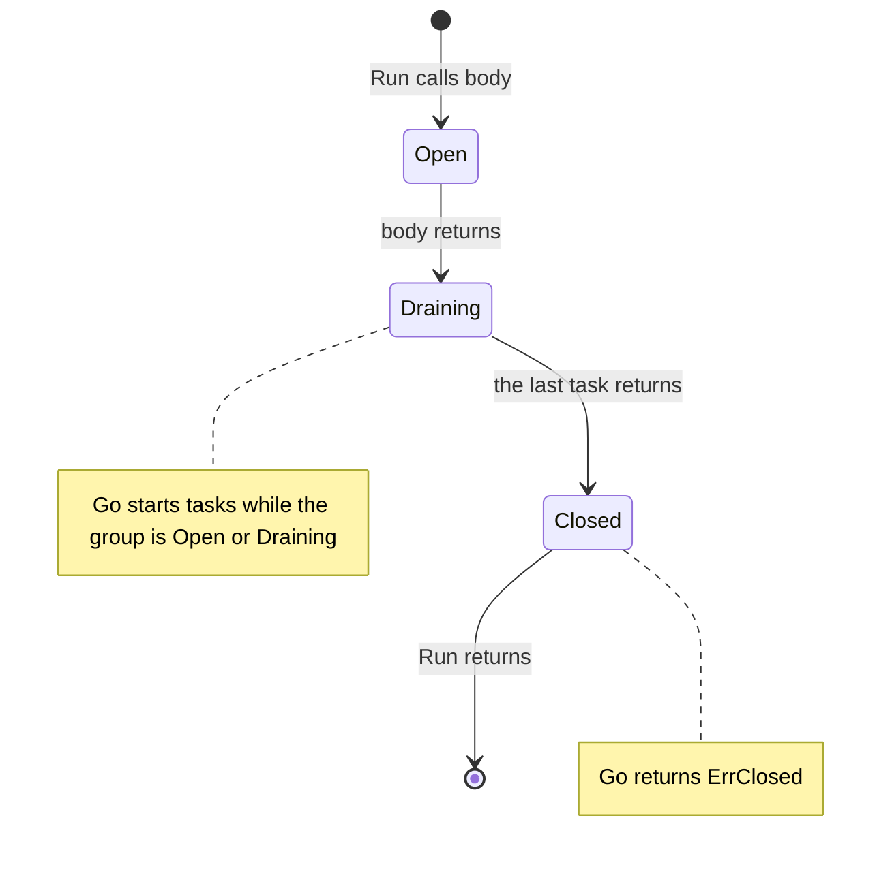

# RFC-0030: Structured Concurrency

## Summary

We propose a package `task` for concurrent work that ends before the
call that started it returns. It has five entry points:

- `task.All(ctx, fns...)` runs a fixed set of functions at once.
- `task.Each(ctx, limit, items, fn)` calls `fn` for every element of a
  slice.
- `task.Map(ctx, limit, items, fn)` calls `fn` for every element of a
  slice and returns the results in order.
- `task.Stream(ctx, limit, seq, fn)` calls `fn` for every element of an
  `iter.Seq2[E, error]`, such as the iterator of a `page.Cursor`.
- `task.Run(ctx, limit, body)` gives `body` a `*task.Group`, whose `Go`
  method starts one goroutine per task.

Every entry point cancels its context on the first error and returns
that error. It returns only after every goroutine it started has
returned. A task that panics crashes the process from its own
goroutine.

`Each`, `Map` and `Stream` run on a set of worker goroutines and do not
allocate per element. `Each` costs 16 ns per element, and `Stream`
costs 48 to 73 ns. Every mechanism we measured that starts a goroutine
per task costs 129 ns or more.

## Motivation

### Core writes its fan-out by hand

At `d301d45`, `batch.Loader.LoadAll` (`batch/loader.go:201-224`)
starts one goroutine per chunk with `sync.WaitGroup.Go` and keeps the
first error under a mutex.

- A failed batch call does not cancel the other calls. They run to
  completion, and `LoadAll` discards their results.
- `LoadAll` does not bound its concurrency. 100,000 keys at a
  `MaxBatch` of 100 start 1,000 concurrent batch calls.

At the same commit, the conformance suite in `coretest/castest` races
16 identical `Put` calls with `sync.WaitGroup.Go` (`castest.go:277-286`
and `:400-409`).
Every goroutine calls `testkit.NoError`, which calls `t.Fatalf`. The
`testing` package requires `FailNow` to run on the test goroutine.
`WaitGroup.Go` counts the resulting `runtime.Goexit` as a normal
return, so the test goroutine continues past `Wait`.

### The standard library and x/sync leave gaps

`sync.WaitGroup.Go` starts a goroutine and waits for it. It does not
return an error, and it does not bound concurrency. Its documentation
states that the function "must not panic".

`golang.org/x/sync/errgroup` adds the first error, cancellation and a
limit, and core may import it. At v0.23.0 it leaves these gaps:

- `Go` blocks on the limit before it checks anything else
  (`errgroup.go:72-75`). After a sibling fails, `Go` still waits for a
  slot and still starts the task.
- A task that ends by `runtime.Goexit` runs the deferred release and
  does not record an error, so the group reports success.
- errgroup hands the group's context to a task only through a
  closure. A task that captures the parent context instead compiles,
  and it then ignores the group's cancellation.
- A caller can omit `Wait`, and the code compiles. The caller then
  returns while goroutines still run.
- errgroup starts one goroutine per task. It does not have a form that
  reuses goroutines across the elements of a slice or an iterator.

### Why core

Core has concurrency primitives for a shared resource
(`pool.Bounded`), for a remote dependency (`resilience.Bulkhead`) and
for coalesced loads (`batch.Loader`). It has none for a caller's own
fan-out, and `batch.Loader` writes one internally. The contract meets
core's bar for a primitive:

- Prior art settles the contract. Trio's nursery bounds every task by
  a lexical block, and errgroup established the first-error rule in
  Go.
- The package imports only `context`, `errors`, `iter`, `sync`,
  `sync/atomic` and `core/errs`.
- Every guarantee is testable. The implementation has a test for each
  of the guarantees listed in this document.

## Detailed design

### The package

```go
// Package task runs concurrent work inside a scope. Every function in
// the package returns only after every goroutine it started has
// returned, so no task runs after the call that started it has
// returned.
//
// # Choosing a function
//
//   - All runs a fixed set of functions at once.
//   - Each and Map call one function for every element of a slice.
//   - Stream calls one function for every element of an iterator.
//   - Run starts tasks one at a time, for work that the other functions
//     do not describe.
//
// # Contexts
//
// Every call derives a cancellable context from its ctx argument. When
// ctx is itself cancellable, deriving and releasing that context lock a
// mutex inside ctx, so concurrent calls that share one ctx contend on
// that mutex. A long-lived goroutine that makes many calls derives its
// own context from the shared one and passes that.
package task

// ErrLimit is returned by Each, Map, Stream and Run when limit is below
// one. They return it without calling fn or body.
var ErrLimit = errors.New("task: limit must be greater than zero")

// ErrClosed is returned by Group.Go after Run has returned. It
// classifies as errs.Invalid, because the caller used a group outside
// its scope and a retry cannot succeed.
var ErrClosed = errs.WithClass(errors.New("task: group closed"), errs.Invalid)

// ErrExited is recorded when a task, a call to fn, body or seq ends by
// runtime.Goexit instead of returning. It classifies as errs.Invalid.
var ErrExited = errs.WithClass(errors.New("task: exited without returning"), errs.Invalid)

// All calls every function in fns on its own goroutine, and returns
// after every call has returned.
//
// All returns the first non-nil error, or nil. Recording that error
// cancels the context passed to the other functions. All does not take
// a limit, because it is meant for a fixed set of functions written at
// the call site. Work whose size depends on input uses Each, Map or
// Stream.
//
// # Panics
//
// A function that panics crashes the process from its own goroutine,
// and All does not return.
func All(ctx context.Context, fns ...func(ctx context.Context) error) error

// Each calls fn once for every element of items, with at most limit
// calls running at once, and returns after every call has returned.
//
// Each starts min(limit, len(items)) goroutines. Every goroutine claims
// the next unclaimed index and calls fn with that index and element.
// Each does not start a goroutine or allocate per element. When items
// is empty, Each returns nil without starting a goroutine.
//
// Each returns the first non-nil error from fn, or nil. Recording that
// error cancels the context passed to fn, and the goroutines stop
// claiming indices. A goroutine that claims an index after the context
// is done records context.Cause and does not call fn. A nil result
// means that fn returned nil for every element.
//
// # Context
//
// fn receives a context derived from ctx. It is cancelled when ctx is
// done, when the first error is recorded, and when Each returns.
//
// # Concurrency
//
// fn runs on up to min(limit, len(items)) goroutines at once. The
// caller must not modify items until Each returns. fn may write element
// i of a slice that the caller owns without a lock, because one call
// receives index i.
//
// # Panics
//
// A call to fn that panics crashes the process from its own goroutine,
// and Each does not return.
func Each[E any](ctx context.Context, limit int, items []E, fn func(ctx context.Context, i int, item E) error) error

// Map calls fn for every element of items, with at most limit calls
// running at once, and returns the results in the order of items.
//
// Map follows the rules of Each. When a call fails, Map returns nil and
// the first error, because the results of the other calls are
// incomplete.
func Map[E, R any](ctx context.Context, limit int, items []E, fn func(ctx context.Context, item E) (R, error)) ([]R, error)

// Stream calls fn for every element that seq yields, with at most limit
// calls running at once, and returns after every call has returned.
//
// Stream calls seq on the caller's goroutine, so seq does not need to
// be safe for concurrent use. It hands elements to its worker
// goroutines through a buffer of limit elements, and it starts one
// worker for each of the first limit elements. A sequence shorter than
// limit starts one goroutine per element. Stream does not allocate per
// element.
//
// Stream returns the first non-nil error from seq or from fn, or nil.
// Recording that error cancels the context passed to fn, and the next
// yield returns false, which stops seq. Stream records context.Cause for
// any element that seq yielded and fn did not receive. A nil result
// means that seq did not yield an error and fn returned nil for every
// element.
//
// # Context
//
// fn receives a context derived from ctx. It is cancelled when ctx is
// done, when the first error is recorded, and when Stream returns.
//
// # Panics
//
// A call to fn that panics crashes the process from its own goroutine,
// and Stream does not return. A seq that panics cancels the context and
// waits for every worker, and then the panic continues.
func Stream[E any](ctx context.Context, limit int, seq iter.Seq2[E, error], fn func(ctx context.Context, item E) error) error

// Run calls body with a new Group, then waits until body and every
// task started in the group have returned.
//
// At most limit tasks run at once. body runs on the caller's goroutine
// and does not count against limit.
//
// Run returns the first non-nil error from body, from a task or from a
// refused call to Go, or nil. Recording that error cancels the group's
// context, with the error as its cause.
//
// # Context
//
// The group's context is derived from ctx, so it has ctx's values and
// deadline. body and every task receive the group's context. It is
// cancelled when ctx is done, when the first error is recorded, and
// when Run returns.
//
// # Panics
//
// A task that panics crashes the process from its own goroutine, and
// Run does not return. The crash trace includes the task's frames. A
// body that panics cancels the group's context and waits for every
// task, and then the panic continues.
func Run(ctx context.Context, limit int, body func(ctx context.Context, g *Group) error) error

// Group starts the tasks of one call to Run.
//
// # Concurrency
//
// A Group is safe for concurrent use. body and every running task may
// call Go.
type Group struct{ /* unexported fields */ }

// Go starts fn in a new goroutine and returns nil, or returns an error
// and does not start fn.
//
// When limit tasks are running, Go waits until one of them returns or
// the group's context is done.
//
// Error modes:
//
//   - The group's context is done. Go returns context.Cause of that
//     context and records it, so Run does not return nil.
//   - Run has returned. Go returns ErrClosed.
//
// # Deadlock
//
// A task that calls Go waits while limit tasks run. When every running
// task waits in Go, none of them returns, and the group waits until its
// context is done. Set limit above the nesting depth, or run nested
// work under a separate call to Run.
func (g *Group) Go(fn func(ctx context.Context) error) error
```

### Choosing a function

| Work | Use |
|---|---|
| A fixed set of different calls, written at the call site | `task.All` |
| One function over a slice | `task.Each` |
| One function over a slice, with the results in order | `task.Map` |
| One function over an iterator, such as a `page.Cursor` | `task.Stream` |
| Stages that run together, or tasks that start tasks | `task.Run` |
| A small fixed number of calls that return no error | `sync.WaitGroup.Go` |

For CPU-bound work, pass `runtime.GOMAXPROCS(0)` as the limit. On
Linux its default follows the cgroup CPU limit, so the value fits a
container. For calls to a dependency, pass the concurrency that the
dependency accepts.

### Calling All

A caller loads the profile and the invoice history of one account
concurrently. `profiles.Get(ctx, id)` returns `(Profile, error)`, and
`invoices.List(ctx, id)` returns `([]Invoice, error)`.

```go
var (
    profile Profile
    history []Invoice
)

err := task.All(ctx,
    func(ctx context.Context) (err error) {
        profile, err = profiles.Get(ctx, id)
        return err
    },
    func(ctx context.Context) (err error) {
        history, err = invoices.List(ctx, id)
        return err
    },
)
```

`profile` and `history` are separate variables, so neither function
needs a lock. When `profiles.Get` fails, `invoices.List` receives a
cancelled context, and `All` returns the profile error.

### Calling Map

The caller has `urls []string` and a function
`fetch(ctx context.Context, url string) ([]byte, error)`. `fetch` has
the signature that `Map` expects, so it passes without a closure.

```go
pages, err := task.Map(ctx, 8, urls, fetch)
```

### Collecting every result with Each

A readiness endpoint reports every failing check. To collect every
outcome, a call records its own result and returns nil, because a
returned error cancels the other calls. Here `checks` is a `[]Check`,
and `Check` has a method `Check(ctx context.Context) error`.

```go
failures := make([]error, len(checks))

err := task.Each(ctx, 8, checks, func(ctx context.Context, i int, c Check) error {
    failures[i] = c.Check(ctx)
    return nil
})
if err != nil {
    return err
}

return errors.Join(failures...)
```

Call `i` writes only `failures[i]`, so the slice does not need a lock.
`errors.Join` discards the nil entries and keeps the failures in the
order of `checks`.

### Calling Stream

A scrub verifies every object in one page of a listing. `store` is a
`blob.Store`, and `verify(ctx context.Context, key string) error`
checks one object.

```go
cursor, err := store.List(ctx, "logs/", page.Page{Limit: 1000})
if err != nil {
    return err
}
defer cursor.Close()

return task.Stream(ctx, 16, cursor.Seq(ctx), func(ctx context.Context, info blob.Info) error {
    return verify(ctx, info.Key)
})
```

`Stream` calls the cursor's iterator on the caller's goroutine, so the
cursor does not need to be safe for concurrent use. An error that the
cursor yields stops the scrub and becomes the result.

### Calling Run

A copy job runs one producer and `copiers` copiers in one scope.
`produce(ctx context.Context, out chan<- string) error` sends keys on
`out` until the source ends or `ctx` is done, and
`copyObject(ctx context.Context, key string) error` copies one object.

```go
keys := make(chan string)

err := task.Run(ctx, 1+copiers, func(ctx context.Context, g *task.Group) error {
    if err := g.Go(func(ctx context.Context) error {
        defer close(keys)
        return produce(ctx, keys)
    }); err != nil {
        return err
    }

    for range copiers {
        if err := g.Go(func(ctx context.Context) error {
            for key := range keys {
                if err := copyObject(ctx, key); err != nil {
                    return err
                }
            }
            return nil
        }); err != nil {
            return err
        }
    }
    return nil
})
```

The limit is `1+copiers`, so every stage runs at once. When a copy
fails, `produce` observes the cancelled context and closes `keys`. The
other copiers then finish their current key and return.

### Lifecycle of a Group



`Run` counts `body` and every admitted task in one atomic integer.
`Go` admits a task with a compare-and-swap that fails when the count
is zero. The count reaches zero once, after `body` and every task have
returned, so a closed group cannot reopen.

A running task may call `Go` after `body` has returned. The new task
increments the count before its parent decrements it. The count never
reaches zero at that point, and `Run` waits for the new task.

### Failure rules

In these rules, a task is a function passed to `All` or `Go`, or a
call to `fn` in `Each`, `Map` or `Stream`.

- The first non-nil error is the result. Later errors are discarded,
  because after the cancellation most of them are `context.Canceled`.
- Recording the first error cancels the context. `context.Cause`
  returns that error inside every task.
- Once the group's context is done, `Go` returns its cause, records
  it, and does not start `fn`. A producer loop that checks the error
  from `Go` stops at the first failure. A `body` that ignores the
  error still gets a non-nil result from `Run`.
- `Each`, `Map` and `Stream` record the cause for every element that
  they skip after the context is done, so a call that skipped an
  element returns an error.
- A task that ends by `runtime.Goexit` records `ErrExited`. The
  `testing` methods `FailNow` and `SkipNow` call `runtime.Goexit`. A
  test that calls one of them inside a task gets `ErrExited`. The
  `testing` package requires `FailNow` on the test goroutine, so a
  task returns its error, and the test checks the result on the test
  goroutine.
- A task that panics crashes the process from its own goroutine. The
  task's deferred cleanup recovers the value to tell a panic from
  `runtime.Goexit`. It then panics again with the same value and does
  not release its slot, so the entry point cannot return before the
  crash. `sync.WaitGroup.Go` uses the same mechanism in Go 1.26.6 and
  1.27.1 (`src/sync/waitgroup.go:236-260`).
- The crash trace includes the task's frames. A probe on Go 1.27.1
  printed the panicking function and its line, under a panic message
  marked `[recovered, repanicked]`.
- A `body` or a `seq` that panics runs on the caller's goroutine. It
  cancels the context and waits for every task, and then the panic
  continues. An upstream `recover`, such as the one in `net/http`'s
  server, can stop that panic. The wait keeps the tasks inside the
  scope in that case too.

### The limit is required

`limit` must be at least one. A fixed fan-out of three lookups calls
`task.Run(ctx, 3, ...)`. Without a required number, a group over
caller-supplied input starts one goroutine per input element. The
caller knows the size of the input and the capacity of the dependency
that the tasks call, so the caller states the bound. The resilience
package requires its thresholds at construction for the same reason.

- `All` takes no limit. Its functions are written at the call site, so
  their number does not depend on input.
- `Each` and `Map` start `min(limit, len(items))` goroutines, so a
  limit larger than the slice does not start extra goroutines.
- `Stream` starts one worker for each of the first `limit` elements,
  so a sequence shorter than `limit` starts one goroutine per element.

### Cost

We measured each mechanism on Go 1.27.1 with an AMD Ryzen 9 9950X3D
and GOMAXPROCS 32. The `task` rows measure the implementation in core.
Every task performs one atomic add and captures its loop index, as a
call site that writes `results[i]` does. The ranges cover eight runs.
The conc and ants rows come from an earlier session with the same
harness and machine.

Per task or element, at limit 64, with 500,000 per run:

| Mechanism | ns | B | allocs |
|---|---|---|---|
| `sync.WaitGroup.Go`, unbounded | 129-206 | 40 | 2 |
| New goroutine per task, channel semaphore | 200-273 | 32 | 1 |
| errgroup v0.11.0 with `SetLimit` | 196-254 | 40 | 2 |
| conc context pool | 207-300 | 64 | 3 |
| ants `Pool.Submit` | 213-272 | 24 | 1 |
| Fixed workers, channel of closures | 54-87 | 16 | 1 |
| Fixed workers, channel of indices | 41-59 | 0 | 0 |
| `task.Go` | 243-333 | 40 | 2 |
| `task.Stream` | 48-73 | 0 | 0 |
| `task.Each` | 16 | 0 | 0 |

Per call, with three tasks per call and 200,000 calls per run. The
allocations include the three closures that the caller builds:

| Mechanism | ns | B | allocs |
|---|---|---|---|
| `sync.WaitGroup.Go` | 476-526 | 160 | 7 |
| `errgroup.WithContext` | 562-612 | 304 | 9 |
| `task.Each` | 563-612 | 256 | 5 |
| `task.All` | 584-638 | 312 | 8 |
| `task.Map` | 588-691 | 312 | 6 |
| `task.Run` | 688-758 | 432 | 10 |
| `task.Stream` | 751-843 | 432 | 7 |
| Fixed workers started per call, limit 64 | 12,383-13,975 | 3,304 | 135 |

Per request under load: 32 goroutines serve 1,000,000 requests, and
every request runs three lookups concurrently. The ranges cover six
runs.

| Mechanism | Background parent | One shared cancellable parent | One parent per worker | B | allocs |
|---|---|---|---|---|---|
| Sequential, no concurrency | 28-29 | | | 0 | 0 |
| `sync.WaitGroup.Go` | 117-125 | | | 160 | 7 |
| `errgroup.WithContext` | 154-164 | 461-522 | 153-157 | 304 | 9 |
| `task.Each` | 133-142 | 414-517 | 135-142 | 256 | 5 |
| `task.Run` | 181-185 | 531-586 | 182-186 | 432 | 10 |

- In the per-task table, every mechanism that starts a goroutine per
  task costs 129 ns or more. The goroutine start is most of that cost.
- `Each` does not have a producer or a channel. Every worker claims an
  index with one atomic add. `Stream` has one producer, the caller's
  goroutine, and one channel, and it costs three to four times as much
  per element as `Each`.
- A shared cancellable parent roughly triples the cost of every call,
  in errgroup and in `task`. Deriving a context from a cancellable
  parent locks the parent's mutex and adds the child to the parent's
  children, and cancelling it locks the mutex again to remove the
  child (`src/context/context.go:492-502` and `:409-411`). One derived
  context per worker goroutine removes the contention.
- Run in sequence, the lookups of one request cost 28 to 29 ns, and
  the cheapest concurrent form costs 117 to 125 ns. Running tasks
  concurrently cuts latency when the tasks block on I/O. When the CPU
  is the bottleneck, it cuts throughput.
- At 100,000 calls per second with three tasks each, `Run` costs 0.02
  to 0.03 CPU cores more than `sync.WaitGroup.Go`.

### Allocations

With tasks that capture nothing, a call allocates:

| Call | allocs | What |
|---|---|---|
| `Each`, `All` | 4 | the derived context and its cancel function, the call's state, one worker closure |
| `Map` | 5 | as `Each`, and the result slice |
| `Stream` | 6 | as `Each`, the buffer channel and the yield function |
| `Run` | 4, and 1 per task | the derived context and its cancel function, the `Group`, the semaphore channel, and the closure of each go statement |

- The workers of one call start from one closure value. A go statement
  without arguments passes the existing function value, so starting a
  worker does not allocate.
- `Each`, `Map` and `All` share one worker loop, generic over a small
  struct type that makes the call for one element. The worker closure
  copies that value, so `Map` does not wrap `fn` in a closure of its
  own.
- `Stream` calls `seq` with one yield function. A range-over-func loop
  over the same `seq` costs 1.5 allocations per call, because the
  compiler cannot see into `seq`.
- `Run` waits on a `sync.WaitGroup` stored in the `Group`, where a
  channel would cost an allocation of its own.
- The derived context costs two allocations, and a context type of
  the package's own would avoid them. `context.Cause` finds a cause
  only through the standard library's cancellable context
  (`src/context/context.go:289-303`), so tasks would then see the
  parent's cause or `context.Canceled` instead of the first error.
- The closure of the go statement in `Go` goes away only if a finished
  goroutine runs the next waiting task. conc works that way and
  measured 207 to 300 ns per task, the same range as a new goroutine
  per task.

We measured four changes to the implementation of `Go`:

- One compare-and-swap replaced two mutex acquisitions. It cut the
  median cost per call from 882 to 715 ns and saved one allocation.
- A plain channel send replaced the select on the semaphore and the
  context, as errgroup admits a task. It measured 215 to 278 ns per
  task against 242 to 307 ns for the select in a back-to-back run. The
  select makes a waiting `Go` return on cancellation, and the design
  keeps it.
- A send without a select, tried before the select, measured 261 to
  303 ns per task against 291 to 340 ns without it. `Stream` gained
  more from the same change: 52 to 95 ns per element against 79 to
  120 ns.
- Padding the task counter onto its own cache line did not move the
  cost outside the spread.

### Migration

`batch.Loader.LoadAll` becomes:

```go
if len(uniq) == 0 {
    return map[K]V{}, nil
}

chunks := slices.Collect(slices.Chunk(uniq, l.maxBatch))

var (
    mu  sync.Mutex
    out = make(map[K]V, len(uniq))
)

err := task.Each(ctx, len(chunks), chunks, func(ctx context.Context, _ int, chunk []K) error {
    got, err := l.fn(ctx, chunk)
    if err != nil {
        return err
    }

    mu.Lock()
    maps.Copy(out, got)
    mu.Unlock()

    return nil
})
if err != nil {
    return nil, err
}

return out, nil
```

- The batch function receives the context of `Each` instead of the
  caller's. It has the same values and deadline, and it is cancelled
  when a sibling batch fails. The `LoadAll` docblock sentence "ctx is
  passed to the batch function unchanged" changes to say so.
- An empty key set returns before `Each`, because a limit of zero
  returns `ErrLimit`.
- The limit is the chunk count, so the concurrency of `LoadAll` does
  not change.

In `coretest/castest`, the tasks of both races return the error from
`Put`, and the test checks the result of `task.Run` on the test
goroutine. The races were at `castest.go:277-286` and `:400-409`.

### Guarantees

Every guarantee below has a test in the implementation, and the suite
passes three times under the race detector on Go 1.27.1. It covers
every statement except the panic in `crash`. gremlins generates 29
mutants of the package, and the suite kills all 29.

`TestScope` checks the guarantees that every function shares, once for
each of `All`, `Each`, `Map`, `Stream` and `Run`:

| # | Guarantee |
|---|---|
| 1 | Every task runs exactly once, and the call returns nil. The test runs 500 tasks |
| 2 | The first error is the result, and the other tasks see it as the cause of their cancelled context |
| 3 | A task that calls `runtime.Goexit` makes the call return `ErrExited` |
| 4 | Every task sees the values and the deadline of `ctx` |
| 5 | The context of every task is cancelled when the call returns |
| 6 | Under a cancelled `ctx`, the call returns the cause and runs no task |
| 7 | With 60 slow tasks at limit 3, exactly 3 run at once. `All` takes no limit and is exempt |
| 8 | At limit 1, the tasks run one at a time |
| 9 | Limits of 0 and -1 return `ErrLimit` and run no task |

`TestCrash` runs every function in a child process whose task panics:

| # | Guarantee |
|---|---|
| 10 | The child dies with the task's frame in its trace, and the call does not return first |

The remaining guarantees belong to one function each:

| # | Function | Guarantee |
|---|---|---|
| 11 | `Run` | `Run` waits for a task that a task started after `body` returned |
| 12 | `Run` | A failure of `body` is the result and cancels the tasks with it as the cause |
| 13 | `Run` | A `body` that panics cancels the tasks and waits for them, and then the panic reaches the caller |
| 14 | `Run` | A `body` that calls `runtime.Goexit` cancels the tasks and waits for them |
| 15 | `Go` | After a failure, `Go` returns the cause and does not start `fn` |
| 16 | `Go` | A `Go` that waits for a slot returns the cause when the group is cancelled, and does not start `fn` |
| 17 | `Go` | A refused `Go` records its cause, so `Run` fails when `body` ignores the refusal |
| 18 | `Go` | `Go` returns `ErrClosed` after `Run` has returned, and does not start `fn` |
| 19 | `Each` | Every call receives the element at its index |
| 20 | `Each` | An empty slice returns nil without calling `fn` |
| 21 | `Each` | No index is claimed after a failure is recorded |
| 22 | `Map` | The results are in the order of `items` |
| 23 | `Map` | A failing call makes `Map` return nil results and the error |
| 24 | `Map` | `Map` accepts an existing function |
| 25 | `All` | `All` runs every function at once. The test passes only when two functions wait for each other |
| 26 | `All` | `All` with no functions returns nil |
| 27 | `Stream` | An error that `seq` yields stops the stream and is the result |
| 28 | `Stream` | After a failure, `Stream` stops `seq` |
| 29 | `Stream` | A `Stream` waiting for a worker returns when the context is done |
| 30 | `Stream` | A `Stream` whose only worker calls `runtime.Goexit` returns `ErrExited` and does not stall |
| 31 | `Stream` | A `seq` that panics cancels the workers and waits for them, and then the panic reaches the caller |
| 32 | `Stream` | An empty `seq` returns nil without calling `fn` |
| 33 | `Each`, `Map`, `Stream` | A call with 512 elements allocates as much as a call with 64 |

## Alternatives considered

### A. Use `sync.WaitGroup.Go`

`sync.WaitGroup.Go`, added in Go 1.25, starts a goroutine and waits
for it. It already crashes on a task panic before `Wait` can return.
It is the cheapest mechanism that starts a goroutine per task: 129 to
206 ns per task and 476 to 526 ns for a fan-out of three.

**Why not:** it provides the wait and none of the rest of the
contract.

- The function returns no error, so every call site writes its own
  error collection, as `LoadAll` does.
- It does not bound concurrency.
- A failure does not cancel the other goroutines.
- It counts `runtime.Goexit` as a normal return. In castest, a failed
  `Put` calls `t.Fatalf` inside the goroutine, and the test goroutine
  continues past `Wait`.
- A caller can omit `Wait`, and the code compiles.

`task` reuses the panic mechanism of `WaitGroup.Go` and adds the error,
the bound and the cancellation for 160 to 280 ns per call. A small
fixed number of calls that return no error still belongs on
`WaitGroup.Go`.

### B. Use errgroup, directly or behind a wrapper

Core may import `golang.org/x/sync`, and every Go developer knows
errgroup's `WithContext`, `Go` and `Wait`. A producer that spans
functions passes the group without nesting a closure. In the serial
per-call benchmark, errgroup is the cheapest form with an error and a
cancellation: 563 to 583 ns for three tasks.

**Why not:** the gaps listed in Motivation are in the contract, and
`task` exists to close them.

- A wrapper that closes them adds a context check before every `Go`,
  a count of refused tasks, a `runtime.Goexit` check in every task and
  a closed state. That wrapper is the size of `Run` itself, and it
  adds a dependency that `Run` does not need.
- errgroup starts a goroutine for every task. `Each`, `Map` and
  `Stream` cost 27 to 73 ns per element because they do not.
- A caller can omit `Wait`. In the callback form, `Run` itself waits,
  so a call site cannot omit the wait. The price is one closure level
  at each call site.

### C. Propagate a task's panic to the caller

conc does this. x/sync implemented it after golang/go#53757 was
accepted, and reverted it in June 2025 with CL 682935. The argument
for it is strong. A caller can recover a panic in a sequential call,
and the same panic in a concurrent call kills the process.
Propagation removes that difference.

**Why not:** the Go project reverted it for three reasons, recorded in
`errgroup.go`.

- It delays the panic until the waiting goroutine calls `Wait`, which
  hides a bug that used to fail at once.
- It turns the task's panic stack into a value, which hides the stack
  from crash-monitoring tools.
- It risks a deadlock that hides the panic entirely, when the panic
  leaves the program unable to reach `Wait`.

Reviewers in the proposal thread also noted that a recovering handler
upstream, such as `net/http`'s, turns the propagated panic into a
process that keeps running. A panic on the task's own goroutine cannot
reach any `recover`, so the process stops at the bug.

### D. Recover a task's panic and return it as an error

ants logs a recovered panic by default, and conc can convert one to an
error. A panicking task then fails the group without stopping the
process.

**Why not:** a programmer error becomes a value that retry, logging
and `errs.Classify` treat as a runtime failure. Code downstream cannot
tell a bug from a failing dependency.

### E. Return every error

The entry points could join every error with `errors.Join`, as conc's
error pool does by default. Readiness-style callers want every
failure.

**Why not:** the first failure cancels the group, so most other tasks
return `context.Canceled`. The joined error would list those errors
beside the cause. A caller that needs every outcome records it inside
the task and returns nil, as the readiness example does.

### F. A zero limit means unbounded

`sync.WaitGroup.Go` and a zero errgroup have no limit. A fixed fan-out
of three lookups would not need to state a number.

**Why not:** an unbounded group over caller-supplied input starts one
goroutine per element. `LoadAll` shows the result: 100,000 keys start
1,000 concurrent batch calls. Requiring the number puts the decision
at the one call site that knows the input. `All` is the exception,
because its functions are written at the call site.

### G. Fixed workers behind `Go`

`Run` starts `limit` workers that read closures from a buffered
channel, and `Go` sends `fn` on the channel. This removes the goroutine
start from every task. With closures that capture their index, it
measured 54 to 87 ns per task, against 243 to 333 ns for `Go`.

**Why not:**

- The workers must exist before the first task arrives. Starting 64 of
  them per call costs 12.4 to 14.0 µs for three tasks, 16 to 20 times
  the cost of `Run`.
- Starting workers on demand requires `Go` to know whether a worker is
  idle. conc hands every task to an idle worker over an unbuffered
  channel, and it measured 207 to 300 ns, no faster than a goroutine
  per task.
- The buffer is a queue. A nil from `Go` would mean the task is
  queued, not started. A queued task then needs a rule for
  cancellation that a started task does not need.
- `Go` cannot avoid the closure, because the closure is its argument.
  A closure that captures a variable allocates 16 B when it is sent on
  a channel.

`Each`, `Map` and `Stream` get the speed of fixed workers without
these costs. They call one function for every element, so they pass
an element where `Go` passes a closure. `Each` and `Map` know the
element count before they start, and `Stream` starts its workers with
its first `limit` elements.

### H. A goroutine pool

ants reuses worker goroutines across tasks and bounds their number.

**Why not:** ants measured 213 to 272 ns per task, against 200 to 273
ns for a new goroutine per task. Its long-lived workers need idle
expiry, which reads the wall clock. A pool also runs after the call
that submitted to it returns, which is the property this design
removes.

### I. Let a `body` panic continue without waiting

`Run` would cancel the group and let the panic continue at once. The
panic would reach the caller without delay, even when a task ignores
its context.

**Why not:** `net/http` recovers a handler's panic and keeps serving
(`src/net/http/server.go:1936`). Without the wait, every recovered
panic would leave that handler's tasks running after the handler has
returned. Under a steady rate of panicking requests, the goroutine
count would grow without bound. With the wait, the delay lasts as long
as the tasks take to observe the cancellation. The same reasoning
applies to a `seq` that panics inside `Stream`.

### J. A context argument on `Go`

`Go(ctx, fn)` would bound the wait for a slot by a context that the
producer chooses, tighter than the group's deadline.

**Why not:** the group's context already bounds the wait. A producer
that needs a tighter bound for the entire fan-out passes `Run` a
context with a shorter deadline. A second context adds a third case to
the select in every waiting `Go` and a parameter to every call site. A
producer that must not wait at all needs non-blocking admission, which
is future work.

### K. Count `body` against the limit

`limit` would bound every goroutine in the group, `body` included.

**Why not:** `body` would hold a slot while it calls `Go`, so a limit
of one would deadlock on the first `Go`. `body` runs on the caller's
goroutine, which exists before `Run` is called. The limit bounds the
goroutines that `Run` adds.

### L. Stream over `iter.Seq[E]`

`Stream` would take an iterator without an error, as `maps.Keys` and
`slices.Values` return.

**Why not:** core's listing APIs return a `page.Cursor`, and a cursor
is consumed through `Seq(ctx) iter.Seq2[T, error]`, which yields
`(zero, err)` on a failure mid-stream. An `iter.Seq` has no channel
for that error. A caller with an iterator that cannot fail adapts it
with a three-line function that yields a nil error.

### M. Another home or another name

- `resilience` bounds calls to a remote dependency. A group bounds a
  caller's own fan-out. Core's naming rule gives each concept its own
  package name.
- `group` produces `group.Group`, which repeats the package name.
- `scope` is a word most readers first read as lexical scope.
- `errgroup` makes a reader expect `WithContext`, `SetLimit` and
  `Wait`, and none of them exists here.
- `task` reads as what the calls do: `task.All`, `task.Each`,
  `task.Map`, `task.Stream`, `task.Run`.

## Drawbacks

- The package adds five functions, one type, one method and three
  errors. A reader chooses among five entry points where errgroup
  offers one, and the package doc lists which to use.
- `Go` costs 243 to 333 ns per task, against 196 to 254 ns for
  errgroup. `Run` costs 688 to 758 ns for a fan-out of three, against
  476 to 526 ns for `sync.WaitGroup.Go`. `Stream` costs 751 to 843 ns
  for three elements, because it starts its workers and its channel
  per call.
- Every `Run` call site nests one closure and checks the error from
  every `Go`. A producer that spans functions takes `*task.Group` as a
  parameter.
- A limit of zero returns `ErrLimit`, so a limit computed from the
  input needs a guard for empty input. The `LoadAll` migration adds one
  early return.
- A task that calls `Go` at the limit can deadlock the group, and the
  package cannot detect it. `pool.Bounded` documents the same hazard
  for a nested `Get`.
- A `body` or `seq` panic waits for every task, so a task that ignores
  its context delays that panic without bound. x/sync cited this cost
  when it reverted panic propagation. We accept it for the caller's
  goroutine only.
- `Stream` calls `seq` on one goroutine. A source slower than its
  workers sets the rate, and a fast source tops out at 48 to 73 ns per
  element.
- `Stream` starts one worker for each of the first `limit` elements,
  so a fast source with a large limit starts `limit` goroutines even
  when fewer would keep up.
- Under `GODEBUG=panicnil=1`, `panic(nil)` looks the same as
  `runtime.Goexit`. Such a task reports `ErrExited` and does not
  crash. Without that setting, Go 1.21 and later turn `panic(nil)` into
  a `*runtime.PanicNilError`, which crashes the process as usual.
- `Each` and `Map` read `items` from their worker goroutines, so a
  caller that modifies `items` during the call has a data race. The
  race detector finds it, and the compiler does not.
- The panic in the task goroutine needs a `forbidigo` exclusion in
  `.golangci.yml`, as `rand/crypto/crypto.go` has. Only a process that
  dies of that panic can observe it, so `.ergon.yaml` exempts `crash`
  from the coverage and mutation gates, and `TestCrash` covers it in a
  child process.
- Code written against errgroup ports by hand. `WithContext`,
  `SetLimit` and `Wait` have no counterparts.

## Open questions

None.

## Unresolved / future work

- Non-blocking admission. A caller that must not wait can put
  `resilience.Bulkhead`, with a capacity at or below the limit, in
  front of `Go`. We add a `TryGo` method when a caller needs one.
- A concurrency bound for `batch.Loader.LoadAll`, as a batch option.
- Chunked claiming in `Each`, when a profile shows contention on the
  shared counter for elements that cost less than the claim.

## References

- Nathaniel J. Smith, "Notes on structured concurrency, or: Go
  statement considered harmful", 25 April 2018,
  <https://vorpus.org/blog/notes-on-structured-concurrency-or-go-statement-considered-harmful/>.
- `golang.org/x/sync/errgroup` v0.23.0, `errgroup.go`, identical to
  v0.22.0.
- golang/go#53757, "x/sync/errgroup: propagate panics and Goexits
  through Wait", <https://github.com/golang/go/issues/53757>.
- golang/go#74275 and CL 682935, which reverted panic propagation in
  June 2025, <https://github.com/golang/go/issues/74275>.
- golang/go#63796, the proposal that added `sync.WaitGroup.Go` in Go
  1.25, <https://github.com/golang/go/issues/63796>.
- golang/go#76126, "sync: WaitGroup.Go(f) may cause Wait's return to
  race with termination of process when f panics",
  <https://github.com/golang/go/issues/76126>.
- Go 1.26.6 and 1.27.1, `src/sync/waitgroup.go:236-260`.
- Go 1.27.1: `src/context/context.go`, `src/net/http/server.go:1936`,
  `src/runtime/debug.go`, and the documentation of `testing.FailNow`.
- `github.com/sourcegraph/conc` at `5f936ab`: `pool/pool.go`,
  `pool/context_pool.go`, `pool/error_pool.go`, `waitgroup.go`.
- `github.com/panjf2000/ants` at `c101e30`.
- ADR-0015, `golang.org/x` modules without requirements in production
  code.
- ADR-0005, the bar for a primitive in core.
- ADR-0008, a contract states what its context governs.
- ADR-0010, one package name per concept.
