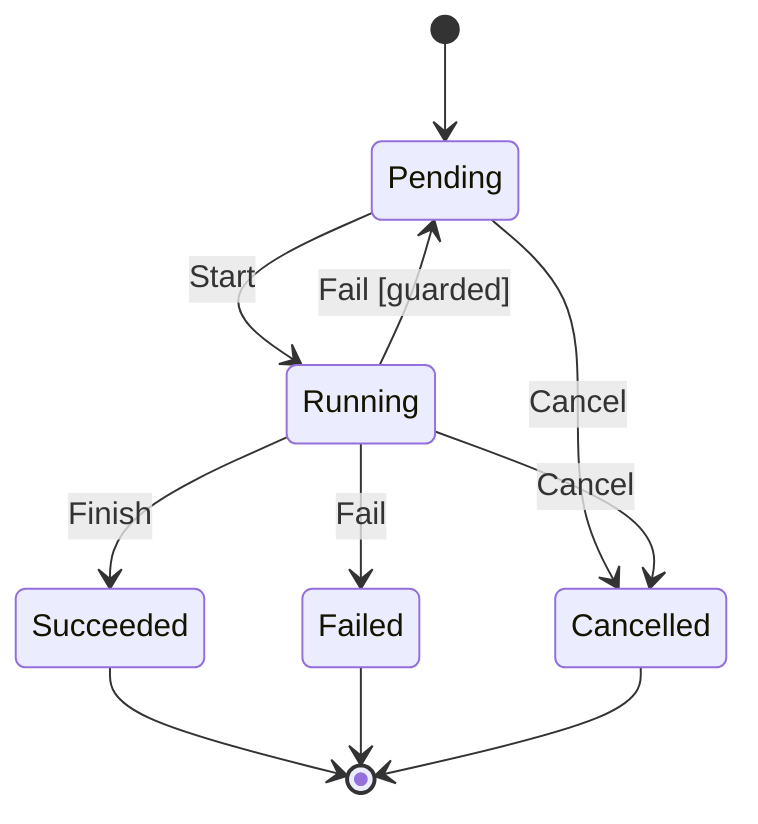

# RFC-0031: Finite State Machines

## Summary

We propose a package `fsm` with two layers:

- `Spec[S, E, D]` is a transition table over small integer states and
  events, built once and validated at construction. `Next` returns the
  state an event leads to, `Allows` reports whether a transition from
  one state to another is declared, and `Terminal` reports whether a
  state rejects every event.
- `Machine[S, E, D]` is one instance of a `Spec`: a current state and
  the data of type `D` that guards and actions read and update. `Fire`
  delivers one event and runs the exit, transition and entry actions
  in that order.

`Next` and `Fire` cost about 5 ns and do not allocate. Core supplies
the mechanism and no ready-made lifecycle. `resilience.Breaker` runs
its circuits on the package.

## Motivation

### Core writes its state machines by hand

- `resilience.Breaker` had three states and stored none of them.
  `Allow`, `Record` and `State` derived the state from two counters, a
  probe flag and a deadline (`resilience/breaker.go:163-257` at
  `7143d11`). A result that arrived while the circuit was open was a
  transition of its own, and a reader found it only by reading both
  functions.
- The XOF's absorb-then-squeeze sequence is a state machine, as its RFC
  states. `task.Group` moves from open to draining to closed, and
  `batch.Loader` moves each batch from accumulating to in flight.

### Core stores a status but not the rule for changing it

Core's storage seams already supply the compare-and-swap that a
stored status needs. `blob.Store.Put` takes a version precondition and
returns `version.ErrMismatch` when it fails (`blob/blob.go:152-153`,
`:212`), and `version.Versioned` documents the optimistic-concurrency
loop (`version/versioned.go:10`). Core does not state which status may
follow which. A caller that stores a lifecycle writes that rule by
hand, checks it before every swap, and repeats the set of final
statuses wherever it needs them.

### Existing Go libraries

We measured one goroutine firing a two-state toggle on Go 1.27.1, with
an AMD Ryzen 9 9950X3D:

| Library | ns per event | allocs per event | States and events | Validated at construction |
|---|---|---|---|---|
| A plain `next[s]` array | 2.2 | 0 | `uint8` | not applicable |
| looplab/fsm | 175-232 | 5 | strings | no |
| qmuntal/stateless | 102-173 | 0-2 | `any` | partly |
| cocoonspace/fsm | 9-11 | 0 | `int`, linear scan | no |
| soypat/go-maquina | 11-13 | 0 | string triggers | partly |
| tobbstr/fsm | 4.6-6.2 | 0 | generic `~uint` | yes |

- The allocations come from a `context.WithCancel` and an event struct
  for every event and from closures (looplab `fsm.go:328-348`), and
  from a context wrapper for every action (stateless
  `config.go:10-12`).
- Strings and `any` cost a map lookup or a boxing allocation, and a
  misspelt state compiles.
- The fastest design, tobbstr/fsm, pairs an immutable, validated
  specification with a dense table indexed by
  `state*events+event` (`fsm.go:321`, `:418-420`). It has one star,
  and a hook that fails mid-transition leaves the transition half done
  (`fsm.go:594-627`).

### Why core

- Prior art settles the semantics. UML and SCXML dispatch one event
  at a time and run exit, transition and entry actions in that order.
  Erlang's `gen_statem` treats a machine as state and event in,
  actions and next state out.
- The package imports only `errors`, `fmt`, `math`, `slices`,
  `strings` and `core/errs`.
- Every rule is testable. `Breaker`, rebuilt on the package, matches
  the original on every call across 600,000 random operations.
- Core keeps to its line between mechanism and domain. Core supplies
  the rule a lease enforces and not the lease, and in the same way it
  supplies the machine and not the lifecycle. Every state machine in
  core describes one of core's own algorithms.

## Detailed design

### The package

```go
// Package fsm runs finite state machines over small integer states
// and events.
//
// A Spec is a transition table, built once by a Builder and validated
// at construction. It is immutable and safe to share. A Machine is one
// instance of a Spec: a current state and the data that guards and
// actions read and update.
//
// # Semantics
//
// A Machine handles one event at a time. Fire selects the first edge
// out of the current state, in declaration order, whose guard holds or
// that has no guard. It then runs the exit action of the old state, the
// edge's action and the entry action of the new state, in that order.
// An edge that leads back to its own state runs only its edge action.
//
// # Allocation contract
//
// Next, Allows, Terminal and Fire do not allocate. Build allocates the
// tables once.
package fsm

// Enum is the constraint on states and events. A value indexes the
// transition table, and String names it in errors and diagrams.
type Enum interface {
    ~uint8
    String() string
}

var (
    // ErrSpec is returned by Builder.Build, joined with one error per
    // problem it found. It classifies as errs.Invalid.
    ErrSpec = errs.WithClass(errors.New("fsm: invalid spec"), errs.Invalid)

    // ErrRejected is returned by Machine.Fire when no edge accepts the
    // event in the current state. It classifies as errs.Conflict: the
    // caller acted on a state the machine is no longer in.
    ErrRejected = errs.WithClass(errors.New("fsm: event not accepted in the current state"), errs.Conflict)

    // ErrReentrant is returned by Machine.Fire when a guard or action
    // of the same machine calls Fire. It classifies as errs.Invalid.
    ErrReentrant = errs.WithClass(errors.New("fsm: fire called during a transition of the same machine"), errs.Invalid)

    // ErrState is returned by Spec.Resume for a state that the Spec
    // does not declare. It classifies as errs.Invalid.
    ErrState = errs.WithClass(errors.New("fsm: state not in the spec"), errs.Invalid)
)

// Builder declares a Spec. It is not safe for concurrent use.
type Builder[S, E Enum, D any] struct{ /* unexported fields */ }

// NewBuilder starts a Spec whose machines begin in initial.
func NewBuilder[S, E Enum, D any](initial S) *Builder[S, E, D]

// Edge declares that event on moves a machine from from to to. If
// makes the edge conditional, and Do runs an action when the edge is
// taken. Edges out of one state for one event are tried in the order
// they are declared.
func (b *Builder[S, E, D]) Edge(from S, on E, to S, opts ...Option[D]) *Builder[S, E, D]

// Edges declares the same edge from every state in from.
func (b *Builder[S, E, D]) Edges(from []S, on E, to S, opts ...Option[D]) *Builder[S, E, D]

// OnEnter runs action whenever a machine enters s from another state.
func (b *Builder[S, E, D]) OnEnter(s S, action func(d *D)) *Builder[S, E, D]

// OnExit runs action whenever a machine leaves s for another state.
func (b *Builder[S, E, D]) OnExit(s S, action func(d *D)) *Builder[S, E, D]

// Terminal declares states that reject every event.
func (b *Builder[S, E, D]) Terminal(states ...S) *Builder[S, E, D]

// Build validates the declaration and returns the Spec, or ErrSpec
// joined with every problem found.
func (b *Builder[S, E, D]) Build() (*Spec[S, E, D], error)

// Option configures one edge.
type Option[D any] struct{ /* unexported fields */ }

// If makes an edge conditional on guard. A guard reads d and must not
// change it, because Spec.Next evaluates guards without actions.
func If[D any](guard func(d *D) bool) Option[D]

// Do runs action when the edge is taken.
func Do[D any](action func(d *D)) Option[D]

// Spec is a validated transition table. It is immutable and safe for
// concurrent use.
type Spec[S, E Enum, D any] struct{ /* unexported fields */ }

// Next returns the state that on leads to from from. It evaluates
// guards against d and does not run actions. It returns from and false
// when no edge accepts on.
func (s *Spec[S, E, D]) Next(from S, on E, d *D) (S, bool)

// Allows reports whether an edge leads from from to to.
func (s *Spec[S, E, D]) Allows(from, to S) bool

// Terminal reports whether st is terminal.
func (s *Spec[S, E, D]) Terminal(st S) bool

// Known reports whether st belongs to the Spec.
func (s *Spec[S, E, D]) Known(st S) bool

// Initial returns the state a new machine starts in.
func (s *Spec[S, E, D]) Initial() S

// Mermaid renders the Spec as a Mermaid state diagram.
func (s *Spec[S, E, D]) Mermaid() string

// Start returns a machine in the initial state with data.
func (s *Spec[S, E, D]) Start(data D) Machine[S, E, D]

// Resume returns a machine in state st, such as a state read from
// storage, or ErrState when the Spec does not declare st.
func (s *Spec[S, E, D]) Resume(st S, data D) (Machine[S, E, D], error)

// Machine is one instance of a Spec.
//
// # Concurrency
//
// Not safe for concurrent use. The owner serialises calls, typically
// under the lock that already guards the data around the machine.
type Machine[S, E Enum, D any] struct{ /* unexported fields */ }

// Fire delivers on and returns the new state, or returns the current
// state and ErrRejected when no edge accepts on. A rejected event runs
// no guard's side effect and no action.
func (m *Machine[S, E, D]) Fire(on E) (S, error)

// State returns the current state.
func (m *Machine[S, E, D]) State() S

// Data returns the machine's data.
func (m *Machine[S, E, D]) Data() *D
```

### Declaring a lifecycle

In this lifecycle, a job moves from pending to running, and from
running to succeeded or failed. A failed attempt returns the job to
pending while attempts remain, and the job can be cancelled until it
finishes.

```go
spec, err := fsm.NewBuilder[State, Event, Job](Pending).
    Edge(Pending, Start, Running, fsm.Do(func(j *Job) { j.Attempts++ })).
    Edge(Running, Finish, Succeeded).
    Edge(Running, Fail, Pending, fsm.If(func(j *Job) bool { return j.Attempts < j.Limit })).
    Edge(Running, Fail, Failed).
    Edges([]State{Pending, Running}, Cancel, Cancelled).
    Terminal(Succeeded, Failed, Cancelled).
    Build()
```

A caller that stores the status checks a transition before its
compare-and-swap, and asks the Spec which statuses are final:

```go
if !spec.Allows(current, Cancelled) {
    return ErrNotCancellable
}
if spec.Terminal(job.Status) {
    archive(job)
}
```

`spec.Mermaid()` renders the same declaration for documentation:



### Running a machine: the circuit breaker

`resilience.Breaker` runs one `Machine` per target. The circuit's
counters and deadline are the machine's data. The data also contains
a pointer to the `Breaker`, whose thresholds and clock the guards read,
so every `Breaker` shares one `Spec`. The package builds that `Spec`
once, when it initialises.

```go
var circuitSpec, errCircuitSpec = fsm.NewBuilder[State, event, circuit](Closed).
    Edge(Closed, allow, Closed).
    Edge(Closed, success, Closed, fsm.Do(clearFailures)).
    Edge(Closed, failure, Open, fsm.If(atThreshold), fsm.Do(countFailure)).
    Edge(Closed, failure, Closed, fsm.Do(countFailure)).
    Edge(Open, allow, HalfOpen, fsm.If(elapsed), fsm.Do(claimProbe)).
    Edge(Open, success, Open, fsm.Do(clearFailures)).
    Edge(Open, failure, Open, fsm.Do(countLateFailure)).
    Edge(HalfOpen, allow, HalfOpen, fsm.If(idle), fsm.Do(claimProbe)).
    Edge(HalfOpen, failure, Open, fsm.If(probeFailed), fsm.Do(countFailure)).
    Edge(HalfOpen, failure, HalfOpen, fsm.Do(countFailure)).
    Edge(HalfOpen, success, Closed, fsm.If(recovered)).
    Edge(HalfOpen, success, HalfOpen, fsm.If(probing), fsm.Do(countSuccess)).
    Edge(HalfOpen, success, HalfOpen, fsm.Do(clearFailures)).
    OnEnter(Open, reopen).
    OnEnter(Closed, reset).
    Build()
```

`Allow` returns whether `Fire(allow)` succeeds, and `Record` fires
`success` or `failure`. `State` reports `HalfOpen` for an open circuit
whose interval has elapsed, as the hand-written `Breaker` did. An
internal test asserts that the declaration builds.

The migration kept the behaviour and added a few nanoseconds:

- `resilience`'s tests pass unchanged, three times under the race
  detector.
- A differential test sent the same random sequence of calls, clock
  advances and state reads to the hand-written `Breaker` and to the
  migrated one. It covered 300 seeds of 2,000 steps over three
  targets, and every result matched. When one late-outcome edge was
  removed from the migrated `Breaker`, the test failed at step 16.
- New tests cover a late failure, a late success, and a second late
  failure after a late success, all while the circuit is open. They
  pass against both versions.
- An `Allow` followed by a `Record` costs 27.7 to 28.7 ns, against 24.0
  to 24.5 ns for the hand-written `Breaker` in a back-to-back run.
  Neither allocates. `TestZeroAlloc` asserts that `Allow`, `Record`
  and `State` do not allocate for a target that has a circuit.

The migrated circuit logic is also longer: 101 lines against 66,
without comments and blank lines. Every late-outcome path becomes a
visible edge, but most of the logic is counter arithmetic, which a
table does not shorten.

### Validation

`Build` reports every problem it finds, joined under `ErrSpec`:

- A state from which no edge leads, and that is not terminal.
- A terminal state with an outgoing edge.
- A state that is unreachable from the initial state, with guards
  ignored.
- An edge declared after an unguarded edge for the same state and
  event, which can never be taken.
- A second guard or action on one edge, a second entry or exit action
  on one state, and a nil guard, action, or entry or exit action.
- More than 65,535 edges, which the table's 16-bit offsets cannot
  address. A full table of 256 states by 256 events needs 65,536.

### Semantics

- A machine handles one event at a time. A guard or action that calls
  `Fire` on its own machine gets `ErrReentrant`. The outer transition
  completes.
- `Fire` tries the edges for the current state and event in
  declaration order, and takes the first whose guard holds or that has
  no guard. When none qualifies, the state and the data do not change.
- A transition runs the exit action of the old state, the edge's
  action and the entry action of the new state, and the machine is in
  the new state before its entry action runs. An edge back to its own
  state runs only its edge action.
- A guard reads the data and must not change it, because `Spec.Next`
  evaluates guards without running actions.
- A guard or action that panics leaves the machine mid-transition, and
  every later `Fire` returns `ErrReentrant`. The machine fails closed
  rather than continuing from a state that no edge describes. `Fire`
  marks the transition before it evaluates the first guard, so a guard
  that calls `Fire` is refused as an action is.

### Concurrency

A `Spec` is immutable, so any number of goroutines and machines can
share one. A `Machine` is not safe for concurrent use. Its owner holds
a lock over more than the machine: `Breaker`'s mutex guards its map of
circuits as well as each circuit, so a lock inside the machine would
be a second lock taken under the first.

A machine without actions or data can advance lock-free on a pure
`Spec`. The caller names the state it expects, and a compare-and-swap
enforces it, as the Go runtime does for goroutine status
(`src/runtime/proc.go:1291-1327`):

```go
for {
    cur := State(word.Load())
    next, ok := spec.Next(cur, on, nil)
    if !ok {
        return fsm.ErrRejected
    }
    if word.CompareAndSwap(uint32(cur), uint32(next)) {
        return nil
    }
}
```

### Persisted state

A state is a small integer, so it stores as one byte. `Resume`
rebuilds a machine from a stored state and refuses one that the Spec
does not declare. A store that updates a status by compare-and-swap
checks `Allows(from, to)` first, so the store never receives an
illegal transition.

### Cost

Measured on the implementation in core, Go 1.27.1, AMD Ryzen 9
9950X3D, five runs of 5,000,000 operations. `TestZeroAlloc` pins the
allocation column:

| Operation | ns | allocs |
|---|---|---|
| `Spec.Allows` | 0.5-0.6 | 0 |
| `Spec.Next`, over the job lifecycle's guarded edge | 2.3-2.4 | 0 |
| `Machine.Fire` | 4.4-4.6 | 0 |
| `Machine.Fire`, guarded edge with an edge action and an entry action | 5.8-5.9 | 0 |

A `Spec` contains a table of states by events and a table of states by
states. With the 256 states and events that `uint8` allows, the tables
take 256 KiB and 64 KiB. For the job lifecycle in this document, they
take about 100 bytes.

### Guarantees

Every guarantee below has a test in the implementation, and the suite
passes three times under the race detector. It covers every statement,
and gremlins generates 68 mutants of the package, which the suite
kills.

| # | Guarantee |
|---|---|
| 1 | `Build` rejects every problem in the Validation list, each in its own test |
| 2 | `Build` sizes its tables from the largest value in any role, so an initial state or a source beyond every other state is reported, not indexed out of range |
| 3 | `Build` accepts 65,535 edges and rejects 65,536 |
| 4 | `Build` reports several problems in one error, and can be called again on the same `Builder` |
| 5 | `Next` follows the first edge whose guard holds, falls through when a guard fails, and runs no action |
| 6 | `Next` rejects an event without an edge, and a state or event one past the Spec, including where the next cell contains an edge |
| 7 | `Allows`, `Terminal` and `Known` follow the declaration, and reject values one past it |
| 8 | `Start` and `Resume` return a machine with the given data, and `Resume` refuses a state outside the Spec |
| 9 | `Mermaid` renders the initial state, every edge in declaration order with guarded edges marked, and every terminal state |
| 10 | `Fire` runs the exit, edge and entry actions in that order, and the entry action sees the new state |
| 11 | An edge back to its own state runs only its edge action |
| 12 | A rejected event changes neither the state nor the data, and the machine accepts events afterwards |
| 13 | A terminal state rejects every event |
| 14 | A `Fire` from a guard or an action of the same machine returns `ErrReentrant`, and the outer transition completes |
| 15 | After an action panics, every `Fire` returns `ErrReentrant` |
| 16 | `Fire`, `Next`, `Allows` and `Terminal` do not allocate |

## Alternatives considered

### A. Import a library

looplab/fsm and qmuntal/stateless are the most used Go state machine
libraries.

**Why not:** core imports only the standard library and dependency-free
golang.org/x modules. Neither library is one of them. Both also cost 100 to
230 ns and up to five allocations per event, type states as strings or
`any`, and create unknown states at use instead of rejecting them at
construction.

### B. States and events as strings or `any`

A string names itself, so a machine does not need a `String` method,
and a new state does not need a constant.

**Why not:** a misspelt string compiles and fails at run time, a
string key costs a map lookup where an integer indexes an array, and
`any` boxes every value that is not a pointer. The `...any` variant of
our mechanism benchmark allocated 16 B on every event. Core's own
`resilience.State` is already a `uint8` with a `String` method
(`resilience/breaker.go:19-46`).

### C. Hierarchical states

Harel's statecharts nest states, so an edge on a parent applies to all
its children, and they run orthogonal regions side by side. They solve
the state explosion of flat diagrams, where every combination of
states needs its own node.

**Why not now:**

- Every state machine in core is flat, and the largest has three
  states.
- Nesting brings rules that each need a specification and tests: the
  least common ancestor of every transition, the priority of a child's
  edge over its parent's, initial substates and history states.
- Every event pays for them. A handler lookup walks up the parents when
  the current state has no edge for the event.
- `Edges` covers the most common reason to nest, one transition out of
  a set of states, with a flat table.

Nesting can be added later without breaking the API. A flat Spec is a
hierarchy of depth one.

### D. A lock-free mode

`Fire` would advance an atomic state word by compare-and-swap. It
measured 4.1 ns uncontended against 10.2 ns for a mutex.

**Why not:** a compare-and-swap covers only the state word.

- A guard may run twice when the swap fails and is retried.
- Concurrent transitions can run their actions in an order that
  differs from the order of the state changes.
- The machine's data cannot change in the same swap as the state.

A lock-free `Fire` would forbid actions and data. That is a second
contract for one type. A caller that needs it writes the loop
in the Concurrency section over a pure `Spec`, as the Go runtime does.

### E. An internal mutex in Machine

`Fire` would lock the machine, and the machine would be safe for
concurrent use on its own.

**Why not:** the owner holds a lock over more than the machine, as
`Breaker` does, so an internal mutex is a second lock inside the
first. A
mutex-guarded transition measured 10.2 ns in our mechanism benchmark,
against 5.0 to 5.4 ns for `Fire` without one.

### F. States as functions

The Go template lexer represents a state as the function that handles
it: `type stateFn func(*lexer) stateFn`
(`src/text/template/parse/lex.go:110`).

**Why not:** a state function has no table, so nothing can validate
the machine, compute `Allows` or `Terminal`, or render it as a
diagram. It fits a parser whose states are code paths, not a lifecycle
whose states are data.

### G. Generated or compile-time tables

Boost.SML builds its transition table from types at compile time, and
its feature table lists allocation and run-time type information as
unused.

**Why not:** Go generics cannot size an array from a type parameter,
so a compile-time table in Go needs a code generator and a build step
for every machine. The run-time table costs 5 ns per event and is built
once.

### H. Timeouts in the machine

`gen_statem` cancels a state timeout on every state change and
delivers an event when it expires.

**Why not now:** a timeout that delivers its event without an incoming
call needs a timer and a goroutine for every timed state. `Breaker`
shows the other form: the deadline is data, and a guard compares it
with the clock on the next event. Timers delivered by the machine can
be added when a caller needs a transition without an incoming event.

### I. A lifecycle in core

Core would provide ready-made machines, such as a job lifecycle or a
lease lifecycle.

**Why not:** core already declined a lease lifecycle and supplies the
rules a lifecycle enforces instead. A job lifecycle belongs to the
scheduler that runs jobs, and core does not include a scheduler.

### J. Another name

- `state` produces `state.State`, and every lifecycle already has a
  type named `State`.
- `machine` and `statemachine` name one half of the package.
- `fsm` is the term a reader searches for, and the package contains both
  halves: `fsm.Spec`, `fsm.Machine`.

## Drawbacks

- The package adds a builder, two types, two option constructors and
  four errors.
- A machine costs about 2 ns per event more than the same logic
  written by hand. `Breaker`'s `Allow` and `Record` pair costs 3 to 5
  ns more than it did.
- A machine whose logic is in its guards and actions gains little from
  the table. `Breaker`'s circuit logic grew from 66 lines to 101.
- States and events are limited to 256 values each.
- Guards and actions are functions over `*D` alone. Configuration that
  they need goes into the data or into closures built with the Spec.
  `Breaker` stores a pointer to itself in every circuit, which costs 8
  bytes per target and lets one Spec serve every `Breaker`.
- The owner serialises calls to a `Machine`, and a machine used from
  more than one goroutine without a lock has a data race.
- Every state and event type needs a `String` method, which `stringer`
  can generate.

## Open questions

None.

## Unresolved / future work

- Hierarchical states, when a machine outgrows `Edges`.
- Timeouts that the machine delivers as events, through
  `clock.Clock`.
- Deferred events, which `gen_statem` retries after the next state
  change.
- testkit model tests generated from a `Spec`, which is already a
  reference model of the machine.

## References

- David Harel, "Statecharts: A visual formalism for complex systems",
  Science of Computer Programming 8 (1987) 231-274.
- W3C, "State Chart XML (SCXML)", Recommendation, 1 September 2015,
  <https://www.w3.org/TR/scxml/>, §3.13.
- OMG, UML 2.5.1, §14.2.3.9, <https://www.omg.org/spec/UML/2.5.1/PDF>.
- Erlang/OTP, `gen_statem`,
  <https://www.erlang.org/doc/system/statem.html>.
- Boost.SML, <https://github.com/boost-ext/sml>.
- Go 1.27.1: `src/runtime/proc.go:1291-1327`,
  `src/text/template/parse/lex.go:110`.
- looplab/fsm at `b456069`, qmuntal/stateless at `baed0e5`,
  cocoonspace/fsm at `2c75fa1`, soypat/go-maquina at `f65c735`,
  tobbstr/fsm at `8103f6b`.
- RFC-0019, the XOF's absorb-then-squeeze machine.
- RFC-0026, alternative E: no lease lifecycle in core.
- ADR-0015, the dependency rule.
