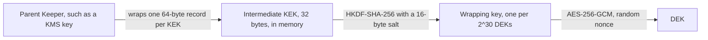

# RFC-0042: Intermediate Key-Encryption Keys

## Summary

We propose a package `crypto/kek` with a production `crypto.Keeper`
over an intermediate key-encryption key (KEK): a 256-bit key that a
parent `Keeper`, such as a key in a hosted KMS, wraps. The keeper
unwraps the KEK once. It then wraps each data encryption key (DEK) in
process memory, without a call to the parent, under a wrapping key
derived from the KEK and a random salt. It derives a new wrapping key
after every 2^30 wraps. A caller makes one custodian call per KEK
instead of one per DEK. The parent wraps the KEK in a record that binds
it to its key ID. `crypto` gains an optional capability, `AADKeeper`,
that passes associated data to the custodian. With it, the custodian
also binds the record to its key ID, and the custodian's access policy
can refuse a record for another tenant's key ID.

## Motivation

A caller that erases units one at a time gives each unit, such as a
stream, a subject or a period, its own DEK. A caller that starts units
at a high rate then makes one custodian round trip per unit:

- `crypto.GenerateKey` calls the custodian's `KeyGenerator` or its
  `Wrap` once per DEK, and both cross the process boundary for a hosted
  custodian or a hardware module.
- The custodian's latency is added to the start of every unit, and its
  request rate bounds how fast units start.

An intermediate KEK moves the custodian call from each DEK to each KEK.
The caller opens a KEK once, for example per period, and wraps every
DEK of that period in process.

`crypto/localkey` is core's only in-memory `Keeper`, and its
documentation restricts it to tests and local development, because the
caller supplies its root key in the clear. A caller that builds a keeper
over an intermediate KEK itself has to get five parts right:

- The message bound of AES-GCM with random nonces: 2^32 messages per
  key, for a key that wraps many DEKs.
- The derivation of a wrapping key.
- The binding of a wrapped DEK to the KEK that wrapped it.
- The binding of a stored KEK to its key ID.
- The part of the key material that `Close` can erase.

## Detailed design

### Key hierarchy



### API

```go
package kek

// KeySize is the length of a KEK.
const KeySize = 32

// RecordSize is the length of the record that the parent wraps: the KEK
// followed by its binding to the key ID.
const RecordSize = 64

// SaltSize is the length of the random salt at the start of every
// wrapped DEK.
const SaltSize = 16

// DomainName separates the derivations, the bindings and the associated
// data of this package from every other derivation and framed sequence.
const DomainName = "thesmos.crypto.kek"

// ErrClosed is returned by Wrap and Unwrap after Close. It classifies
// as errs.Invalid.
var ErrClosed = errs.WithClass(errors.New("kek: keeper closed"), errs.Invalid)

// ErrKeyIDMismatch is returned by New and NewAAD when the unwrapped
// record is bound to another key ID.
var ErrKeyIDMismatch = errors.New("kek: record bound to another key ID")

// Keeper is a crypto.Keeper over an intermediate key-encryption key
// (KEK) that a parent Keeper protects at rest.
//
// # Exposure
//
// The KEK is in process memory from the constructor until Close, and so
// is the wrapping key derived from it. A disclosure of that memory
// exposes every DEK wrapped under the KEK. The parent protects the KEK
// only at rest.
//
// A cleanup zeroes the KEK of a Keeper that becomes unreachable without
// Close. The runtime does not guarantee that the cleanup runs, in
// particular before the program exits.
//
// # Concurrency
//
// Safe for concurrent use.
type Keeper struct{ /* unexported */ }

// Generate creates a KEK for keyID. It returns the KEK's Keeper and the
// wrapped record, which the caller persists with keyID and
// parent.KeyID().
//
// Generate reads the KEK from r and wraps the record with parent.Wrap.
// The Keeper reads the salt of every wrapping key from r. Outside tests
// r must be a cryptographic source, because two keepers that read the
// same salt share one wrapping key.
//
// Returns crypto.ErrKeyID for an empty keyID, the error of r, and the
// parent's error.
func Generate(ctx context.Context, parent crypto.Keeper, r rand.Rand, keyID string) (*Keeper, []byte, error)

// GenerateAAD is Generate for a parent that binds associated data. It
// wraps the record with keyID as the associated data.
//
// A record from GenerateAAD opens only with NewAAD, and a record from
// Generate opens only with New.
func GenerateAAD(ctx context.Context, parent crypto.AADKeeper, r rand.Rand, keyID string) (*Keeper, []byte, error)

// New unwraps a record from Generate with parent.Unwrap and returns the
// Keeper of its KEK. The Keeper reads the salt of every wrapping key
// from r, under the rule that Generate states.
//
// Returns crypto.ErrKeyID for an empty keyID, the parent's error when
// the unwrap fails, crypto.ErrKeySize when the record is not RecordSize
// bytes long, and ErrKeyIDMismatch when the record is bound to another
// keyID.
func New(ctx context.Context, parent crypto.Keeper, r rand.Rand, keyID string, wrapped []byte) (*Keeper, error)

// NewAAD is New for a record from GenerateAAD. It unwraps the record
// with keyID as the associated data, and returns the errors of New.
func NewAAD(ctx context.Context, parent crypto.AADKeeper, r rand.Rand, keyID string, wrapped []byte) (*Keeper, error)

// KeyID returns the KEK's key ID, given to the constructor.
func (k *Keeper) KeyID() string

// Wrap seals dek under the keeper's wrapping key. The keeper derives a
// wrapping key from the KEK and a salt read from r at its first Wrap,
// and derives a new one after every 2^30 wraps. ctx is unused, because
// Wrap does not call anything outside the process.
//
// Returns the error of r when a derivation reads a salt, and ErrClosed
// after Close.
//
// # Allocation contract
//
// One allocation for the returned slice, except in a call that derives
// a wrapping key.
func (k *Keeper) Wrap(ctx context.Context, dek []byte) ([]byte, error)

// Unwrap derives the wrapping key from the salt in wrapped, or reuses
// the cipher it derived for that salt, and opens the DEK. Material
// corrupted in any position, truncated, or wrapped under another KEK or
// another keyID fails.
func (k *Keeper) Unwrap(ctx context.Context, wrapped []byte) ([]byte, error)

// Close zeroes the KEK and drops the derived wrapping keys once the
// Wrap and Unwrap calls in progress have returned. Later calls return
// ErrClosed. Close is idempotent and returns nil.
func (k *Keeper) Close() error
```

### Derivation and layout

The keeper builds one info string from its key ID:

```text
info = Framer(Domain{DomainName, 1}).String(keyID)
```

At its first `Wrap`, and after every 2^30 wraps, it derives a wrapping
key:

```text
salt = 16 bytes from r
wkey = HKDF-SHA-256(secret = KEK, salt = salt, info = info, length = 32)
aead = aesgcm.NewRandomNonce(wkey)
```

Every `Wrap` seals under the current wrapping key:

```text
wrapped = salt || crypto.Seal(aead, nil, dek, info)
```

The info string is also the associated data of the envelope. A DEK
wrapped under one key ID fails to unwrap under another key ID, even
with the same KEK.

| Field | Bytes |
|---|---|
| Salt | 16 |
| Envelope version | 1, value 1 |
| Algorithm name length | 1, value 11 |
| Algorithm name | `aes-256-gcm` |
| Nonce | 12 |
| Ciphertext | the length of the DEK |
| Tag | 16 |

A 32-byte DEK wraps to 89 bytes.

No wrapping key seals more than 2^30 DEKs. With random 96-bit nonces,
the probability that two of 2^30 seals under one key share a nonce is
about 2^-37. Each derivation reads a new random salt, so no other
keeper uses the same wrapping key, and the keeper's own count enforces
the bound.

`Unwrap` derives the wrapping key from the salt at the start of the
wrapped DEK. It keeps the ciphers of up to 1,024 salts, and it empties
that set when a new salt would exceed the limit. A reader then derives
once per salt instead of once per DEK.

Measured with Go 1.27.1 under `GODEBUG=fips140=only`, HKDF-SHA-256 over
a 32-byte secret with a 16-byte salt succeeds. `aesgcm.NewRandomNonce`
succeeds in the same mode. Go's `crypto/hkdf` refuses a secret shorter
than 112 bits and any hash outside SHA-2 and SHA-3 in that mode. A KEK
is 256 bits, and the hash is SHA-256.

### Cost

The benchmarks ran with Go 1.27.1 on an AMD Ryzen 9 9950X3D with 4
cores, 3 runs each. FIPS 140 mode is `GODEBUG=fips140=on`.

| Operation | Normal mode | FIPS 140 mode | Allocations |
|---|---|---|---|
| `Wrap` | 174–177 ns | 299–301 ns | 1, 96 B |
| `Unwrap` under the wrapping key that sealed the DEK | 114–115 ns | 113–116 ns | 1, 32 B |
| `Unwrap` of a salt the keeper has cached | 123–127 ns | 124–129 ns | 1, 32 B |
| One derivation, for a salt the keeper has not seen | 819–834 ns | 817–829 ns | 20, 2.6 KB |

A process that wraps one million DEKs per second spends 0.18 of a core
on `Wrap`, and 0.3 of a core in FIPS 140 mode.

### The stored KEK

The parent wraps a 64-byte record, not the bare KEK:

```text
binding = SHA-256(info)
record  = KEK || binding
wrapped = parent.Wrap(record)                     in Generate
wrapped = parent.WrapAAD(record, []byte(keyID))   in GenerateAAD
```

| Field | Bytes |
|---|---|
| KEK | 32 |
| Binding | 32, the SHA-256 digest of the framed key ID |

`New` and `NewAAD` compute the binding of the key ID they are given,
and refuse a record with another binding with `ErrKeyIDMismatch`. A
Keeper's `Unwrap` fails on material corrupted in any position, so an
attacker who cannot call the parent cannot produce a wrapped record
that the parent unwraps. A stored record swapped with the record of
another key ID fails in `New`.

The record is 64 bytes long for every key ID. The Keeper conformance
suite requires every Keeper to wrap DEKs of 16, 32 and 64 bytes, so
every conforming parent wraps a record. A record that contained the
framed key ID itself would be at least 69 bytes long, a length the
suite does not test.

### Binding at the custodian

The record's binding stops an attacker who can rewrite storage but
cannot call the parent. Another tenant of a shared parent key can call
the parent's `Wrap`. That tenant can wrap a record for any key ID with
a KEK it knows and store it in place of the victim's record. The
victim's keeper then wraps every new DEK under a KEK the attacker
knows. Only the custodian can refuse that wrap, and only when the
request contains the key ID. `crypto` gains an optional capability that
passes associated data to the custodian:

```go
// AADKeeper is the optional capability of a Keeper whose custodian
// binds associated data to a wrapped key. Material wrapped with one
// associated data unwraps only with the same associated data.
//
// The associated data is not secret. A hosted custodian can log it and
// can evaluate its access policy against it.
type AADKeeper interface {
    Keeper

    // WrapAAD encrypts a DEK and binds aad to the result. Wrap on the
    // same value behaves as WrapAAD with empty aad.
    WrapAAD(ctx context.Context, dek, aad []byte) ([]byte, error)

    // UnwrapAAD decrypts a DEK that WrapAAD wrapped with the same aad.
    // Material wrapped with other aad, under a different key, or
    // corrupted in any position returns an error and never a wrong key.
    // Unwrap on the same value behaves as UnwrapAAD with empty aad.
    UnwrapAAD(ctx context.Context, wrapped, aad []byte) ([]byte, error)
}

// AsAADKeeper returns the first AADKeeper in the chain that starts at k
// and follows each decorator's UnwrapKeeper() Keeper, and reports
// whether it found one. It follows the rules of AsDestroyer.
//
// # Allocation contract
//
// Zero alloc.
func AsAADKeeper(k Keeper) (AADKeeper, bool)
```

A caller that relies on the binding finds the capability with
`crypto.AsAADKeeper` when it wires the parent. It fails at once when
the parent has none, and it calls `GenerateAAD` and `NewAAD`. The
caller chooses the pair explicitly, because a record wrapped with
associated data opens only with the same associated data. A keeper that
detected the capability itself would stop opening every stored record
on the day an adapter upgrade added the capability.

`AADKeeper` takes the associated data as bytes, as `crypto.Seal` does.
An adapter over the AWS KMS encryption context maps the bytes to one
string pair. `GenerateAAD` passes the bytes of the key ID as the
associated data, without framing, so a custodian policy can compare
them with a tenant's own identifier. The record's binding already separates this package's
records from every other value the parent wraps.

The custodians bind associated data in these ways:

- AWS KMS uses the encryption context, a set of string pairs, as
  additional authenticated data, and requires the same context to
  decrypt. Key policies can condition on it with the
  `kms:EncryptionContext:` condition keys. Grants can constrain it with
  `EncryptionContextEquals` and `EncryptionContextSubset`. The key store
  of the AWS KMS Hierarchical keyring puts `branch-key-id` into the
  encryption context of every intermediate key.
- Cloud KMS takes `additionalAuthenticatedData` of up to 64 KiB, and
  does not decrypt without the same value.
- `crypto/localkey` implements the capability. `WrapAAD` passes `aad`
  to `crypto.Seal` as associated data, and `Wrap` behaves as `WrapAAD`
  with empty `aad`.

`coretest/cryptotest` gains `AssertAADKeeperContract`, which requires:

- A DEK wrapped with an `aad` unwraps with the same `aad`.
- It fails to unwrap through `UnwrapAAD` with other or empty `aad`, and
  through `Unwrap`.
- Material from `Wrap` unwraps through `UnwrapAAD` with empty `aad`.

The constructors stop these attackers:

| The attacker can | `Generate` and `New` | `GenerateAAD` and `NewAAD` |
|---|---|---|
| Rewrite storage | `New` refuses a swapped record | `NewAAD` refuses a swapped record |
| Rewrite storage and call a shared parent's `Wrap` | `New` accepts a record the attacker wrapped for another key ID | The custodian's policy refuses a wrap for another tenant's key ID |
| Read the memory of a process with an open keeper | Every DEK under the KEK is exposed | Every DEK under the KEK is exposed |

A parent key per tenant gives the protection of the second row without
the capability, because each tenant can call only its own parent. The
caller chooses between the two. A parent key per tenant works on every
custodian, and the caller erases a tenant by destroying that one key.
The custodian binding lets tenants share one parent key.

### Capabilities the keeper does not implement

- `UnwrapKeeper`. The keeper is not a decorator of its parent. With the
  method, `crypto.GenerateKey` would find the parent's `KeyGenerator`
  through it. It would then make a custodian call per DEK, which is the
  cost the keeper exists to remove.
- `crypto.Destroyer`. The wrapped record is in the caller's storage, so
  the keeper cannot make every instance fail to unwrap. A caller erases
  a KEK by deleting every copy of its wrapped record, including the
  copies in backups, and by closing every open keeper over it. A
  wrapped record in a backup opens for as long as its parent key
  exists. Destroying the parent key through `crypto.Destroyer` erases
  every KEK under it, including the copies in backups.
- `crypto.KeyGenerator`. Without it, `crypto.GenerateKey` reads the DEK
  from its `rand.Rand` and calls `Wrap`. A keeper over a KEK needs
  exactly that.
- `crypto.AADKeeper`. The envelope of each DEK binds the key ID.
  Binding a caller's associated data as well is not part of this
  proposal.

### Close

`Close` returns an error, so a `Keeper` is an `io.Closer` and closes on
the same shutdown path as a caller's other resources, as a
`batch.Loader` does. `Close` takes the keeper's write lock. `Wrap` and
`Unwrap` take its read lock, so `Close` waits for the calls in
progress.

After `Close`, the KEK in the keeper is zero, and the keeper drops its
wrapping key and its set of derived ciphers. Go's AES implementation
keeps each cipher's key schedule in memory that the keeper cannot zero.
The schedules remain until the collector frees them and the allocator
reuses the memory. Go cannot guarantee that the heap contains no other
copy of the KEK, as `crypto/localkey` documents for its root key.

The constructors attach a cleanup with `runtime.AddCleanup`, which
zeroes the KEK when a keeper becomes unreachable without `Close`. The
cleanup takes the key's buffer as its argument. It does not reference
the keeper, because the runtime never collects a keeper that its
cleanup or the cleanup's argument references. `Close` stops the
cleanup. The runtime does not guarantee that a cleanup runs, in
particular before the program exits. The cleanup shortens the exposure
of a keeper that a caller forgets to close, and it does not replace
`Close`.

The keeper does not use `runtime/secret.Do`. That function erases the
registers and the stack of a call, and erases the call's heap
allocations once the garbage collector finds them unreachable. Its
package exists only with `GOEXPERIMENT=runtimesecret`, and it is
outside the Go 1 compatibility promise. On platforms other than
linux/amd64 and linux/arm64, `Do` calls the function without erasing
anything.

### Tests

- `cryptotest.AssertKeeperContract` passes with the standard
  assertions, with a second keeper opened by `New` from the same
  wrapped record, and with a keeper over another KEK.
- `New` returns `ErrKeyIDMismatch` for a record that `Generate` wrapped
  for another key ID under the same parent.
- `New` returns `crypto.ErrKeySize` for a parent that unwraps 32 bytes.
- With `crypto/localkey` as the parent, a record from `GenerateAAD`
  opens with `NewAAD`. It fails at the parent with another key ID and
  through `New`. A record from `Generate` fails through `NewAAD`.
- A DEK wrapped under one key ID fails to unwrap under a keeper with
  the same KEK and another key ID. The test builds the second record
  from the layout.
- With the wrap limit lowered to 4 in an internal test, 10 wraps use 3
  salts. Each salt appears in at most 4 of them, and every DEK unwraps.
- Concurrent wraps across a derivation pass the race detector, and each
  salt appears in at most as many wraps as the limit.
- An unwrap of 100 DEKs that share a salt derives one cipher. The test
  is internal, because it counts derivations.
- The set of derived ciphers has at most 1,024 entries after unwraps of
  2,000 salts.
- `BenchmarkKeeper` reports one allocation per `Wrap` and per `Unwrap`,
  and `BenchmarkNewCipher` reports the cost of one derivation.
- `crypto.AsKeyGenerator` and `crypto.AsDestroyer` report false for the
  keeper. `Generate` does not call the parent's `KeyGenerator`, and
  `crypto.GenerateKey` over the keeper does not call the parent.
- After `Close`, `Wrap` and `Unwrap` return `ErrClosed`. A `Close`
  during concurrent wraps passes the race detector, and each of those
  wraps either completes or returns `ErrClosed`.
- A keeper that becomes unreachable without `Close` has a zero KEK
  after a garbage collection. The test is internal, because it inspects
  the key's buffer.
- `crypto/localkey` passes `cryptotest.AssertAADKeeperContract`.
- `crypto.AsAADKeeper` finds the capability on a Keeper, behind one
  decorator and behind two, and reports false for a Keeper without it.
- A recorded wrapped DEK unwraps with a recorded KEK, and a recorded
  record matches its key ID. These vectors pin the derivation and both
  layouts.
- The keeper passes its checks under `GODEBUG=fips140=only`, in a
  child process.

### Migration

None. The package, the capability and its function are new.
`localkey.Keeper` gains two methods, and no existing API changes.

## Alternatives considered

### A. Wrap directly under the KEK

`Wrap` would seal each DEK under the KEK with a random nonce, count its
calls and refuse the wrap after 2^32. A wrap would cost the same as a
wrap under a derived key, and the wrapped DEK would be 16 bytes
shorter.

**Why not:** the 2^32 bound applies to the key in every process that
uses it. The count is per instance. Each process of a fleet that opens
the same KEK counts separately, and no process enforces the bound for
the fleet. A derived wrapping key belongs to one keeper, because its
salt is random, so the keeper's own count enforces the bound.

### B. A key derived per wrap

`Wrap` would read a salt, derive a wrapping key and build a cipher for
every DEK. Each wrapping key would seal one DEK. The keeper would not
count wraps or cache ciphers.

**Why not:** the derivation dominates the cost and does not scale
across cores. Measured with a prototype on the same machine, a wrap
costs 1.06 to 1.11 µs and 20 allocations (2.7 KB). In FIPS 140 mode it costs 1.34 to 1.37 µs. With
32 goroutines the machine wrapped 1.8 to 1.9 million DEKs per second.
The profile shows the garbage collector as the limit. In FIPS 140 mode
the machine wrapped 0.53 to 0.60 million per second. Its profile put
51% of the CPU samples in the CPU-jitter entropy source:

- In FIPS 140 mode, Go reads randomness from a `sync.Pool` of DRBG
  instances. A new instance seeds from the CPU-jitter entropy source.
  The Go source estimates that read at 500 µs.
- `sync.Pool` drops an instance when two consecutive garbage
  collections start without a call retrieving it.
- A path that allocates 2.7 KB per wrap runs the collector so often
  that the process keeps seeding new instances.

### C. An SP 800-108 KDF, as the AWS keyring uses

The AWS KMS Hierarchical keyring derives each wrapping key with a KDF
in counter mode over HMAC-SHA-256, from its intermediate key, a 16-byte
random salt and the label `aws-kms-hierarchy`. AWS calls that
intermediate key a branch key. The same KDF here would match that
keyring's derivation.

**Why not:** Go's standard library has no public SP 800-108 KDF, so core
would write and test its own. `crypto/hkdf` is in the standard library
and runs in FIPS 140-only mode. Matching the AWS derivation would not
make the wrapped keys interoperable either, because the layouts and the
associated data differ.

### D. A cache of DEKs

A decorator would cache the parent's generated DEKs and hand one DEK to
two or more units.

**Why not:** units that share a DEK cannot be erased one at a time.
Deleting one unit's wrapped DEK erases nothing while another unit uses
the same DEK.

### E. A second constructor in `crypto/localkey`

`localkey` would gain a constructor that takes a parent and a wrapped
root key.

**Why not:** `localkey` documents that it is not custody, because the
caller supplies its root key in the clear. One type would have two
contracts, and the statement that it must not protect production data
would be false for one of its constructors.

### F. The salt from `crypto/rand`

The keeper would read each salt from `crypto/rand` and take no
`rand.Rand`. A caller could not pass a weak source by mistake.

**Why not:** AES-GCM generates each nonce inside the FIPS module,
whatever `r` is. A weak `r` repeats salts, so keepers that read the
same salt share one wrapping key, and their wraps add up against its
2^32 bound. `crypto.Seal` documents the same rule for its nonces: a
deterministic `rand.Rand` belongs only in tests. Every other primitive
in core reads randomness through `rand.Rand`, so a caller injects one
source into every primitive, and a test replays a wrap from a seeded
source.

### G. The KEK from the parent's `KeyGenerator`

`Generate` would call `crypto.GenerateKey`, which uses the parent's
`KeyGenerator` when the parent has one. The KEK would come from the
custodian's entropy source.

**Why not:** the custodian wraps the bare key it generates, and that
wrapped key does not contain the binding to its key ID. `Generate`
would have to discard it and make a second call to wrap the record.
With `go.thesmos.sh/core/rand/crypto.Rand` as `r`, the KEK comes from
`crypto/rand`, whose output passes through an SP 800-90A Rev. 1 DRBG in
FIPS 140-3 mode.

## Drawbacks

- The KEK and the current wrapping key are in process memory while a
  keeper is open. A disclosure of that memory exposes every DEK wrapped
  under the KEK, so a deployment that keeps KEKs in certified hardware
  cannot use the keeper.
- The keeper keeps a count, a wrapping key and up to 1,024 derived
  ciphers. `Close` drops them, and it cannot zero the ciphers' key
  schedules.
- The bound per wrapping key depends on unique salts. A deterministic
  `r` outside tests makes keepers share one wrapping key, and their
  wraps add up against its bound.
- An unwrap of a salt the keeper has not seen adds a derivation: 0.82 to
  0.83 µs and 20 allocations.
- A wrapped DEK is 16 bytes longer than a direct wrap: 89 bytes for a
  32-byte DEK.
- With `Generate` and `New`, a tenant that can call a shared parent's
  `Wrap` and rewrite storage can plant a KEK for another tenant. A
  deployment that shares a parent key between tenants needs
  `GenerateAAD` over a custodian whose policy can condition on the
  associated data, or a parent key per tenant.
- The KEK comes from `r`, not from the custodian's entropy source, even
  when the parent implements `KeyGenerator`.
- A deployment chooses between the two pairs of constructors once. A
  move from one pair to the other rewraps every stored record.
- `crypto` gains one interface and one function. `crypto/localkey`
  gains two methods, and `coretest/cryptotest` gains one assertion
  function.
- The package adds one type, four constructors, four methods, two
  errors and four constants. The wrapped DEK and the record are new
  persisted layouts.

## Open questions

None.

## Unresolved / future work

- A store of KEKs and a rotation policy. Both are the policy of the
  system that runs the keeper.
- The keeper implementing `crypto.AADKeeper` for the DEKs it wraps, so a
  caller can bind a DEK to the unit it encrypts.
- `runtime/secret.Do` around the derivation and the seal, behind a
  build tag for `GOEXPERIMENT=runtimesecret`.

## References

- RFC-0018, key custody.
- RFC-0034, scheduled key destruction.
- ADR-0018, core ships mechanisms, not lifecycles.
- ADR-0022, decorators expose what they wrap.
- AWS Encryption SDK, AWS KMS Hierarchical keyrings,
  <https://docs.aws.amazon.com/encryption-sdk/latest/developer-guide/use-hierarchical-keyring.html>.
- AWS Encryption SDK Specification, AWS KMS Hierarchical Keyring,
  <https://github.com/awslabs/aws-encryption-sdk-specification/blob/master/framework/aws-kms/aws-kms-hierarchical-keyring.md>.
- AWS Encryption SDK Specification, Branch Key Store,
  <https://github.com/awslabs/aws-encryption-sdk-specification/blob/master/framework/branch-key-store.md>.
- AWS KMS Developer Guide, encryption context,
  <https://docs.aws.amazon.com/kms/latest/developerguide/encrypt_context.html>.
- Cloud KMS, additional authenticated data,
  <https://docs.cloud.google.com/kms/docs/additional-authenticated-data>.
- RFC 5869, HMAC-based Extract-and-Expand Key Derivation Function
  (HKDF), <https://www.rfc-editor.org/rfc/rfc5869.html>.
- Go 1.27.1: `crypto/hkdf`, `crypto/cipher.NewGCMWithRandomNonce`,
  `crypto/rand.Reader`, `runtime.AddCleanup`, `runtime/secret.Do`,
  `sync.Pool`, and the source of `crypto/internal/fips140/drbg`.
