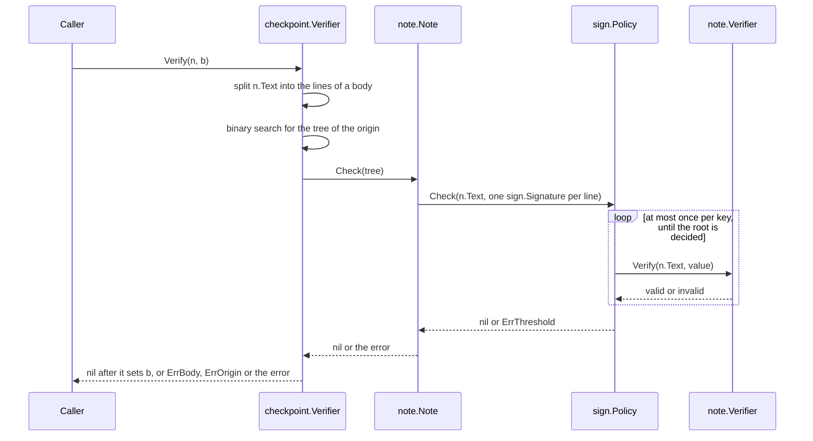

<!--
  ~ Copyright ThesmOS B.V. 2026
  ~ SPDX-License-Identifier: Apache-2.0
-->

# RFC-0047: Signed Notes and Checkpoints

## Summary

We propose two packages that implement four C2SP formats over core's
signing seam:

- `note` implements signed-note: notes, signature lines, verifier keys
  and signature types.
- `tlog/checkpoint` implements the bodies of tlog-checkpoint, the two
  signed messages of tlog-cosignature, and the policy files of
  tlog-policy.

A note key is a `sign.Verifier`. Its signature lines convert to
`sign.Signature` values whose `KeyID` follows from each line's key name
and key ID. Any `sign.Policy` of note keys verifies a note, such as one
log key, every key of a hybrid signer, or a quorum of nested witness
groups. `sign.Policy.Check` keeps its bounds: at most one verification
per key, and none when the lines cannot satisfy the policy.

The caller resolves verifier keys through a `note.Resolver`, a table
from signature type to constructor that the caller writes. Each entry
combines a message format with a `sign.Resolver` entry, so the assigned
types 0x01, 0x04 and 0x06 resolve the same way as the 0xff types that a
caller defines. A tlog-policy file compiles to one `sign.Policy` per log
origin. Its quorum is also available as a `sign.Rule`, which a caller
combines with a log rule of its own.

Each string with rules of its own is a defined type with a `Valid`
method: key names, origins, extension lines, and the names of a policy
file.

Every operation of the two packages has a path without an allocation
through memory of the caller. A log signs each checkpoint into a reused
note, a verifier parses each checkpoint into a reused note and body, and
a reload of an unchanged policy file builds nothing again. `crypto/sign`
gains the two mechanisms that these paths need: `AppendSigner`, which
appends a signature to a buffer of the caller, and `Rules` with
`Policy.Reset`, which build a policy again in its own memory.

## Motivation

### tlog has no checkpoint

`tlog` builds a transparency log in C2SP tiles. Its write order ends
with "Publish the new size and root in a signed checkpoint"
(`tlog/doc.go:66`). Its readers verify a proof "against a signed root"
before they keep tiles from an untrusted server (`tlog/doc.go:79-80`).
Core has no code that formats, signs, parses or verifies a checkpoint,
so every log and every reader built on `tlog` writes its own.

### A witness quorum has no parser

`sign.NewPolicyTree` builds "the nested groups of a C2SP tlog-policy"
(`crypto/sign/doc.go:84-85`). A tlog-policy file identifies each log and
each witness by a signed-note verifier key. Core cannot parse a verifier
key, so a caller decodes the keys and writes the tree by hand.

### Post-quantum logs need types that signed-note leaves open

signed-note assigns one post-quantum type, 0x06: a cosignature with
ML-DSA-44 over a 32-byte root. Type 0x06 does not cover these
configurations, which core supports:

- CNSA 2.0 requires ML-DSA-87 for national security systems
  (`crypto/algorithm.go:134-137`). A log or a witness that signs with
  ML-DSA-87 needs a 0xff type, and signed-note does not define how a
  0xff type is encoded.
- `tlog` builds trees over any `crypto.Hasher`. A tree over SHA-384 has
  48-byte roots, and the message of type 0x06 has room for 32 bytes.

### Checkpoints run at the rate of the logs

A log signs a checkpoint at each update of its tree. A witness verifies
and cosigns the checkpoints of every log that it witnesses, and a
monitor verifies the checkpoints of the logs that it follows. Each of
these processes handles checkpoints at the rate of its logs, so an
allocation per checkpoint loads its garbage collector in proportion to
that rate. Core gives its hot paths a form without allocations, as
`tlog.Update`, `arena` and `pool` do, and the formats of checkpoints
follow the same rule.

### Why core

- The formats need only the standard library and core's `crypto`,
  `crypto/sign` and `clock`.
- A witness quorum is safe only when each key counts once and the
  number of verifications is bounded by the keys of the policy.
  `sign.Policy` enforces both over a whole tree. A caller that evaluates
  a quorum itself repeats both rules.
- `tlog` implements the tiles and the entry bundles of the same logs.

## Detailed design

### Components

| Component | Package | Responsibility |
|---|---|---|
| `Name`, `Type`, `NewType` | `note` | Key names, and the bytes of a signature type, including the encoding of a 0xff type |
| `Key`, `ParseKey`, `Key.Set` | `note` | Verifier keys and their key IDs, parsed into a new Key or into memory of the caller |
| `KeyID`, `Algorithm` | `note` | The `sign.KeyID` and the algorithm of every note key and signature line |
| `Verifier`, `Signer` | `note` | A `sign.Verifier` and a `sign.AppendSigner` for one note key |
| `Resolver`, `Keyring` | `note` | The caller's table from signature type to constructor, and the Verifiers of a configuration kept across its loads |
| `Text`, `TextSigner` | `note` | Signatures over the note text, such as type 0x01 |
| `Note`, `Signature`, `Parse`, `Open`, `Sign` | `note` | The encoding of a note, and its verification against a `sign.Policy` |
| `Origin`, `Extension`, `Body`, `ParseBody` | `tlog/checkpoint` | Checkpoint bodies |
| `CosignatureV1`, `SubtreeV1`, `CosignatureV1Signer`, `SubtreeV1Signer`, `Timestamp` | `tlog/checkpoint` | The two timestamped messages of tlog-cosignature |
| `PolicyName`, `Policy`, `ParsePolicy`, `Policy.QuorumRule` | `tlog/checkpoint` | tlog-policy files, and their quorum as a `sign.Rule` |
| `Verifier` | `tlog/checkpoint` | One `sign.Policy` per origin, built from a `Policy` and built again in its own memory |
| `AppendSigner`, `AppendSign`, `AsAppendSigner` | `crypto/sign` | A signature appended to a buffer of the caller |
| `Rules`, `Policy.Reset` | `crypto/sign` | The memory of the rules of a tree, and a policy built again in its own memory |
| `Verifier.Context` | `crypto/sign/mldsa` | The context string of an ML-DSA key, which the signer of type 0x06 checks |

`note` imports `crypto`, `crypto/sign`, `errs` and `pool`.
`tlog/checkpoint` imports `note`, `crypto`, `crypto/sign`, `clock`,
`errs` and `pool`. The kanon codecs of both import the kanon runtime.
Neither package imports an algorithm package. The caller's table names
`ed25519`, `mldsa` or `ecdsap384`.

### Names and signature types

```go
package note

// Name is a key name: non-empty valid UTF-8 without '+', without a
// character below U+0020, and without a character of the Unicode
// White_Space property.
type Name string

// Valid reports whether n is a key name.
func (n Name) Valid() bool

// Type is a signed-note signature type: the bytes that a key ID and a
// verifier key encode between the key name and the public key. An
// assigned type is one byte. A type without an assigned byte is 0xff,
// a length byte n from 1 to 255, and an identifier of n bytes.
type Type string

// TypeEd25519 is type 0x01, an Ed25519 signature over the note text.
const TypeEd25519 Type = "\x01"

// NewType returns the type 0xff ‖ len(identifier) ‖ identifier.
//
// Returns ErrType, classified errs.Invalid, for an identifier that is
// empty or longer than 255 bytes.
func NewType(identifier string) (Type, error)

// Valid reports whether t is one byte other than 0xff, or 0xff
// followed by a length byte n of at least 1 and by n more bytes.
func (t Type) Valid() bool

// String returns "0x01" for the type of the byte 0x01, the identifier
// for a valid type without an assigned byte, and "0x" followed by the
// bytes of t in hexadecimal for any other value. It is for diagnostics,
// and allocates nothing for a valid type.
func (t Type) String() string
```

`Name` applies golang.org/x/mod's rule for key names, which tests for
spaces with `unicode.IsSpace`, the White_Space property. It also refuses
the characters below U+0020, because a note cannot contain them. With
Go 1.27.1, `unicode.IsSpace` reports false for U+0000 to U+0008 and for
U+000E to U+001F. x/mod's rule alone accepts a name with one of these
characters. `note.Parse` refuses every line with that name.

Every rule of this RFC about control characters refers to the
characters below U+0020, as signed-note does. A note may contain U+007F
and U+0080 to U+009F. `unicode.IsControl` reports them, so no rule of
this RFC uses it.

signed-note reserves 0xff for types without an assigned byte. It
recommends that the byte "be followed by a longer identifier that is
unlikely to collide". It does not define where the identifier ends. A
parser of a verifier key needs that end, because the type and the
public key are one base64 string. `NewType` encodes the identifier with
a length byte, as tlog-cosignature encodes `opaque cosigner_name<1..2^8-1>`.
`NewType` checks only the length of the identifier. We recommend a
schema-less URL under a domain that the type's owner controls, such as
`example.com/ml-dsa-87`, which is the form that signed-note recommends
for key names to avoid collisions. The owner of a 0xff type specifies
the type's bytes for its own verifiers, so a type works without an
assignment by C2SP.

A key ID hashes the type and the public key as one string, so the
encoding of a 0xff type does not change the key ID. A verifier key whose
0xff type follows another convention parses into a different `Type`.
That type has no entry in the caller's resolver, so resolution fails
with `ErrUnknownType`.

`String` returns a substring of a table for a type of one byte, and a
substring of the type for the identifier of a 0xff type. Neither
allocates.

### Verifier keys

```go
// Key is a signed-note verifier key.
type Key struct {
    // Name is the key name.
    Name Name

    // Type is the signature type.
    Type Type

    // PublicKey is the public key in the encoding that the type's
    // sign.Verifier returns from PublicKey and that its sign.Resolver
    // entry takes: 32 bytes for Ed25519, the FIPS 204 encoding for
    // ML-DSA, and PKIX DER for ECDSA P-384.
    PublicKey []byte
}

// ParseKey parses a verifier key: the name, '+', the key ID in 8
// lowercase hexadecimal digits, '+', and the type followed by the
// public key in padded standard base64. The name of the returned Key
// is a substring of vkey.
//
// Returns ErrKey, classified errs.Invalid, for an invalid name, a key ID
// that is not 8 lowercase hexadecimal digits, base64 that the strict
// decoder refuses, an invalid type, an empty public key, and a key ID
// that differs from Key.ID.
func ParseKey(vkey string) (Key, error)

// Valid reports whether k has a valid name, a valid type and a public
// key.
func (k Key) Valid() bool

// ID returns the key ID: the first four bytes of SHA-256(name ‖ 0x0A ‖
// type ‖ public key), read as a big-endian integer.
func (k Key) ID() uint32

// AppendText appends the verifier key of k to b, and implements
// encoding.TextAppender. Returns ErrKey for a Key that is not Valid.
func (k Key) AppendText(b []byte) ([]byte, error)

// MarshalText returns the verifier key of k, as AppendText does.
func (k Key) MarshalText() ([]byte, error)

// Set sets k to the key of the verifier key vkey, as ParseKey parses
// it, and reuses the memory of k: its name and its type when they equal
// those of vkey, and the capacity of its public key. A name that differs
// is a substring of vkey. With String, Set implements flag.Value. k is
// unchanged on an error.
func (k *Key) Set(vkey string) error

// UnmarshalText sets k to the key of text, as Set does, and implements
// encoding.TextUnmarshaler.
func (k *Key) UnmarshalText(text []byte) error

// String returns the verifier key of k, or "" for a Key that is not
// Valid.
func (k Key) String() string
```

`ParseKey` accepts exactly the keys that `AppendText` writes. It refuses
a key whose key ID is not the derivation that signed-note recommends,
as golang.org/x/mod and torchwood do. Type 0x02 derives its key ID from
the PKIX encoding alone, so this package cannot represent a key of type
0x02.

`Key` implements the text interfaces of `encoding`, so a configuration
in JSON or YAML decodes a list of verifier keys into `[]note.Key`, and a
command line takes a verifier key as a flag. `Set` and `UnmarshalText`
decode into a pooled buffer and allocate nothing for a Key that holds
the same key, as at each reload of a configuration.

### Key identity

```go
// KeyID returns the sign.KeyID of the note key with the given name and
// key ID: the key ID in four big-endian bytes, followed by the first 12
// bytes of SHA-256(name).
func KeyID(name Name, id uint32) sign.KeyID

// Algorithm is the algorithm of every note Verifier, and of every
// sign.Signature that Note.Check builds from a signature line.
const Algorithm crypto.Algorithm = "signed-note"
```

signed-note identifies a key by its name and its key ID: "The tuple of
key name and key ID uniquely identifies the key that performed the
signature and the algorithm it used". `KeyID` maps that tuple to the 16
bytes of a `sign.KeyID`. A signature line identifies its key by the same
tuple, so a line converts to a `sign.Signature` without a table of keys:

```go
sign.Signature{Algorithm: note.Algorithm, KeyID: note.KeyID(s.Name, s.ID), Value: s.Value}
```

The derivation has three consequences:

- `sign.Policy.Check` finds the key of a line in the index of its own
  keys. It ignores a line whose name or key ID differs from every key of
  the policy, which is signed-note's rule for unknown keys.
- `sign.NewPolicyTree` refuses two keys with one name and one key ID,
  because their `KeyID` values are equal. golang.org/x/mod refuses the
  same pair as an "ambiguous key". `NewPolicyTree` also refuses one
  public key under two names, which is tlog-policy's rule for duplicate
  keys.
- The first four bytes of a note key's `KeyID` are its key ID. The
  hexadecimal `KeyID` in an error of `NewPolicyTree` starts with the 8
  digits of the verifier key.

A signature line does not identify an algorithm. The type of its key
selects the algorithm, and the key ID commits to the type. Every note
`Verifier` reports `Algorithm`, so `Check`'s comparison of algorithms
always succeeds for note keys. A record can store a line as a
`sign.Signature`, with the canonical codec of `sign.Signature`. A policy
of the same note keys checks the stored signatures again without the
note's signature lines.

### Verifiers, signers and resolution

```go
// Verifier is a sign.Verifier for the signatures of one note key.
//
// An implementation reports KeyID(k.Name, k.ID()) from KeyID, Algorithm
// from Algorithm, and k.PublicKey from PublicKey, where k is Key(). It
// computes the KeyID once, so KeyID, PublicKey and Algorithm allocate
// nothing. Verify reports whether the value of a signature line, the
// bytes after its key ID, is a valid signature for the note text.
type Verifier interface {
    sign.Verifier

    // Key returns the key whose signatures the Verifier checks.
    Key() Key
}

// Signer is a Verifier that signs note texts. Sign returns the value of
// a signature line for the text, and AppendSign appends it to dst by
// the rules of sign.AppendSigner.
type Signer interface {
    Verifier
    Sign(text []byte) ([]byte, error)
    AppendSign(ctx context.Context, dst, text []byte) ([]byte, error)
}

// Resolver maps a signature type to a function that builds the Verifier
// of a key of that type.
//
// The caller builds a Resolver from the types it trusts, as a map
// literal. There is no global registry and there are no default
// entries, so a verifier key selects only a type that the caller
// listed. Apply a Resolver only to keys that the caller trusts, such as
// the keys of its policy file, and never to a key that a note contains.
type Resolver map[Type]func(Key) (Verifier, error)

// Verifier returns the Verifier of k.
//
// Returns ErrUnknownType, classified errs.Unsupported, when r has no
// entry for k.Type, when the entry returns neither a Verifier nor an
// error, and when the entry builds a Verifier for another key: one whose
// Key, KeyID, PublicKey or Algorithm is not that of k. Returns the
// entry's error for a key that the entry refuses.
func (r Resolver) Verifier(k Key) (Verifier, error)

// Text returns the Resolver entry of a type whose signatures are the
// signatures of an algorithm over the note text. resolve is the
// sign.Resolver entry of the algorithm, such as ed25519.Resolve.
func Text(resolve func(pub []byte) (sign.Verifier, error)) func(Key) (Verifier, error)

// TextSigner is a Signer whose signatures are the signatures of a
// sign.Signer over the note text. The zero TextSigner has no key: its
// Verify reports false, and its Sign, SignContext and AppendSign return
// ErrKey.
type TextSigner struct{ /* unexported fields */ }

// NewTextSigner returns a new TextSigner, as TextSigner.Reset sets it.
func NewTextSigner(name Name, t Type, s sign.Signer) (*TextSigner, error)

// Reset sets ts to the signer of the key with name, type t and the
// public key of s.
//
// Returns ErrKey for a nil s, an invalid name and a signer without a
// public key, and ErrType for an invalid type. For TypeEd25519, returns
// ErrKey for a signer whose algorithm is not Ed25519. ts is unchanged
// on an error.
func (ts *TextSigner) Reset(name Name, t Type, s sign.Signer) error

// Keyring builds the Verifier of each key of a configuration through a
// Resolver, and keeps the Verifiers for the next load of the
// configuration. Reset starts a load, and drops each Verifier that the
// load before did not ask for. The zero Keyring resolves nothing.
type Keyring struct{ /* unexported fields */ }

func (k *Keyring) Reset(r Resolver)
func (k *Keyring) Grow(n int)
func (k *Keyring) Verifier(key Key) (Verifier, error)
```

Each entry of a `Resolver` combines a message format with an
algorithm. The format is a function of `note` or of `tlog/checkpoint`.
The algorithm is a `sign.Resolver` entry. The following resolver
accepts checkpoints signed with Ed25519, cosignatures with Ed25519 and
with ML-DSA-44, and the signatures of a log that signs with ML-DSA-87:

```go
pq, err := note.NewType("example.com/ml-dsa-87")
if err != nil {
    return err
}

r := note.Resolver{
    note.TypeEd25519:                  note.Text(ed25519.Resolve),
    checkpoint.TypeEd25519Cosignature: checkpoint.CosignatureV1(ed25519.Resolve),
    checkpoint.TypeMLDSA44Cosignature: checkpoint.SubtreeV1(mldsa.Resolver(mldsa.MLDSA44, "")),
    pq:                                note.Text(mldsa.Resolver(mldsa.MLDSA87, "example.com/checkpoint")),
}
```

Type 0x06 signs with the empty context, as torchwood v0.10.0 verifies
it. Its entry calls `mldsa.Resolver` with an empty string. A 0xff type
with ML-DSA defines its own context, and its entry binds that context.

The Verifier of an entry keeps the public key that the Verifier of its
algorithm copies, so it does not alias the caller's key. A `Keyring`
builds the Verifier of each key once: its `Verifier` returns the
Verifier that it built for a key of the same name, type and public key
in the load before, and allocates nothing for it. A process that reloads
its policy file therefore builds a Verifier only for a new key.

A context bounds the wait of every signer of `note` and of
`tlog/checkpoint`, such as a signer behind a hardware module. Each
signer implements `sign.ContextSigner` and `sign.AppendSigner`. Its
`SignContext` builds the signed message and calls `sign.SignContext` on
the wrapped signer. Its `AppendSign` builds the message in a pooled
buffer and calls `sign.AppendSign`. The signers leave out `Unwrap`.
Through `Unwrap`, `sign.AsStreamingSigner` would find the wrapped
signer's streaming capability, and a caller that streamed the note text
to it would get a signature over the wrong message for a cosignature
type.

The constructor of a signer for an assigned type refuses a wrapped
signer of another algorithm with `ErrKey`. The algorithm of an assigned
type is fixed, and a signer of another algorithm writes lines that no
verifier of the type accepts. A signer's key aliases the public key of
the wrapped signer, which the `sign.Verifier` contract makes immutable,
so `Reset` copies nothing.

### Notes

```go
// Signature is one signature line of a note.
type Signature struct {
    // Name is the key name.
    Name Name

    // Value is the signature: the decoded bytes after the key ID.
    Value []byte

    // ID is the key ID.
    ID uint32
}

// Valid reports whether s has a valid name and a value.
func (s Signature) Valid() bool

// AppendText appends the signature line "— <name> <base64(ID ‖
// Value)>\n" to b, and implements encoding.TextAppender. Returns ErrKey
// for an invalid name, and ErrNote for an empty Value.
func (s Signature) AppendText(b []byte) ([]byte, error)

// Note is a signed note: a text and its signature lines.
type Note struct {
    // Text is the note text. It ends in a newline.
    Text []byte

    // Signatures are the signature lines, in the order of the note.
    Signatures []Signature
}

// Valid reports whether n's text ends in a newline, is valid UTF-8 and
// contains no character below U+0020 other than newline, and whether n
// has at least one signature line and every line is Valid.
func (n *Note) Valid() bool

// Parse parses a signed note into a new Note without verifying it, as
// Note.UnmarshalText parses it. Text is a subslice of msg. The text of
// a note is untrusted until Check returns nil.
//
// Returns ErrNote, classified errs.Invalid, for a note that is not valid
// UTF-8, that contains a character below U+0020 other than newline,
// that has no blank line before its signature lines, or that has a
// signature line with an invalid name, base64 that the strict decoder
// refuses, or fewer than 5 decoded bytes.
func Parse(msg []byte) (Note, error)

// Open parses msg, and returns the note when its signatures satisfy p.
//
// Returns the errors of Parse, and the error of Note.Check.
func Open(msg []byte, p sign.Policy) (Note, error)

// Sign returns the note of text with one signature line from each of
// signers, in order, as Note.Sign signs it into a new Note.
func Sign(ctx context.Context, text []byte, signers ...Signer) (Note, error)

// Sign sets n to the note of text with one signature line from each of
// signers, in order, and appends each signature to the Value at the
// position of its signer. ctx bounds the wait of a signer behind a
// process boundary.
//
// Returns ErrNote for a text that does not end in a newline, that is
// not valid UTF-8, or that contains a character below U+0020 other
// than newline. Returns ErrKey for a nil signer and a signer with an
// invalid name, and the error of a signer. After an error n has no
// text and no line, and keeps its memory.
func (n *Note) Sign(ctx context.Context, text []byte, signers ...Signer) error

// Check reports whether the signature lines of n satisfy p for n.Text.
// It converts each line to a sign.Signature and calls p.Check.
//
// Returns nil when p is satisfied, and the error of sign.Policy.Check
// otherwise, which wraps sign.ErrThreshold, classified errs.Integrity.
func (n *Note) Check(p sign.Policy) error

// Find returns the first signature line whose name and key ID are k's,
// and reports whether n has one. It does not verify the line.
func (n *Note) Find(k Key) (Signature, bool)

// AppendText appends the note to b: the text, a blank line, and each
// signature line. It implements encoding.TextAppender. Returns ErrNote
// for a Note that is not Valid.
func (n *Note) AppendText(b []byte) ([]byte, error)

// MarshalText returns the note, as AppendText appends it.
func (n *Note) MarshalText() ([]byte, error)

// UnmarshalText sets n to the note of msg, as Parse parses it, and
// reuses the memory of n: its lines, each key name that equals the name
// of the line at its position, and each Value, into which it decodes
// the signature of the line at its position. After an error n has no
// text and no line, and keeps its memory.
func (n *Note) UnmarshalText(msg []byte) error

// TextOf returns the text of the signed note msg, as Parse returns it in
// Note.Text, without building a Note. It checks msg as Parse does, and
// returns the errors of Parse. The text is a subslice of msg.
func TextOf(msg []byte) ([]byte, error)

var (
    // ErrNote is returned for a malformed note or note text.
    ErrNote = errs.WithClass(errors.New("note: malformed note"), errs.Invalid)

    // ErrKey is returned for a malformed key or key name, and for a
    // signer whose key does not fit its type.
    ErrKey = errs.WithClass(errors.New("note: malformed key"), errs.Invalid)

    // ErrType is returned for a malformed signature type.
    ErrType = errs.WithClass(errors.New("note: malformed signature type"), errs.Invalid)

    // ErrUnknownType is returned by Resolver.Verifier for a type that
    // the Resolver cannot resolve.
    ErrUnknownType = errs.WithClass(errors.New("note: unknown signature type"), errs.Unsupported)
)
```

`Parse` splits a note at its last blank line, as signed-note specifies,
and accepts exactly the notes that `AppendText` writes. It keeps every
line, including repeated lines and the lines of unknown keys. `Check`
passes them to `sign.Policy.Check`, which considers the first line for
each key of the policy and ignores the others without verifying them.

`Check` takes no excluded keys. `sign.Policy.Check` removes the whole
party of an excluded key, and the parties are the children of the root.
The children of a checkpoint's root are the log rule and the quorum.
One excluded witness key would remove the quorum, and every check would
fail. A caller with a policy of its own that excludes keys converts the
lines as the previous section shows. It then calls `sign.Policy.Check`
itself.

`Sign` returns a `Note` and not bytes, so one call serves both sides of
witness cosigning. A log formats the whole note with `AppendText`. A
witness returns only its lines, each formatted with
`Signature.AppendText`. A log that receives a witness's lines appends
them to `Note.Signatures`.

Each reuse form writes a value into the memory of the value at the same
position in the previous call:

- `Note.Sign` appends each signature to the Value of the line at the
  position of its signer. A log or a witness that signs every checkpoint
  of one log into one Note allocates nothing with Ed25519.
- `Note.UnmarshalText` decodes each signature into the Value at its
  position and keeps each key name that repeats. A verifier that parses
  every checkpoint of one log into one Note allocates nothing.
- `Parse` allocates three times for any number of lines: the lines, one
  buffer for the values, and one string for the key names.

A caller that hashes the texts of the notes of many logs parses notes
whose key names change from one call to the next, so `UnmarshalText`
allocates the names on almost every call. `TextOf` returns the text
without a Note. It checks the lines in the order of `Parse` and decodes
each signature in chunks of 512 characters into an array on its stack,
so it allocates nothing for any note that it accepts. A fuzz test
compares its text and its errors with those of `Parse`.

`Key`, `Signature` and `Note` have canonical kanon codecs, the form of
these types in a kanon record, with the field numbers Name 1, Type 2 and
PublicKey 3, Name 1, Value 2 and ID 3, and Text 1 and Signatures 2. A
decode accepts only the encoding that its encode writes. The C2SP text
is the form that key IDs and signatures cover, and `Parse` and
`AppendText` read and write it.

### Checkpoint bodies

```go
package checkpoint

// Origin is the origin line of a checkpoint: non-empty valid UTF-8
// without a character below U+0020.
type Origin string

// Valid reports whether o is an origin line.
func (o Origin) Valid() bool

// Extension is an extension line of a checkpoint: non-empty valid
// UTF-8 without a character below U+0020.
type Extension string

// Valid reports whether e is an extension line.
func (e Extension) Valid() bool

// Body is the text of a C2SP tlog-checkpoint: the origin, the tree
// size, the root hash and the extension lines.
type Body struct {
    // Origin identifies the log.
    Origin Origin

    // Extensions are the extension lines.
    Extensions []Extension

    // Size is the number of leaves of the tree.
    Size uint64

    // Root is the root hash of the tree: 32 bytes for a tree over
    // SHA-256, as RFC 6962 and C2SP specify, and 48 or 64 bytes for a
    // tree that tlog builds over another hasher.
    Root crypto.Digest
}

// Valid reports whether b has a valid origin, a root of 32, 48 or 64
// bytes, and valid extension lines.
func (b Body) Valid() bool

// ParseBody parses the text of a checkpoint. The origin and the
// extension lines are substrings of one string of text.
//
// Returns ErrBody, classified errs.Invalid, for a text with fewer than
// three lines, a text that does not end in a newline, an origin or an
// extension line that is not Valid, a size that is not the decimal of a
// uint64 without leading zeros, and a root that the strict base64
// decoder refuses or that is not 32, 48 or 64 bytes.
func ParseBody(text []byte) (Body, error)

// AppendText appends the text of b to dst, and implements
// encoding.TextAppender. Returns ErrBody for a Body that is not Valid.
func (b Body) AppendText(dst []byte) ([]byte, error)

// MarshalText returns the text of b, as AppendText does.
func (b Body) MarshalText() ([]byte, error)

// UnmarshalText sets b to the body of text, as ParseBody does, and
// keeps the origin and each extension line of b that equals the line of
// text. b is unchanged on an error.
func (b *Body) UnmarshalText(text []byte) error
```

`ParseBody` accepts exactly the texts that `AppendText` writes, so a
cosigner and a verifier that parse and format one body produce the same
bytes. `Body.Root` is the `crypto.Digest` that `tlog.Builder.Root`
returns, and a log writes a body from its builder without a conversion.
C2SP's public witnesses verify only trees over SHA-256. A 48-byte root
is for a deployment whose witnesses verify trees over SHA-384.

`checkpoint.Origin(k.Name)` converts a key name to an origin, and every
valid key name is a valid origin. An origin may contain spaces and `+`,
which tlog-checkpoint permits and a key name excludes. A checkpoint with
such an origin matches no log of a policy.

`ParseBody` makes one string of the text and takes the origin and the
extension lines from it, so it allocates twice for a body with extension
lines and once for a body without them. `UnmarshalText` makes that
string only for a line that differs from the line of the Body, so the
next checkpoint of the same log parses into the same Body without an
allocation. `Body` has a canonical kanon codec with the field numbers
Origin 1, Extensions 2, Size 3 and Root 4.

### Cosignatures

tlog-cosignature defines a `timestamped_signature` value and two signed
messages:

| Type | Value of the line | Signed message | Algorithm |
|---|---|---|---|
| 0x04 | u64 timestamp ‖ 64-byte signature | `cosignature/v1\n`, `time <timestamp>\n`, then the note text | Ed25519 |
| 0x06 | u64 timestamp ‖ 2,420-byte signature | `cosigned_message`: the label `subtree/v1\n\0`, the key name, the timestamp, the origin, start 0, end equal to the size, and the 32-byte root | ML-DSA-44 with the empty context |

```go
const (
    // TypeEd25519Cosignature is type 0x04, the timestamped Ed25519
    // cosignature. Its Resolver entry is CosignatureV1(ed25519.Resolve).
    TypeEd25519Cosignature note.Type = "\x04"

    // TypeMLDSA44Cosignature is type 0x06, the timestamped ML-DSA-44
    // cosignature. Its Resolver entry is
    // SubtreeV1(mldsa.Resolver(mldsa.MLDSA44, "")).
    TypeMLDSA44Cosignature note.Type = "\x06"
)

// CosignatureV1 returns the note.Resolver entry of a type whose
// signatures are timestamped signatures, by the algorithm of resolve,
// over "cosignature/v1\ntime <timestamp>\n" followed by the note text.
func CosignatureV1(resolve func(pub []byte) (sign.Verifier, error)) func(note.Key) (note.Verifier, error)

// SubtreeV1 returns the note.Resolver entry of a type whose signatures
// are timestamped signatures, by the algorithm of resolve, over the
// cosigned_message of the checkpoint in the note text.
func SubtreeV1(resolve func(pub []byte) (sign.Verifier, error)) func(note.Key) (note.Verifier, error)

// CosignatureV1Signer is a note.Signer whose signatures are
// CosignatureV1 signatures of a sign.Signer. Each signature contains
// the time of a reading of a clock.UTCSource, in whole seconds. The
// zero CosignatureV1Signer has no key, and its Sign returns ErrKey.
type CosignatureV1Signer struct{ /* unexported fields */ }

// NewCosignatureV1Signer returns a new CosignatureV1Signer, as Reset
// sets it.
func NewCosignatureV1Signer(name note.Name, t note.Type, s sign.Signer, utc clock.UTCSource, maxError time.Duration) (*CosignatureV1Signer, error)

// Reset sets c to the signer of the key with name, type t and the
// public key of s, with the timestamps of readings of utc within
// maxError.
//
// Returns ErrKey and ErrType as note.TextSigner.Reset does, and
// ErrTimestamp for a nil utc or a negative maxError. For
// TypeEd25519Cosignature, returns ErrKey for a signer whose algorithm is
// not Ed25519. Its Sign returns an error that wraps ErrClock,
// classified errs.Transient, when utc returns an error, when the reading
// is not within maxError, and when the reading is before the Unix
// epoch. c is unchanged on an error.
func (c *CosignatureV1Signer) Reset(name note.Name, t note.Type, s sign.Signer, utc clock.UTCSource, maxError time.Duration) error

// SubtreeV1Signer is a note.Signer whose signatures are SubtreeV1
// signatures of a sign.Signer, timestamped as a CosignatureV1Signer
// timestamps them. With a nil UTC source the timestamp is 0, which does
// not state a time, as a log writes it when it signs its own checkpoint.
type SubtreeV1Signer struct{ /* unexported fields */ }

// NewSubtreeV1Signer returns a new SubtreeV1Signer, as Reset sets it.
func NewSubtreeV1Signer(name note.Name, t note.Type, s sign.Signer, utc clock.UTCSource, maxError time.Duration) (*SubtreeV1Signer, error)

// Reset returns the errors of CosignatureV1Signer.Reset, apart from the
// one for a nil utc, and ErrKey for a name longer than 255 bytes. For
// TypeMLDSA44Cosignature, it returns ErrKey for a signer whose
// algorithm is not ML-DSA-44, and for a signer that reports a context
// other than the empty one through a Context() string method. Its Sign
// also returns ErrBody for a body that a SubtreeV1 signature cannot
// cover.
func (c *SubtreeV1Signer) Reset(name note.Name, t note.Type, s sign.Signer, utc clock.UTCSource, maxError time.Duration) error

// Timestamp returns the time of a timestamped signature value: the
// big-endian uint64 in its first 8 bytes, as seconds since the Unix
// epoch in UTC. Returns the zero Time for a timestamp of 0, which does
// not state a time. Read the timestamp only of a signature that
// verified.
//
// Returns ErrTimestamp, classified errs.Invalid, for a value shorter
// than 8 bytes, and for a timestamp above 2^63 − 1.
func Timestamp(value []byte) (time.Time, error)
```

`mldsa.Verifier` reports its context, so the signer of type 0x06 can
refuse an ML-DSA-44 key that signs under another context. An
`mldsa.Signer` has the method through the `Verifier` it embeds:

```go
package mldsa

// Context returns the FIPS 204 context string under which v verifies,
// and under which a Signer of the same key signs.
func (v *Verifier) Context() string
```

`SubtreeV1Signer.Reset` finds the method on the signer, or behind its
`Unwrap`, as the `As` functions of `sign` find a capability. A signer
that does not report its context, such as one behind a hardware module,
signs without the check. Its cosignatures then fail verification when
its context is not empty, and a witness detects that when it verifies
its own first cosignature.

A cosignature's timestamp states the cosigner's UTC, and a monitor
bounds the time of a tree with it. A cosigner reads a `clock.UTCSource`,
and signs only with a reading for which `UTCReading.Within(maxError)`
reports true. clock prescribes that check for a caller that stamps
under a rule on clock accuracy (`clock/doc.go:28-33`). A `clock.Clock`
does not fit, because it states nothing about its distance from UTC. In
production, `hlc.Clock.Time` returns the HLC's wall time, and `Update`
moves that wall time forward to a peer's (`clock/hlc/hlc.go:91-93`,
`:117`).

`Timestamp` returns a `time.Time` and not a `clock.Instant`. clock
assigns an external fact, such as the time of an RFC 3161 timestamp
token, to `time.Time` (`clock/instant.go:24-36`). A cosignature's
timestamp is the claim of another party, without a logical counter and
without a node of the deployment.

A verifier of either format reads the timestamp from the value, and
rebuilds the signed message from the timestamp and the note text in a
pooled buffer. `Check` passes the same text to each verifier, and each
verifier checks its cosignature against its own timestamp. A verifier
returns false for a value shorter than 8 bytes and for a timestamp above
2^63 − 1.

A `SubtreeV1` verifier parses the note text as a body. It returns false,
and its signer returns `ErrBody`, for each of these bodies:

- A text that is not a body
- A body with extension lines
- A root that is not 32 bytes
- An origin or a key name longer than 255 bytes
- A body of size 0 whose root is not SHA-256 of the empty string

`cosigned_message` has a field `hash[32]`, so it cannot contain a
48-byte root. It also omits the extension lines. A caller reads
`Body.Extensions` after verification, and every signature that counts
must cover every line that the caller reads. torchwood v0.10.0 refuses
the same bodies.

A `CosignatureV1` verifier accepts any note text, because its message
contains the whole text. A deployment can cosign notes other than
checkpoints with it.

### Policies

```go
// PolicyName is the name of a witness or a group in a tlog-policy: a
// non-empty sequence of the octets 0x21 to 0x7E and 0x80 to 0xFF.
// Witnesses and groups share one namespace, and a policy compares names
// as octets.
type PolicyName string

// Valid reports whether n is a name that a policy file can contain.
func (n PolicyName) Valid() bool

// QuorumNone is the predefined quorum of a policy that does not require
// a cosignature. No witness or group can have this name.
const QuorumNone PolicyName = "none"

// Policy is a C2SP tlog-policy: the logs whose checkpoints a verifier
// accepts, the witnesses and groups whose cosignatures count, and the
// quorum of cosignatures that a checkpoint needs.
type Policy struct {
    // Quorum is the name of the witness or group whose cosignatures a
    // checkpoint needs, or QuorumNone.
    Quorum PolicyName

    // Logs are the log lines. A log signs the checkpoints whose origin
    // is its key name.
    Logs []Log

    // Witnesses are the witness lines, in the order of the file.
    Witnesses []Witness

    // Groups are the group lines, in the order of the file. A group
    // refers only to witnesses and groups before it.
    Groups []Group
}

// Log is a line "log <vkey> [<url>]".
type Log struct {
    // URL is the optional URL. tlog-policy leaves its meaning to the
    // application, and core does not read it.
    URL string

    // Key is the log's verifier key.
    Key note.Key
}

// Valid reports whether l has a Valid key.
func (l Log) Valid() bool

// Witness is a line "witness <name> <vkey> [<url>]".
type Witness struct {
    // Name is the witness's name in the policy.
    Name PolicyName

    // URL is the optional URL.
    URL string

    // Key is the witness's verifier key.
    Key note.Key
}

// Valid reports whether w has a Valid name other than QuorumNone and a
// Valid key.
func (w Witness) Valid() bool

// Group is a line "group <name> <threshold> <member>...".
type Group struct {
    // Name is the group's name in the policy.
    Name PolicyName

    // Members are the names of the group's witnesses and groups.
    Members []PolicyName

    // Threshold is the number of members that must count: the number of
    // the line, 1 for any, and len(Members) for all.
    Threshold int
}

// Valid reports whether g has a Valid name other than QuorumNone, at
// least one member, Valid members other than QuorumNone that differ
// from each other, and a threshold from 1 to the number of members.
func (g Group) Valid() bool

// Valid reports whether every log, witness and group of p is Valid,
// whether each name is defined once and before a group or the quorum
// refers to it, whether each name is a member at most once and each
// public key appears once, and whether the quorum is a defined name or
// QuorumNone. It allocates nothing.
func (p *Policy) Valid() bool

// QuorumRule returns the quorum of p as a sign.Rule in the memory of
// rules, with the Verifier of each witness key from keys: an AllOf rule
// of its key for a witness, and an AtLeast rule of its members with its
// threshold for a group. A Verifier builds its trees from the same rule.
//
// Returns ErrPolicy for a Policy that is not Valid and for the quorum
// QuorumNone, and the error of keys.Verifier for a key that keys cannot
// resolve.
func (p *Policy) QuorumRule(rules *sign.Rules, keys *note.Keyring) (sign.Rule, error)

// ParsePolicy parses a tlog-policy file into a new Policy, as
// Policy.UnmarshalText parses it.
func ParsePolicy(text []byte) (Policy, error)

// UnmarshalText sets p to the policy of the file text. It compares each
// line of text with the line at its position in p first, and keeps p
// as it is when every line is equal. Otherwise it parses text into the
// slices of p.
//
// Returns ErrPolicy, classified errs.Invalid, with the number of the
// offending line, for each rule of the file that the text breaks. After
// an error p has no line and no quorum, and keeps its memory.
func (p *Policy) UnmarshalText(text []byte) error
```

`ParsePolicy` enforces the rules of tlog-policy:

- The file contains only the octets 0x09, 0x0A, 0x20 to 0x7E, and 0x80
  to 0xFF.
- Spaces and tabs separate the items of a line. Empty lines, and lines
  whose first item starts with `#`, are ignored. A `#` after another
  item is an item.
- A `log` line has 2 or 3 items, a `witness` line 3 or 4, a `group`
  line at least 4, and a `quorum` line exactly 2.
- Each name of a witness or a group is defined once, and `none` is
  reserved.
- A group refers only to witnesses and groups of earlier lines. A name
  is a member at most once in the whole file.
- A threshold is `any`, `all`, or a number of ASCII digits from 1 to
  the number of members.
- The file has exactly one `quorum` line. It refers to an earlier
  witness or group, or to `none`.
- Each public key appears on one line at most.

A file may omit `log` lines, as tlog-policy permits for an application
that knows its logs from another source. Such an application appends
them to `Policy.Logs` before it builds a `Verifier`.

`UnmarshalText` runs over the bytes of the file first. It compares each
name, URL, threshold and member with the value at its position in p,
and each key with the verifier key that it writes for the key of p into
a pooled buffer. A reload of an unchanged file therefore allocates
nothing. At the first line that differs it parses the string of the
file. It counts the lines, the members and the bytes of the public keys
first, and allocates each slice once at its size. Every name, URL and
key name is then a substring of that one string, and the keys of one
0xff type share one `Type`. `ParsePolicy` allocates six times for
tlog-policy's example: the string, the logs, the witnesses, the groups,
the members and the public keys.

### Checkpoint verification

```go
// Verifier verifies checkpoints against a Policy. The zero Verifier has
// no tree and refuses every checkpoint with ErrOrigin.
//
// # Concurrency
//
// Safe for concurrent use while no goroutine calls Reset on it.
type Verifier struct{ /* unexported fields */ }

// NewVerifier returns a new Verifier for p, with each key resolved
// through r, as Verifier.Reset sets it. The Verifier does not refer to
// p.
func NewVerifier(p *Policy, r note.Resolver) (*Verifier, error)

// Reset sets v to the Verifier of p, with each key resolved through r,
// and reuses the memory of v: the Verifier of each key of the policy
// before, through a note.Keyring, the rules, and the sign.Policy of
// each tree.
//
// Returns ErrPolicy for a policy without logs and for a Policy that is
// not Valid. Returns the error of r.Verifier for a key that r cannot
// resolve, and an error that wraps sign.ErrPolicy, classified
// errs.Invalid, for a tree that sign.Policy.Reset refuses. After an
// error v has no tree and keeps its memory.
func (v *Verifier) Reset(p *Policy, r note.Resolver) error

// Verify sets b to the body of the checkpoint in n when the signatures
// of n satisfy the policy: the signature of a log whose key name is the
// origin, and the cosignatures of the quorum. It reuses the memory of b
// as Body.UnmarshalText does.
//
// Returns ErrBody when n.Text is not a body, and ErrOrigin, classified
// errs.Integrity, for an origin that is not the key name of a log of
// the policy. Returns the error of Note.Check when the signatures do
// not satisfy the tree of the origin. b is unchanged on an error.
func (v *Verifier) Verify(n *note.Note, b *Body) error

var (
    // ErrBody is returned for a malformed body, and for a body that a
    // SubtreeV1 signature cannot cover.
    ErrBody = errs.WithClass(errors.New("checkpoint: malformed body"), errs.Invalid)

    // ErrPolicy is returned for a policy that breaks a rule of
    // tlog-policy, or that a Verifier cannot build a tree from.
    ErrPolicy = errs.WithClass(errors.New("checkpoint: invalid policy"), errs.Invalid)

    // ErrOrigin is returned by Verify for an origin that is not the key
    // name of a log of the policy.
    ErrOrigin = errs.WithClass(errors.New("checkpoint: unknown origin"), errs.Integrity)

    // ErrTimestamp is returned for a malformed timestamp, and for a
    // signer that cannot read one.
    ErrTimestamp = errs.WithClass(errors.New("checkpoint: invalid timestamp"), errs.Invalid)

    // ErrClock is returned by the Sign of a cosigner whose UTC source
    // has no reading within the error bound.
    ErrClock = errs.WithClass(errors.New("checkpoint: clock outside its error bound"), errs.Transient)
)
```

A `Verifier` keeps one `sign.Policy` for each origin, the key name of
one or more `log` lines. The tree of an origin requires one of its log
keys and the quorum:

- A witness is an `AllOf` rule of its key.
- A group is an `AtLeast` rule of its members, with its threshold.
- The root is `AtLeast("checkpoint", 2, logs, q)`. `logs` is an
  `AtLeast` rule with threshold 1 over one `AllOf` rule per log key of
  the origin, and `q` is the rule that `QuorumRule` returns.
- Under `quorum none`, the root is the `logs` rule alone.

tlog-policy's example policy, with one log, becomes this tree:

```go
sign.AtLeast("checkpoint", 2,
    sign.AtLeast("example.com/log", 1, sign.AllOf("example.com/log", log)),
    sign.AtLeast("X-and-Y", 2,
        sign.AtLeast("X-witnesses", 2, sign.AllOf("X1", x1), sign.AllOf("X2", x2), sign.AllOf("X3", x3)),
        sign.AtLeast("Y-witnesses", 1, sign.AllOf("Y1", y1), sign.AllOf("Y2", y2), sign.AllOf("Y3", y3)),
    ),
)
```

tlog-policy accepts a checkpoint that "is signed by any one of the
listed logs", so the logs of one origin are alternatives, such as the
keys before and after a key rotation. The log rule makes the origin
binding of tlog-policy a property of the tree. A checkpoint whose origin
is the key name of no log fails with `ErrOrigin`, before any
verification. `quorum none` still requires a log's signature, so no tree
has a threshold of 0.

`Reset` builds the quorum once and the tree of each origin over it. It
sorts the logs by origin, keeps the trees sorted by origin, and builds
each tree in the `sign.Policy` of the tree at its position before.
`Verify` finds the tree of an origin by a binary search, which compares
the origin line of the note with the comparison operators of strings,
and so without a copy of the line. A `Reset` to the policy that the
Verifier holds allocates nothing. A caller that reloads the policy of
goroutines that verify resets a second Verifier and swaps the two.

A caller verifies the checkpoints of its logs in a loop of two calls
per checkpoint, which allocates nothing:

```go
p, err := checkpoint.ParsePolicy(policyText)
if err != nil {
    return err
}

v, err := checkpoint.NewVerifier(&p, r)
if err != nil {
    return err
}

var (
    n    note.Note
    body checkpoint.Body
)

for msg := range checkpoints {
    if err := n.UnmarshalText(msg); err != nil {
        return err
    }

    if err := v.Verify(&n, &body); err != nil {
        return err
    }
}
```

`Verify` parses the body before it selects a tree, because the tree
depends on the origin:



### A caller's tree around the quorum

A caller whose notes need another log rule writes its own tree around
`QuorumRule`, and checks a note with `Note.Check`. These notes need it:

- The checkpoint of a log that signs with two algorithms, every key of
  which must sign. tlog-policy makes the logs of an origin alternatives,
  so the caller writes the hybrid log as an `AllOf` rule of its keys.
- A note whose first line is not the key name of the log that signs it.

```go
var (
    rules sign.Rules
    keys  note.Keyring
    tree  sign.Policy
)

keys.Reset(r)

q, err := p.QuorumRule(&rules, &keys)
if err != nil {
    return err
}

if err := tree.Reset(rules.AtLeast("note", 2, rules.AllOf("example.com/log", logPQ, logEC), q)); err != nil {
    return err
}

if err := n.Check(tree); err != nil {
    return err
}
```

`logPQ` and `logEC` are the `note.Verifier` values that `keys.Verifier`
builds for the log's two keys. `Policy.Reset` checks the whole tree, so
a log key that is also a witness key fails there. A caller that builds
the tree again resets `rules` and `keys` first, and allocates nothing
for the policy that it held.

### Signing and cosigning

A log signs a checkpoint of the tree of a `tlog.Builder` `b` into a
`Note` that it reuses for every checkpoint:

```go
s, err := note.NewTextSigner("example.com/log", note.TypeEd25519, key)
if err != nil {
    return err
}

var (
    n    note.Note
    text []byte
    out  []byte
)

for b := range updates {
    text, err = checkpoint.Body{Origin: "example.com/log", Size: b.Size(), Root: b.Root()}.AppendText(text[:0])
    if err != nil {
        return err
    }

    if err := n.Sign(ctx, text, s); err != nil {
        return err
    }

    out, err = n.AppendText(out[:0])
    if err != nil {
        return err
    }

    publish(out)
}
```

A witness verifies the log's signature and a consistency proof from the
last checkpoint that it cosigned, and then cosigns. `utc` is a
`clock.UTCSource`, such as the `Source` of `clock/kernel`:

```go
c, err := checkpoint.NewCosignatureV1Signer("example.com/witness", checkpoint.TypeEd25519Cosignature, key, utc, time.Second)
if err != nil {
    return nil, err
}

var cosigned note.Note
if err := cosigned.Sign(ctx, n.Text, c); err != nil {
    return nil, err
}

return cosigned.Signatures[0].AppendText(nil)
```

### Reading cosignature timestamps

`Verify` stops once the result is decided, so it does not report which
cosignatures it verified. A monitor that needs a witness's time verifies
that witness's line itself, at one verification per witness:

```go
keys.Reset(r)

for _, w := range p.Witnesses {
    wv, err := keys.Verifier(w.Key)
    if err != nil {
        return err
    }

    s, ok := n.Find(w.Key)
    if !ok || !wv.Verify(n.Text, s.Value) {
        continue
    }

    t, err := checkpoint.Timestamp(s.Value)
    if err != nil {
        return err
    }

    times[w.Name] = t
}
```

The loop verifies the witnesses that the monitor lists, so the result
does not depend on the order in which `Check` evaluates the tree. The
same loop finds an invalid line of a known witness, which signed-note
asks a verifier to reject.

### Additions to crypto/sign

```go
package sign

// AppendSigner is the optional capability of a Signer that writes its
// signature into a buffer that the caller supplies. AppendSign reads
// message and writes dst only until it returns. It returns dst unchanged
// with an error, which wraps context.Cause(ctx) when ctx ends before the
// signature is available.
type AppendSigner interface {
    Signer
    AppendSign(ctx context.Context, dst, message []byte) ([]byte, error)
}

// AppendSign appends the signature of s over message to dst. It calls
// the AppendSigner that AsAppendSigner finds in s, and otherwise signs
// through SignContext and appends a copy of the signature.
func AppendSign(ctx context.Context, s Signer, dst, message []byte) ([]byte, error)

// AsAppendSigner returns the first AppendSigner in the chain that starts
// at s and follows each decorator's Unwrap.
func AsAppendSigner(s Signer) (AppendSigner, bool)

// Rules is the memory of the rules of a tree. Its AllOf and AtLeast
// build the rules that the functions AllOf and AtLeast build, and copy
// keys and children into memory that Rules keeps. Reset makes that
// memory free for the rules of the next tree.
type Rules struct{ /* unexported fields */ }

func (r *Rules) Grow(keys, children int)
func (r *Rules) AllOf(name string, keys ...Verifier) Rule
func (r *Rules) AtLeast(name string, threshold int, children ...Rule) Rule
func (r *Rules) Reset()

// Reset sets p to the Policy that requires root to count, as
// NewPolicyTree builds it, and reuses the memory of p. After an error p
// refuses every check with ErrPolicy, and keeps its memory.
func (p *Policy) Reset(root Rule) error
```

The Ed25519, ML-DSA and ECDSA P-384 signers of core implement
`AppendSigner`. The Ed25519 signer appends without an allocation,
because `crypto/ed25519.Sign` returns a signature that the compiler
keeps on the stack of its caller. The ML-DSA and ECDSA P-384 signers
allocate what `crypto/mldsa.PrivateKey.Sign` and `crypto/ecdsa.SignASN1`
allocate, since both return a new slice.

`NewPolicyTree` and `Policy.Reset` check the shape of a tree and count
its keys and rules before they copy it, so they size the memory of the
policy once. `NewPolicyTree` allocates four times for the tree of
tlog-policy's example: two for the index of the keys, one for the keys
and one for the rules. `Policy.Reset` and the methods of `Rules`
allocate nothing for a tree that fits the memory of the build before.

### Departures from the specifications

| Rule | This design | Reason |
|---|---|---|
| signed-note: a verifier "MUST verify" a signature of a known key, and "SHOULD reject the whole note" when one fails | `Check` verifies a known key's signature only when the result depends on it. A failing signature does not reject a note that the policy accepts without it | For a quorum of four organisations with two hybrid witnesses each, a check that verifies all 16 keys takes 4.0 to 4.1 ms. A check that stops after the first witness of three organisations takes 1.50 to 1.53 ms. A failing signature never makes a note valid |
| signed-note: a verifier SHOULD limit the signatures of a note, and MUST accept at least 16 | `Parse` sets no limit | `Check` verifies at most one line per key of the policy. The caller bounds the bytes that it reads |
| signed-note: 0xff is "followed by a longer identifier" of no defined length | 0xff, a length byte and the identifier | A parser of a verifier key needs the end of the type |
| signed-note: the derivation of a key ID is RECOMMENDED | `ParseKey` requires the derivation | golang.org/x/mod and torchwood check the derivation too |
| tlog-policy: no public key on two `log` lines, and none on two `witness` lines | Each public key on one line at most, of any kind | `sign.NewPolicyTree` refuses one public key twice in a tree |
| tlog-cosignature: an ML-DSA-44 cosignature makes no statement about extension lines | `SubtreeV1` does not verify over a body with extension lines | Every signature that counts covers every line that the caller reads |

### Bounds

| Quantity | Bound |
|---|---|
| Verifications per `Verify` | At most one per key of the origin's tree, and none when the lines cannot satisfy the tree |
| Verifications for a note that repeats one known key's line 1,000 times | 1 |
| Work per signature line before verification | One strict base64 decode and one SHA-256 of the key name |
| Signed message of `SubtreeV1` | At most 580 bytes: 12 + 1 + 255 + 8 + 1 + 255 + 8 + 8 + 32 |
| Nested groups in a quorum | 62. The root, 62 groups and the witness's key set fill the 64 rules of depth that `sign.Policy.Reset` accepts |

Core measured its verification costs with Go 1.27.1 on an AMD Ryzen 9
9950X3D and four Ps, in six runs of each benchmark of `Verify`:

- An Ed25519 log signature and cosignatures from the first two of 3
  Ed25519 witnesses take 3 verifications, 79 to 82 µs.
- The same checkpoint with ML-DSA-44 witnesses takes 159 to 160 µs.
- Neither allocates.

The size of a signature line depends on its type:

| Type | Value | Base64 characters of the key ID and the value |
|---|---|---|
| 0x01, Ed25519 | 64 bytes | 92 |
| 0x04, Ed25519 cosignature | 72 bytes | 104 |
| 0x06, ML-DSA-44 cosignature | 2,428 bytes | 3,244 |
| 0xff, ML-DSA-87 over the text | 4,627 bytes | 6,176 |

A note with 16 ML-DSA-87 signature lines and key names of 30 bytes is
about 99 KB. A reader that accepts the 16 signatures that signed-note
requires reads at least that much.

### Failure handling

| Condition | Function | Error | Class |
|---|---|---|---|
| An identifier that is empty or longer than 255 bytes | `note.NewType` | `note.ErrType` | `Invalid` |
| A malformed verifier key, or a key ID that differs from the key's | `note.ParseKey`, `Key.Set`, `Key.UnmarshalText` | `note.ErrKey` | `Invalid` |
| A `Key` that is not `Valid` | `Key.AppendText`, `Key.MarshalText` | `note.ErrKey` | `Invalid` |
| A nil signer, or a name or a type that is not `Valid` | `note.NewTextSigner`, `TextSigner.Reset`, the cosigner constructors and their `Reset` | `note.ErrKey`, `note.ErrType` | `Invalid` |
| A signer whose algorithm is not that of an assigned type, or an ML-DSA-44 signer of type 0x06 that reports a context other than the empty one | `note.NewTextSigner`, `TextSigner.Reset`, the cosigner constructors and their `Reset` | `note.ErrKey` | `Invalid` |
| A zero `TextSigner`, `CosignatureV1Signer` or `SubtreeV1Signer` | Their `Sign`, `SignContext` and `AppendSign` | `note.ErrKey` | `Invalid` |
| A type without an entry, or an entry that builds a Verifier for another key | `Resolver.Verifier`, `Keyring.Verifier` | `note.ErrUnknownType` | `Unsupported` |
| A note that is not valid UTF-8, contains a character below U+0020 other than newline, has no blank line before its signatures, or has a malformed signature line | `note.Parse`, `note.Open`, `Note.UnmarshalText` | `note.ErrNote` | `Invalid` |
| A text that does not end in a newline, is not valid UTF-8, or contains a character below U+0020 other than newline | `note.Sign`, `Note.Sign`, `Note.AppendText` | `note.ErrNote` | `Invalid` |
| Signature lines that do not satisfy the policy | `Note.Check`, `note.Open`, `checkpoint.Verifier.Verify` | wraps `sign.ErrThreshold` | `Integrity` |
| A text that is not a checkpoint body, or a `Body` that is not `Valid` | `checkpoint.ParseBody`, `Body.AppendText`, `Body.UnmarshalText`, `checkpoint.Verifier.Verify` | `checkpoint.ErrBody` | `Invalid` |
| A body that a `SubtreeV1` signature cannot cover | `Sign` of a `SubtreeV1Signer` | `checkpoint.ErrBody` | `Invalid` |
| A nil UTC source for a `CosignatureV1Signer`, or a negative `maxError` | The cosigner constructors and their `Reset` | `checkpoint.ErrTimestamp` | `Invalid` |
| A UTC source that returns an error, a reading that is not within `maxError`, or a reading before the Unix epoch | `Sign` of the cosigners | wraps `checkpoint.ErrClock` | `Transient` |
| A value shorter than 8 bytes, or a timestamp above 2^63 − 1 | `checkpoint.Timestamp` | `checkpoint.ErrTimestamp` | `Invalid` |
| A file that breaks a rule of tlog-policy | `checkpoint.ParsePolicy`, `Policy.UnmarshalText` | `checkpoint.ErrPolicy`, with the line number | `Invalid` |
| A `Policy` that is not `Valid`, or whose quorum is `QuorumNone` | `Policy.QuorumRule` | `checkpoint.ErrPolicy` | `Invalid` |
| A `Policy` without logs, or one that is not `Valid` | `checkpoint.NewVerifier`, `checkpoint.Verifier.Reset` | `checkpoint.ErrPolicy` | `Invalid` |
| A tree deeper than 64 rules | `checkpoint.NewVerifier`, `checkpoint.Verifier.Reset` | wraps `sign.ErrPolicy` | `Invalid` |
| A key that the resolver cannot resolve | `Policy.QuorumRule`, `checkpoint.NewVerifier`, `checkpoint.Verifier.Reset` | the error of `Resolver.Verifier` | its class |
| An origin that is not the key name of a log of the policy | `checkpoint.Verifier.Verify` | `checkpoint.ErrOrigin` | `Integrity` |

A malformed signature value, a timestamp above 2^63 − 1, and a body that
a `SubtreeV1` message cannot cover make a note `Verifier` return false.
They are never errors, because `sign.Verifier` collapses every
verification failure to false.

### Allocation contract

Every operation has a path without an allocation through memory of the
caller. The benchmarks of the two packages assert each count of this
table, with Ed25519 keys where the table names no algorithm.

| Operation | Allocations |
|---|---|
| `Note.UnmarshalText` into a Note of the same keys | None |
| `note.Parse` | Three, whatever the number of lines |
| `Note.Sign` into a reused Note | None with Ed25519 |
| `note.Sign` | Two for one signer: the lines and the value |
| `Note.Check` of up to 16 lines | None, apart from `sign.Policy.Check` |
| `Key.Set` and `Key.UnmarshalText` of the key that the Key holds | None |
| `note.ParseKey` | One, the public key, and one more for a type without an assigned byte |
| `Type.String` of a valid type | None |
| `Keyring.Verifier` of a key that it keeps | None |
| `Resolver.Verifier`, a `Text` entry, a `CosignatureV1` entry | Two with Ed25519: the Verifier and the Verifier of the algorithm |
| A `SubtreeV1` entry | Four with ML-DSA-44 |
| `TextSigner.Reset`, `CosignatureV1Signer.Reset`, `SubtreeV1Signer.Reset` | None |
| `NewTextSigner`, `NewCosignatureV1Signer`, `NewSubtreeV1Signer` | One, the signer |
| `AppendSign` of a note signer into a buffer with room | None with Ed25519. With ML-DSA-44, the signature that the standard library returns |
| `Verify` of every note Verifier | The allocations of the wrapped `sign.Verifier`: none for Ed25519 and ML-DSA-44 |
| `Body.UnmarshalText` of the origin and the extension lines that the Body holds | None |
| `checkpoint.ParseBody` | Two with extension lines, one without |
| `Policy.UnmarshalText` of the file that the Policy holds | None |
| `checkpoint.ParsePolicy` | Six for tlog-policy's example |
| `Policy.Valid` | None |
| `Policy.QuorumRule` into the `Rules` and the `Keyring` of the quorum before | None |
| `checkpoint.Verifier.Reset` to the policy that the Verifier holds | None |
| `checkpoint.NewVerifier` | 18 for one log and three witnesses: the Verifier, its Keyring, rules, order of logs and trees, two for the Verifier of each key, and four for the `sign.Policy` of the origin |
| `checkpoint.Verifier.Verify` | None, apart from the Verifiers of the keys, into a Body of the same extension lines |
| `sign.Policy.Reset`, the methods of `sign.Rules` | None for a tree that fits the memory of the build before |
| `sign.NewPolicyTree` | Four for the tree of tlog-policy's example |

`sign.Policy.Check` allocates nothing when it returns nil for a policy of
at most 64 keys and 128 rules, apart from what each verifier allocates.
A tree within tlog-policy's recommended limits of 32 witnesses and 32
groups, with the keys of one origin, fits that bound.

### Tests

| # | Guarantee |
|---|---|
| 1 | `ParseKey` accepts signed-note's example key, `example.com/foo+530d903a+AekyeRrm56hApGFkyQR4ZCbV54Id2LKaANYcrnKv3U2k`, and `note.Open` verifies signed-note's example note under a policy of that key |
| 2 | `ParseKey` accepts the keys of types 0x01, 0x04 and 0x06 in the tests of transparency-dev/formats v0.1.1, and `AppendText` writes each one back byte for byte |
| 3 | `ParseKey`, `Key.Set` and `Key.UnmarshalText` refuse each malformed case of the failure table, and `Set` and `UnmarshalText` leave the Key unchanged. `AppendText` and `ParseKey` round-trip random keys of every type, including 0xff types with 1 and 255 identifier bytes. A `flag.FlagSet` takes a verifier key through `Key.Set` |
| 4 | Fixed vectors pin `Key.ID` and `KeyID`, and the first four bytes of `KeyID` equal the key ID |
| 5 | A property test shows that `Parse` accepts exactly the notes that `AppendText` writes. It draws texts, names and values from all of Unicode, including U+0000 to U+001F and U+007F to U+009F. `Parse` refuses each malformed case of the failure table |
| 6 | `Check` ignores a line whose name or key ID differs from every key. It verifies one line of a note that repeats a known key's line 1,000 times, counted through a `Verifier` that records its calls |
| 7 | Each `Valid` method refuses one value for each rule of its type, and accepts every value that a parser of the two packages returns. `Name.Valid` refuses each character from U+0000 to U+001F |
| 8 | `SubtreeV1` verifies the type 0x06 log signature in torchwood v0.10.0's `cmd/litewitness/testdata/mldsa.txt`, whose timestamp is 0 |
| 9 | `CosignatureV1` verifies fixed type 0x04 cosignatures that torchwood v0.10.0 made, stored in `testdata` |
| 10 | `SubtreeV1` returns false for each body of the list in Cosignatures, and its signer refuses each one with `ErrBody` |
| 11 | A cosigner over `clock/fake` writes the fake time, and `Timestamp` returns it. After `SetUTCError` with an unsynchronised reading or an error above `maxError`, `Sign` returns `ErrClock`. `Timestamp` returns the zero Time for 0, and `ErrTimestamp` for 2^63 |
| 12 | Each signer constructor and `Reset` refuses a signer of another algorithm for an assigned type. `SubtreeV1Signer.Reset` refuses an `mldsa.Signer` with a context that is not empty for type 0x06, directly and behind a decorator that implements `Unwrap` |
| 13 | `ParsePolicy` parses tlog-policy's example and torchwood v0.10.0's `cmd/age-keyserver/witness_policy.txt`. It refuses the violation of each rule with its line number |
| 14 | Under tlog-policy's example, `Verify` accepts the log's signature with two X witnesses and one Y witness, and refuses it with three Y witnesses and one X witness |
| 15 | A policy of logs with three origins, listed out of order, verifies a checkpoint of each origin, and refuses a checkpoint of another origin with `ErrOrigin` |
| 16 | Under `quorum none`, `Verify` accepts a checkpoint with the log's signature alone, and refuses one without it |
| 17 | A tree of `QuorumRule` and an `AllOf` rule of two log keys refuses a note that only one of the two keys signed |
| 18 | Each reuse form returns the memory of the value before, checked by the address of its first byte: `Note.Sign`, `Note.UnmarshalText`, `Key.Set`, `Body.UnmarshalText`, `Policy.UnmarshalText` and `Keyring.Verifier`. `Verifier.Reset` over three loads of one policy builds the Verifier of each key once, counted through a resolver that records its calls |
| 19 | Benchmarks assert every count of the allocation table |
| 20 | The suites cover every statement of both packages and of the additions to `crypto/sign`, and gremlins kills every mutant of `note` and `tlog/checkpoint` |

## Alternatives considered

### A. Use an existing module

golang.org/x/mod, torchwood, transparency-dev/formats and sigsum-go
implement parts of the formats:

| Module | What it implements | Why not |
|---|---|---|
| golang.org/x/mod v0.41.0, `sumdb/note` | Notes, type 0x01, `Open` and `Sign` | Its `go.mod` requires golang.org/x/tools, and core's production code imports only golang.org/x modules without a `require` directive. `NewVerifier` accepts type 0x01 alone. `Open` verifies the first line of every known key, and rejects the note when one fails. It refuses a note with more than 100 lines. It does not implement cosignatures or quorums |
| filippo.io/torchwood v0.10.0 | The four formats, with types 0x01, 0x04 and 0x06 | A module outside the Go project. `VerifyCheckpoint` verifies through x/mod's `Open`, so it verifies every known key. Its parsed policy requires every listed log, so a policy with logs of two origins rejects every checkpoint. Its parser cuts a line at `#` anywhere, ignores extra items, and does not compare public keys. Its cosigners read `time.Now` |
| github.com/transparency-dev/formats v0.1.1 | Checkpoints, cosignatures, and types 0x01, 0x02, 0x04, 0x05 and 0x06 | A module outside the Go project. Several of its key constructors do not compare a verifier key's key ID with its key. Its checkpoint parser accepts a size with leading zeros and a root of any length. Its witness policy parser accepts a threshold of 0 and two witnesses with one key |
| sigsum.org/sigsum-go v0.14.1, `pkg/policy` | Sigsum's policy format, types 0x01 and 0x04 | A module outside the Go project. Its policy identifies keys by raw Ed25519 hexadecimal, not by verifier keys. It verifies every listed witness before it evaluates the quorum |

**Why not:** core's rule for production imports excludes all four
modules, and each of them verifies every known key. This design keeps a
rule from three of them: x/mod's rule for key names and its split at the
last blank line, torchwood's refusal of extension lines under type 0x06,
and sigsum-go's rule that a name is a member at most once.

### B. A registry of 0xff types beside a sign.Resolver

A table of 0xff types would state each identifier, its algorithm, and
whether it signs the note text or a cosignature message. A
`sign.Resolver` would then build the algorithm's verifier. The assigned
types would be built into the package.

**Why not:** two tables can disagree. A registered type whose algorithm
is missing from the `sign.Resolver` fails only at resolution. Built-in
assigned types would also make every verifier accept types 0x04 and
0x06. signed-note asks implementations to "select only the one(s)
required for their design". With one `note.Resolver`, the caller's
table lists every accepted type, and an empty table accepts none.

### C. An index from signature lines to keys

`note` would keep a map from a key name and a key ID to the keys of a
policy, and convert each line through it. Each note key would report
the algorithm of its type, such as `ed25519` for type 0x01.

**Why not:** `sign.Policy` does not expose its keys, so a caller would
list the keys twice, once in the tree and once in the index. A key in
the tree and not in the index never counts. The algorithm of a type
would also mislead in a stored `sign.Signature`. A cosignature of type
0x04 is not an Ed25519 signature over the message it is stored with. No
`sign.Resolver` entry can rebuild a note key from an algorithm and a
public key either, because the key ID needs the name.

### D. Verify every signature of a known key

`Check` would verify every line of a known key, reject the note when one
fails, and evaluate the tree afterwards. signed-note asks for this, and
x/mod, torchwood and sigsum-go do it.

**Why not:** the cost. For a quorum of four organisations with two
hybrid witnesses each, verifying every key takes 4.0 to 4.1 ms. Stopping
once the result is decided takes 1.50 to 1.53 ms when the first witness
of three organisations cosigns. Stopping early changes only which
invalid lines a verifier finds, because an invalid signature never makes
a note valid. A monitor that reports invalid lines verifies each line
itself.

### E. A size limit in Parse

`Parse(msg, maxBytes)` would refuse a note longer than a limit that the
caller sets.

**Why not:** the bytes are in memory before `Parse` runs, so the limit
saves nothing that the read did not already spend. `Parse` costs time
and memory linear in the note. `Check` verifies at most one line per key
of the policy, whatever the number of lines. The limit belongs to the
reader, such as `http.MaxBytesReader`.

### F. Three packages

tlog-cosignature would get a package of its own beside `note` and
`tlog/checkpoint`.

**Why not:** `SubtreeV1` parses a checkpoint body, so the package would
import `tlog/checkpoint`. Every verifier of a checkpoint with witnesses
would import both packages. The split adds an import to every caller,
and no caller uses the cosignatures without the bodies.

### G. A 0xff identifier without a length

The bytes after 0xff would be matched against the identifiers of the
caller's types, as a prefix-free code.

**Why not:** a verifier key would parse only with the caller's table at
hand. A policy file that contains a type unknown to the caller would
then fail to parse. With the length byte, the file parses. The resolver
then refuses the key of the unknown type. An identifier that is a prefix
of another identifier would make two types ambiguous.

### H. ML-DSA-44 cosignatures over bodies with extension lines

transparency-dev/formats verifies a type 0x06 cosignature of a
checkpoint with extension lines over the checkpoint's first three
lines.

**Why not:** a caller reads `Body.Extensions` after `Verify`. When every
counting signature is of type 0x06, nothing authenticates the extension
lines. torchwood v0.10.0 refuses such checkpoints. tlog-checkpoint
states that the extension lines "SHOULD be empty" under type 0x06.

### I. A composite type for hybrid keys

A 0xff type would contain two public keys in one verifier key and two
signatures in one signature line. One `log` line would then describe a
hybrid log, which `Verifier` checks without another log rule.

**Why not:** `sign` already expresses a hybrid signer as an `AllOf` rule
of two keys, which counts only when both keys sign. A composite type
would encode that rule a second time, inside a key type, with one type
per pair of algorithms. `NewPolicyTree` would compare the composite's
combined public key, and miss one of its keys listed again on its own.
A caller with a hybrid log writes an `AllOf` rule and combines it with
`QuorumRule`.

### J. Require every log key of an origin

`Verifier` would count the logs of one origin only when every key
signs.

**Why not:** tlog-policy accepts a checkpoint that "is signed by any one
of the listed logs". A verifier that required every key would read a
policy file differently from the other implementations of the format.
It would also reject the checkpoints of a key rotation that lists the
old and the new key.

### K. Excluded keys in Note.Check

`Note.Check` would take the `exclude` keys of `sign.Policy.Check`, so a
caller could keep a requester from approving their own request.

**Why not:** an excluded key removes its whole party, a child of the
root. One excluded witness key removes the quorum of a checkpoint's tree
and makes every check fail. Checkpoints and cosignatures have no
requester to exclude. A caller with a policy of its own that needs
exclusion converts the lines and calls `sign.Policy.Check` itself.

### L. Constructors without reuse

Every parse, signature and build would return new memory: `Parse`,
`Sign`, `ParsePolicy` and `NewVerifier` only, without `UnmarshalText`,
`Note.Sign`, `Reset` and `Keyring`.

**Why not:** a log, a witness and a monitor handle checkpoints at the
rate of their logs, and reload their policy files. Without reuse, every
checkpoint allocates its note, its lines, its values and its body, and
every reload allocates every Verifier and every tree again. The reuse
forms make each of these paths free of allocations, and the
constructors remain the form for a single call.

## Drawbacks

- `note` adds 51 exported identifiers in 12 source files, and its kanon
  codecs add 29 generated methods in 5 more. `tlog/checkpoint` adds 44
  exported identifiers in 8 source files, and 48 generated methods in 2
  more. Each source file has a test file.
- `crypto/sign` gains `AppendSigner`, `AppendSign`, `AsAppendSigner`,
  `Rules` with four methods, and `Policy.Reset`. The Ed25519, ML-DSA and
  ECDSA P-384 signers gain `AppendSign`, and `crypto/sign/mldsa` gains
  `Verifier.Context`.
- `Check` accepts a note with an invalid signature of a known key when
  the policy is met without that key. signed-note asks a verifier to
  reject such a note.
- The encoding of a 0xff type is core's. Another implementation
  computes the same key ID only when it encodes the type the same way,
  and C2SP defines no encoding.
- Every note `Verifier` reports the algorithm `signed-note`. The
  algorithm of a key is visible only through its type and the caller's
  table.
- `ParseKey` cannot represent a key whose key ID is not the recommended
  derivation, such as a key of type 0x02.
- `Name` refuses names with a character below U+0020, which
  golang.org/x/mod's `NewVerifier` accepts. No note can contain such a
  name.
- `ParsePolicy` refuses a public key on a `log` line and a `witness`
  line, which tlog-policy does not forbid.
- A checkpoint with extension lines or a 48-byte root cannot collect
  cosignatures of type 0x06.
- A `Verifier` builds one tree per origin, each with a copy of the
  quorum. A policy with 32 origins and 32 witnesses builds 32 trees of
  33 keys each.
- A `Verifier`, a `TextSigner` and the cosigners are safe for concurrent
  use only while no goroutine calls their `Reset`. A caller that reloads
  a policy while goroutines verify keeps two Verifiers and swaps them.
- The names, URLs and key names of a parsed `Policy`, the key name of a
  parsed `Key`, and the origin and the extension lines of a parsed `Body`
  are substrings of one string of the input, so any one of them keeps
  the whole input in memory.
- `Policy.UnmarshalText` compares each key of the file by writing the
  verifier key of the key that the Policy holds, which costs one SHA-256
  and one base64 encoding per key at each reload.
- `Type.String` returns only the identifier for a type without an
  assigned byte, so an identifier that reads like `0x01` prints like
  type 0x01.
- A cosigner refuses to sign while its UTC source is not synchronised
  or reports an error above `maxError`. A witness whose time discipline
  fails stops cosigning until the discipline recovers.
- A caller that writes its own tree around `QuorumRule` also writes its
  own log rule. `ErrOrigin` and the origin binding of `Verifier` do not
  apply to that tree.
- `SubtreeV1Signer.Reset` checks the context only of a signer that
  reports it. A signer behind a hardware module that does not report its
  context signs without the check.
- The signers leave out `Unwrap`, so `sign.AsStreamingSigner` does not
  find a streaming capability behind them.

## Open questions

None.

## Unresolved / future work

- A proposal of this encoding of 0xff types to C2SP. The owner of a
  0xff type specifies its bytes for its own verifiers, so this RFC does
  not depend on the proposal.
- Cosignatures of subtrees with a start other than 0, which
  tlog-cosignature defines and no checkpoint represents.
- Type 0x02, the ECDSA signatures of transparency-dev/witness, and type
  0x05, the RFC 6962 `TreeHeadSignature` of static-ct-api.
- A witness client and a witness server for C2SP tlog-witness. Both
  speak HTTP, so they belong to a module outside core.
- The text of a `Policy`, for a tool that writes policy files.
- The refusal of a cosignature with a timestamp in the future, which
  tlog-cosignature permits. A caller compares the result of `Timestamp`
  with its clock.

## References

- C2SP at 2f3eec0:
  - signed-note, <https://github.com/C2SP/C2SP/blob/2f3eec0/signed-note.md>,
    whose rule on control characters is at lines 55-56.
  - tlog-checkpoint, <https://github.com/C2SP/C2SP/blob/2f3eec0/tlog-checkpoint.md>.
  - tlog-cosignature, <https://github.com/C2SP/C2SP/blob/2f3eec0/tlog-cosignature.md>.
  - tlog-policy, <https://github.com/C2SP/C2SP/blob/2f3eec0/tlog-policy.md>.
- golang.org/x/mod v0.41.0:
  - `go.mod`, which requires golang.org/x/tools.
  - `sumdb/note/note.go`: `isValidName` at lines 235-239, `NewVerifier`
    at 241-274, `VerifierList` at 414-440 and `Open` at 504-600.
- filippo.io/torchwood v0.10.0:
  - `checkpoint.go`: `ParseCheckpoint` and `VerifyCheckpoint`.
  - `cosignature.go`: the cosigners at lines 33-85, the signed messages
    at 87-163, and the rule for the root of an empty tree at 158-160.
  - `subtree.go`: `emptyHash`, SHA-256 of the empty string, at lines
    280-282.
  - `policy.go`: `ParsePolicy` at lines 141-228.
  - `cmd/litewitness/testdata/mldsa.txt` and
    `cmd/age-keyserver/witness_policy.txt`.
- github.com/transparency-dev/formats v0.1.1:
  - `log/checkpoint.go`: `Checkpoint.Unmarshal`.
  - `note/note_cosigv1.go`: `NewMLDSAVerifier`,
    `NewVerifierForCosignatureV1` and `verifyMLDSACosigV1`.
  - `note/note_cosigv1_test.go`, the keys at lines 146-154.
  - `witness/witness.go`, the threshold at line 111, and
    `witness/witness_policy_test.go`, the shared key at lines 78-79.
- sigsum.org/sigsum-go v0.14.1:
  - `pkg/policy/config.go`: `parseLog` and `parseWitness`.
  - `pkg/policy/builder.go`: `lookupMember` at lines 73-85.
  - `pkg/policy/policy.go`: `VerifyCosignedTreeHead` at lines 75-101.
  - `pkg/checkpoint/signature.go`: the signature types at lines 18-19.
- Go 1.27.1: `unicode.IsSpace` at `src/unicode/graphic.go:128`, and
  `unicode.IsSpace` and `unicode.IsControl` over U+0000 to U+00A0,
  measured.
- RFC 4648, section 4, the base64 encoding.
- RFC 6962, section 2.1, the Merkle tree hash.
- RFC 8446, section 3, the presentation language of `cosigned_message`.
- FIPS 204, ML-DSA.
- RFC-0032, transparency log trees, which leaves these formats to a
  separate RFC.
- RFC-0039, signature policies and verifier resolution.
- RFC-0044, nested signature policies, and the verification costs it
  measured.
- ADR-0008, core defines contracts that describe IO and contains no
  transport.
- ADR-0010, one package name, one concept.
- ADR-0015, the golang.org/x modules that production code may import.
- ADR-0022, decorators expose what they wrap.
- ADR-0023, verifiers resolve from a table the caller writes.
- ADR-0034, the root's children are the parties of a policy.
- ADR-0043, core structs have canonical kanon codecs.
- `tlog/doc.go`, `crypto/sign/doc.go`, `crypto/sign/append.go`,
  `crypto/sign/policy.go`, `crypto/sign/resolver.go`,
  `crypto/sign/unwrap.go`, `crypto/sign/mldsa/mldsa.go`,
  `crypto/algorithm.go`, `clock/doc.go`, `clock/instant.go`,
  `clock/utc.go` and `clock/hlc/hlc.go`.
