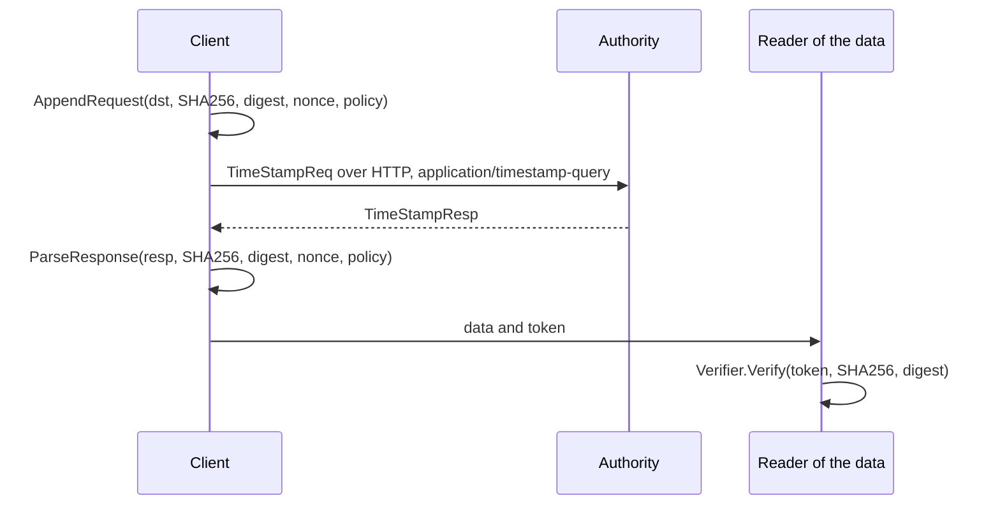

# RFC-0048: RFC 3161 Time-Stamp Tokens

## Summary

We propose three packages for the Time-Stamp Protocol of RFC 3161:

- `crypto/tsp` encodes a time-stamp request, checks the response of an
  authority, and verifies a time-stamp token offline against the roots
  and the policies that the caller trusts.
- `coretest/tsptest` is a time-stamp authority for tests, with a
  certificate chain of its own, and builds the malformed and forged
  tokens that a verifier refuses.
- `internal/der` reads and writes DER without copying and without an
  allocation. `crypto/tsp` and `coretest/tsptest` build on it.

A `tsp.Verifier` checks a token in the steps of RFC 3161 section 2.2 and
RFC 5652 section 5.6. It verifies RSASSA-PKCS1-v1_5, RSASSA-PSS, ECDSA,
Ed25519 and the three ML-DSA parameter sets over SHA-256, SHA-384 and
SHA-512. It returns the token's TSTInfo as a `tsp.Info`, whose `Time` is
a `clock.UTCReading`: genTime with the token's accuracy as its error
bound. A token of a certificate that the Verifier verified before costs
no allocation for Ed25519 and ML-DSA.

## Motivation

### A time that a third party vouches for

Core stamps an event with a `clock.UTCReading`, a wall-clock time and the
bound of its error (`clock/utc.go`). A process can read such a time from
its own clock, and a `tlog/checkpoint` cosignature contains the time of
its witness. Neither proves the time to a party that trusts neither the
process nor the witness.

A time-stamp authority signs the digest of some data with the time of
its clock, under a policy that states the accuracy of that clock. The
resulting RFC 3161 token proves that the data existed before that time.
ETSI EN 319 422 profiles such tokens for the qualified electronic time
stamps of the EU regulation 910/2014. A transparency log that obtains a
token for each checkpoint gives every reader a time for the checkpoint
that the log cannot backdate.

### The verification is offline and frequent

A reader verifies a token whenever it relies on the token, long after
the authority issued it, without contacting the authority. A monitor of
a log verifies one token per checkpoint at the rate of the log's
checkpoints. Core gives such paths a form without allocations, as
`tlog`, `note` and `tlog/checkpoint` do.

Outside its certificates, a token of `coretest/tsptest` with a nonce
and a SigningCertificateV2 has 12 OBJECT IDENTIFIERs and 6 INTEGERs.
`encoding/asn1` decodes into structs through reflection, and allocates
a slice for each OBJECT IDENTIFIER and a `big.Int` for each INTEGER of
that type.

### Why core

- The protocol needs only the standard library. `crypto/x509` parses
  certificates and verifies chains. Go 1.27's `crypto/mldsa` verifies
  ML-DSA, which RFC 9882 specifies for CMS.
- The result is a `clock.UTCReading`, a `crypto.Digest` names the data,
  and the errors classify with `errs`.
- The Go packages that implement RFC 3161, such as
  `github.com/digitorus/timestamp`, depend on modules outside the
  standard library, which core does not import.

## Detailed design

### Components

| Component | Package | Responsibility |
|---|---|---|
| `Hash`, `SHA256`, `SHA384`, `SHA512` | `crypto/tsp` | The hash of a message imprint: its OID, its `crypto.Algorithm` and its size |
| `AppendRequest` | `crypto/tsp` | The DER of a TimeStampReq, appended to a buffer of the caller |
| `ParseResponse`, `StatusError` | `crypto/tsp` | The token of a TimeStampResp, or the status of a response that grants none |
| `Verifier`, `VerifierConfig`, `Policy` | `crypto/tsp` | The offline verification of a token |
| `Info`, `Info.Extension` | `crypto/tsp` | The verified TSTInfo |
| `Authority`, `Config`, `Spec` | `coretest/tsptest` | A time-stamp authority for tests, and tokens that deviate from RFC 3161 |
| `Reader`, `Builder`, the value decoders | `internal/der` | DER elements as slices of the input, and DER appended to a buffer |

`crypto/tsp` imports `cache`, `clock`, `clock/hlc`, `crypto`, `errs`,
`internal/der` and `pool` from core. `coretest/tsptest` imports `clock`,
`errs` and `internal/der`. `internal/der` imports only the standard
library.

The client in the following sequence sends the request with its own
HTTP client, as RFC 3161 section 3.4 describes, because the package has
no transport.



### Requests and responses

```go
package tsp

// Hash is the hash algorithm of a message imprint. This package keeps no
// table of hashes: a caller with another algorithm writes a Hash with its
// OID.
type Hash struct {
    Algorithm crypto.Algorithm
    OID       x509.OID
    Size      int
}

var SHA256, SHA384, SHA512 Hash

// AppendRequest appends the DER of a TimeStampReq of version 1 with the
// message imprint of imprint under h, policy unless it is the zero OID,
// nonce, and certReq TRUE. It returns ErrHash for a Hash without an OID
// or an imprint of another size than h.Size.
func AppendRequest(dst []byte, h Hash, imprint crypto.Digest, nonce uint64, policy x509.OID) ([]byte, error)

// ParseResponse returns the TimeStampToken of resp, a slice of resp,
// once the status grants a token and the token's TSTInfo repeats the
// imprint, the nonce, and the policy unless it is the zero OID. It does
// not verify the signature or the certificate.
func ParseResponse(resp []byte, h Hash, imprint crypto.Digest, nonce uint64, policy x509.OID) ([]byte, error)

// StatusError is the error of a response that grants no token.
type StatusError struct {
    Text     string // the statusString, its texts joined by "; "
    Status   int    // the PKIStatus
    FailInfo uint32 // bit n is the failure bit n of PKIFailureInfo
}

func (e *StatusError) Error() string
func (e *StatusError) Class() errs.Class
```

`StatusError.Class` classifies the status for a caller that retries:

| Status | Class |
|---|---|
| waiting, or a rejection with timeNotAvailable or systemFailure | Transient |
| any other rejection | Invalid |
| revocationWarning, revocationNotification | Denied |
| a status that RFC 3161 does not define | Unspecified |

### Verification

```go
package tsp

// Policy is a policy that a Verifier accepts, with the accuracy of its
// tokens that state none. RFC 3161 section 2.4.2 lets a policy state the
// accuracy in place of the token.
type Policy struct {
    ID       x509.OID
    Accuracy time.Duration // positive
}

type VerifierConfig struct {
    Roots         *x509.CertPool // required
    Intermediates *x509.CertPool // optional
    // Check is called with the Info and the chain of each token that
    // verifies, and its error fails the verification.
    Check    func(info Info, chain []*x509.Certificate) error
    Policies []Policy // at least one, no two of one ID
}

func NewVerifier(cfg VerifierConfig) (*Verifier, error)

// Verify verifies token for imprint, a digest of h, and returns its
// TSTInfo. The Info refers to token.
func (v *Verifier) Verify(token []byte, h Hash, imprint crypto.Digest) (Info, error)

type Info struct {
    Time     clock.UTCReading // genTime, with the accuracy as MaxError
    Serial   []byte           // the content of serialNumber
    Nonce    []byte           // nil when the token has none
    TSA      []byte           // the DER of the tsa GeneralName, or nil
    Policy   Policy           // the Verifier's Policy of the token
    Ordering bool
}

// Extension returns the extnValue of the token's extension id.
func (i Info) Extension(id x509.OID) (value []byte, critical, ok bool)
```

Verify checks a token in this order, and stops at the first failure:

1. The token is a ContentInfo of SignedData whose encapsulated content
   is a TSTInfo, with one SignerInfo that has signed attributes.
2. The message imprint has the Hash's OID and the caller's digest. The
   policy is one of the Verifier's.
3. The digest algorithm and the signature algorithm are ones that the
   next section lists.
4. The content-type attribute is id-ct-TSTInfo, and the message-digest
   attribute is the digest of the TSTInfo.
5. The SigningCertificateV2 attribute, or the SigningCertificate
   attribute, names a certificate of the token. When the token has both,
   each names it.
6. The certificate has one critical extended key usage,
   id-kp-timeStamping, and a chain to the Roots that is valid at
   genTime, through the Intermediates and the token's other
   certificates. Every certificate of the chain that has an extended key
   usage lists id-kp-timeStamping or anyExtendedKeyUsage, as
   `crypto/x509` requires of a chain for a usage.
7. The signer identifier identifies the certificate, by its issuer and
   serial number or by its subject key identifier. Each issuerSerial of
   the signing-certificate attributes identifies it too.
8. The signature over the signed attributes, with the tag of a SET,
   verifies under the certificate's key.
9. A tsa field is a name of the certificate: a directoryName whose Name
   is the DER of its subject, or a GeneralName of its subjectAltName
   extension with the same DER.
10. Check accepts the token.

The Verifier keeps the verified chains of 64 certificates in a
`cache.Cache`, by the SHA-256 of the certificate. A token of a known
certificate whose genTime is within the validity of every certificate of
its chain skips step 6. A token outside that validity verifies its chain
again. `VerifierConfig` has no option for the number of cached chains.
A caller loses the cache only when it cycles through the tokens of more
than 64 authority certificates. It then verifies a chain for most
tokens.

The Verifier does not check revocation. Under RFC 3161 section 4, a
token issued before the revocation of its authority's certificate
remains valid for some reasons of revocation. The caller's Check
decides, from the chain and genTime. Check also reads what core cannot
know, such as the status of an authority in a trusted list, or the
qcStatements extension of a qualified time stamp through
`Info.Extension`.

### The names and usages of the authority

RFC 3161 identifies the authority by the signing-certificate attribute
and calls the tsa field a hint. A present tsa field must still
correspond to a subject name of the certificate that verifies the token.
`openssl ts -verify` refuses a token whose tsa field is another name.
Verify refuses such a token with `ErrSignature`. A non-nil `Info.TSA` is
then always a name of the certificate that signed the token.

Verify compares names by their DER. It compares the issuer of a signer
identifier the same way, and `crypto/x509` matches an issuer with the
subject of its parent by the DER too. OpenSSL compares a directoryName in
a canonical form that ignores the case of ASCII letters, extra spaces and
the string type. A token whose tsa field encodes the authority's name in
another form than the certificate fails Verify and passes OpenSSL. The
test responses of `github.com/digitorus/timestamp` contain four tokens of
two GlobalSign authorities from 2017. In each token, the tsa field is the
DER of the certificate's subject. That package writes the field from the
same DER.

`crypto/x509` accepts a chain for a usage only when every certificate of
the chain with an extended key usage lists that usage or
anyExtendedKeyUsage. RFC 3161 and RFC 5280 constrain only the authority's
certificate. OpenSSL requires of each certificate above it only that it
is a CA. In the same test responses, the intermediate of GlobalSign's
authority for Adobe CDS lists only Adobe's usage 1.2.840.113583.1.1.5.
Verify refuses the tokens of that chain with `ErrCertificate`. Verify
still applies the check of `crypto/x509`. With that check, a Verifier
whose root also issues intermediates for other purposes refuses an
authority certificate under such an intermediate. A caller that must
accept an authority with a chain like Adobe's needs the check of OpenSSL
instead. Step 6 already checks the usage of the authority's certificate
itself.

### Signature algorithms

| signatureAlgorithm | Scheme | Digest of the SignerInfo | Parameters |
|---|---|---|---|
| rsaEncryption | RSASSA-PKCS1-v1_5 | any of the three | absent or NULL |
| sha256WithRSAEncryption and its siblings | RSASSA-PKCS1-v1_5 | the algorithm's own | absent or NULL |
| id-RSASSA-PSS | RSASSA-PSS | the hash of the parameters | hash and MGF1 of the digest, salt of at most 64 octets, trailer 1 |
| ecdsa-with-SHA256 and its siblings | ECDSA | the algorithm's own | absent |
| id-Ed25519 | Ed25519 | SHA-512, RFC 8419 | absent |
| id-ml-dsa-44 | ML-DSA-44 | any of the three, RFC 9882 | absent |
| id-ml-dsa-65 | ML-DSA-65 | SHA-384 or SHA-512 | absent |
| id-ml-dsa-87 | ML-DSA-87 | SHA-512 | absent |

`x509.Certificate.CheckSignature` accepts SHA-1, and it does not
enforce the digests of RFC 8419 and RFC 9882. `crypto/tsp` calls
`crypto/rsa`, `crypto/ecdsa`, `crypto/ed25519` and `crypto/mldsa`
itself.

### Strictness

`crypto/tsp` reads DER and no other encoding: a tag in one octet, a
definite length in its shortest form, and the one encoding of each
value. A token in BER returns `ErrMalformed`. The ordering of a TSTInfo
and the critical flag of an extension, both DEFAULT FALSE, may state
FALSE, because authorities write them.

RFC 5652 lets an authority encode its SignedData in BER, which can split
the eContent OCTET STRING into segments. A reader of BER joins the
segments into a buffer before it hashes and parses the TSTInfo. That
buffer costs an allocation per token, so Verify does not read BER. The
GlobalSign tokens of the test responses are DER.

### FIPS 140-only mode

`crypto/sha1` panics in FIPS 140-only mode. A SigningCertificate
identifies a certificate by its SHA-1 digest. Under
`GODEBUG=fips140=only`, the Verifier does not check that identifier
beside a SigningCertificateV2, and returns `ErrUnsupported` for a token
that has only a SigningCertificate.

### Errors

| Error | Class | Cause |
|---|---|---|
| `ErrMalformed` | Integrity | A response or a token that is not the DER of its structure |
| `ErrImprint` | Integrity | Another hash or another digest than the caller's |
| `ErrNonce` | Integrity | A response without the request's nonce |
| `ErrPolicy` | Integrity | A policy that the Verifier does not accept, or another than the requested one |
| `ErrSignature` | Integrity | A signed attribute, a signer identifier, a signature or a tsa field that fails its check |
| `ErrCertificate` | Integrity | A certificate that the token lacks, or that fails its usage or chain check |
| `ErrUnsupported` | Unsupported | An algorithm that the package does not verify |
| `ErrHash` | Invalid | A Hash without an OID, or an imprint of another size |
| `ErrConfig` | Invalid | A VerifierConfig that NewVerifier refuses |
| `*StatusError` | by status | A response that grants no token |

### Allocation contract

Measured with Go 1.27.1 on an AMD Ryzen 9 9950X3D, `GOMAXPROCS=4`:

| Call | Time | Allocations |
|---|---|---|
| `AppendRequest` into a buffer of 167 octets | 38 ns | 0 |
| `ParseResponse` of a granted response | 250 ns | 0 |
| `Verify` of an Ed25519 token of a known certificate | 28.7 µs | 0 |
| `Verify` of an ML-DSA-65 token of a known certificate | 112 µs | 0 |
| `Verify` of an ECDSA P-256 token of a known certificate | | 9 |
| `Verify` of an RSASSA-PKCS1-v1_5 token of a known certificate | | 9 |
| `Verify` of an RSASSA-PSS token of a known certificate | | 13 |

The allocations of RSA and ECDSA are those of `crypto/rsa` and
`crypto/ecdsa`, which convert the public key and allocate their big
numbers on each verification. A memory profile attributes none of them
to `crypto/tsp`. The benchmarks of `crypto/tsp` check each count as a
ceiling.

### DER

```go
package der

type Tag uint8

const (
    TagBoolean         Tag = 0x01
    TagInteger         Tag = 0x02
    TagBitString       Tag = 0x03
    TagOctetString     Tag = 0x04
    TagNull            Tag = 0x05
    TagOID             Tag = 0x06
    TagUTF8String      Tag = 0x0c
    TagGeneralizedTime Tag = 0x18
    TagSequence        Tag = 0x30
    TagSet             Tag = 0x31
)

func Context(n uint8) Tag            // [n] IMPLICIT over a primitive type
func ContextConstructed(n uint8) Tag // [n] EXPLICIT, or IMPLICIT over a constructed type

// Reader reads the elements of a slice in sequence, and returns slices
// of the input.
type Reader struct{ /* the unread input */ }

func NewReader(b []byte) Reader
func (r *Reader) Empty() bool
func (r *Reader) Next() (tag Tag, element, content []byte, ok bool)
func (r *Reader) Read(tag Tag) (content []byte, ok bool)
func (r *Reader) ReadElement(tag Tag) (element, content []byte, ok bool)
func (r *Reader) Optional(tag Tag) (content []byte, present, ok bool)

// Builder appends elements to a slice. Close writes the length of an
// element that Open started, so the caller computes no length.
type Builder struct{ /* the slice */ }

func NewBuilder(dst []byte) Builder
func (b *Builder) Bytes() []byte
func (b *Builder) Add(tag Tag, content []byte)
func (b *Builder) AddElement(element []byte)
func (b *Builder) AddUint64(v uint64)
func (b *Builder) AddBoolean(v bool)
func (b *Builder) AddGeneralizedTime(t time.Time)
func (b *Builder) Open(tag Tag) int
func (b *Builder) Close(at int)

func Integer(content []byte) bool
func Uint64(content []byte) (uint64, bool)
func Boolean(content []byte) (value, ok bool)
func ObjectIdentifier(content []byte) bool
func BitString(content []byte) (bits []byte, unused int, ok bool)
func Bit(bits []byte, n int) bool
func GeneralizedTime(content []byte) (time.Time, bool)
```

The package is internal, so its API can change with its two users.

### A test authority

```go
package tsptest

type Config struct {
    Clock      clock.Clock
    Policy     x509.OID
    Extensions []pkix.Extension
    Accuracy   time.Duration
    Validity   time.Duration
    Key        Key    // Ed25519, ECDSA P-256 or P-384, RSA PKCS #1 or PSS, ML-DSA-44, -65 or -87
    Digest     Digest // SHA-256, SHA-384 or SHA-512
    ESS        ESS    // SigningCertificateV2, SigningCertificate, both, or neither
    Usage      Usage  // the extended key usage of the authority's certificate
    IssuerSerial, SubjectKeyID, Ordering, TSA bool
}

func New(cfg Config) (*Authority, error)

func (a *Authority) Roots() *x509.CertPool
func (a *Authority) Leaf() *x509.Certificate
func (a *Authority) Intermediate() *x509.Certificate
func (a *Authority) Respond(req []byte) ([]byte, error)
func (a *Authority) TSTInfo(req []byte) ([]byte, error)
func (a *Authority) Token(s Spec) ([]byte, error)
func (a *Authority) Attributes(tstInfo []byte) [][]byte

// Spec replaces the parts of a token that the Authority writes: the
// content type, the signed attributes, the algorithms, the signer
// identifier, the signature, the certificates, and further SignerInfos.
type Spec struct{ /* the replaced parts */ }

func Attribute(typ []byte, values ...[]byte) []byte
func StatusResponse(status int, failBits []int, texts ...string) []byte
```

The tests of `crypto/tsp` build each malformed and forged token of the
verification steps with a `Spec`. A test of a client serves `Respond`
with `net/http/httptest`, or calls it directly.

## Alternatives considered

### A. `encoding/asn1` for the TSTInfo and the SignedData

Decode each structure into a Go struct with `asn1.Unmarshal`, as
`crypto/x509` does for certificates.

**Why not:** reflection allocates a slice per OBJECT IDENTIFIER and a
`big.Int` per INTEGER of that type, on every token. A verification that
allocates per token loads the garbage collector of a monitor in
proportion to the checkpoints that it follows. `crypto/tsp` still uses
`crypto/x509` for certificates and chains, and the Verifier keeps those
results in its cache.

### B. `golang.org/x/crypto/cryptobyte`

`cryptobyte.String` reads DER without copying, as `internal/der` does,
and the standard library vendors it.

**Why not:** `golang.org/x/crypto` v0.57.0 requires `golang.org/x/net`,
`golang.org/x/sys` and `golang.org/x/term`, and core admits only the
`golang.org/x` modules without requirements. The vendored
copy is internal to the standard library. `internal/der` is 628 lines
with its documentation, for the subset of DER that the two packages read
and write.

### C. A CMS package

Implement CMS SignedData as a package of its own, and RFC 3161 on top,
so a CAdES signature could share the CMS layer.

**Why not:** a time-stamp token constrains CMS to one SignerInfo with
signed attributes and an encapsulated TSTInfo. A general CMS package
needs detached content, more than one signer, unsigned attributes and
countersignatures. No package of core verifies another CMS profile.
`crypto/tsp` keeps its CMS reader unexported, so a CMS package can take
it over without an API change.

### D. A client with HTTP in core

Send the request and read the response in `crypto/tsp`.

**Why not:** a caller chooses the HTTP client, its retries and its
timeouts, and core does not perform the I/O for it. The caller passes
the bytes of the response to `ParseResponse`.

### E. `github.com/digitorus/timestamp`

The package that `github.com/sigstore/timestamp-authority` v2.1.3
requires.

**Why not:** its version of 14 September 2026 requires
`github.com/digitorus/pkcs7`, a module outside the standard library.

## Drawbacks

- `crypto/tsp` adds 2,547 lines of source and 3,981 lines of tests,
  `coretest/tsptest` 1,407 and 708, and `internal/der` 628 and 850.
- The module has two DER decoders: `encoding/asn1` inside `crypto/x509`,
  and `internal/der`.
- An authority that encodes its SignedData in BER, which RFC 5652 allows,
  issues tokens that `Verify` refuses with `ErrMalformed`.
- The Verifier checks no revocation. A caller that needs it writes a
  Check.
- A verification of RSA or ECDSA allocates 9 to 17 times, in the
  standard library.
- The cache of chains takes 64 entries of a chain each, whatever the
  number of authorities that a caller trusts.
- Verify refuses a token whose tsa field names the authority in another
  encoding than its certificate, and a chain whose intermediate lists an
  extended key usage without id-kp-timeStamping. OpenSSL accepts both.

## Open questions

None.

## Unresolved / future work

- This proposal has no CMS package and no CAdES signature.
- This proposal has no transport for the Time-Stamp Protocol.

## References

- RFC 3161, Internet X.509 Public Key Infrastructure Time-Stamp Protocol
  (TSP), sections 2.2, 2.3, 2.4, 3.4 and 4.
- RFC 5652, Cryptographic Message Syntax (CMS), sections 5 and 11.
- RFC 5035 and RFC 5816, the ESS signing-certificate attributes.
- RFC 4055, RSASSA-PSS parameters. RFC 5754, SHA-2 in CMS. RFC 5758,
  ECDSA in CMS.
- RFC 8419, EdDSA in CMS. RFC 9882, ML-DSA in CMS.
- ETSI EN 319 422, time-stamping protocol and time-stamp token profiles.
- `github.com/digitorus/timestamp`, a Go implementation of RFC 3161,
  whose tests contain responses of GlobalSign authorities from 2017.
- OpenSSL, `apps/ts.c` and `crypto/ts/ts_rsp_verify.c`, the verification
  of `openssl ts -verify`.
