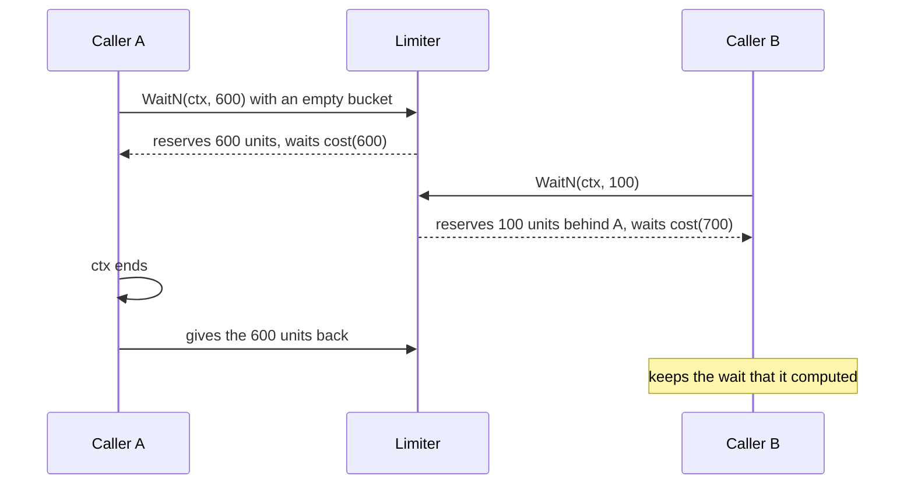

<!--
  ~ Copyright ThesmOS B.V. 2026
  ~ SPDX-License-Identifier: Apache-2.0
-->

# RFC-0050: Rate Limiter

## Summary

We propose `resilience.Limiter`, a token bucket that admits units of
work at a rate per second up to a burst, such as the bytes that
background jobs read and write. `AllowN` takes units when the bucket
has them, and `WaitN` reserves units and waits on a timer of the
caller's `clock.Clock` until the bucket has gained them. A rate of zero
admits every call.

The Limiter keeps the bucket as the generic cell rate algorithm does,
as one time in int64 nanoseconds, so it has no floating point and no
rounding that admits more than the rate. `AllowN` takes 24 ns and
allocates nothing. A call of `WaitN` that waits allocates only its
timer.

## Motivation

### Core bounds calls, not rates

`resilience` bounds the calls to a dependency with these mechanisms:

- `Breaker` stops the calls to a dependency that keeps failing.
- `Bulkhead` bounds the calls in flight.
- `Retrier` bounds the retries.

None of them bounds a rate. A background job that reads and writes as
fast as its dependency allows takes the bandwidth of the requests that a
caller serves meanwhile, and a bound on its concurrency does not limit
its bytes per second.

### Time through `clock.Clock`

Every mechanism of `resilience` reads time through `clock.Clock`, so a
test drives it with core's fake clock, and the open interval of a
breaker takes no wall-clock time. `golang.org/x/time/rate` reads
`time.Now` and waits on `time.NewTimer` inside `Limiter.WaitN`, so a
fake clock cannot control its waits. A limiter over `clock.Clock` lets a
test of a job assert how long the job takes at a rate, in virtual time.

## Detailed design

### API

```go
package resilience

// LimiterConfig configures a Limiter. Clock and Rate are required, and
// Burst is required when Rate is positive.
type LimiterConfig struct {
    Clock clock.Clock
    Rate  int64 // units per second, and zero means no limit
    Burst int64 // 1 to 4,611,686,018 when Rate is positive
}

// NewLimiter returns a Limiter with a full bucket, or ErrConfig for a nil
// Clock, a negative Rate, or a Burst out of range.
func NewLimiter(cfg LimiterConfig) (*Limiter, error)

// AllowN takes n units when the bucket has them, and reports whether it
// took them. It never waits.
func (l *Limiter) AllowN(n int64) bool

// WaitN takes n units, and waits until the bucket has gained them. It
// returns ErrUnits for a negative n or an n above Burst, and the error
// of ctx when ctx ends first.
func (l *Limiter) WaitN(ctx context.Context, n int64) error
```

The zero Limiter has a Rate of zero and admits every call.

A Limiter keeps the Rate and the Burst of its construction. `AllowN` and
`WaitN` read both without the lock, and `due` measures the units owed at
one rate, so a change of rate needs a rule for the units that waiting
calls reserved at the old one. A caller that changes its rate builds a
new Limiter, and the calls that wait on the old one finish at the old
rate.

### The bucket as one time

The Limiter stores `due`: the time at which the bucket would be empty
once it paid every unit taken so far. The generic cell rate algorithm of
ATM networks calls it the theoretical arrival time. The bucket is full
while `due` is at or before the current time, and `fill` is the time in
which an empty bucket gains Burst units:

- A call of n units costs `cost(n) = ceil(n * 1e9 / Rate)` nanoseconds.
- `AllowN` moves `due` to `max(due, now) + cost(n)`, and takes the units
  when the new `due` is at most `fill` after now.
- `WaitN` moves `due` the same way and waits `due - fill - now`, the time
  until the bucket has gained what the call lacks.

Each cost rounds up to a whole nanosecond, so the Limiter never admits
more than Rate units per second. Over many calls it admits a few
nanoseconds' worth fewer. A Burst of at most 4,611,686,018 keeps
`n * 1e9` within an int64 for every n that a call can take, and `due`
saturates at the largest `time.Duration` instead of wrapping.



### Reservations

A call of `WaitN` reserves its units when it starts, and the bucket owes
them to the call while it waits. Calls that wait together take their
units in the order in which they started, so a later call does not take
units ahead of an earlier one. A call whose context ends while it waits
gives its reservation back by moving `due` back by its cost. A call that
reserved after it keeps the wait that it computed, which is longer than
it needs to be.

`AllowN` reports false while the reservations of waiting calls exceed
what the bucket gained, so a caller that polls does not take units ahead
of the calls that wait.

A call of `WaitN` whose wait ends after the deadline of ctx waits until
the deadline passes and returns the context's error.
`golang.org/x/time/rate` refuses such a call at once. A deadline is a
time of the wall clock. The Limiter measures its waits with its Clock,
which a test replaces with core's fake clock. A comparison of the two
would refuse or wait depending on whether the Clock follows the wall
clock.

### Time

The Limiter measures time as the duration since its construction, read
from `clock.Clock.Time`. When the clock moves back, the bucket does not
gain units until the clock passes the last time that the Limiter read
again. One mutex guards `due`. A call locks it only to read the clock
and to move `due`, and never while it waits.

### Errors

| Error | Class | Cause |
|---|---|---|
| `ErrConfig` | Invalid | A nil Clock, a negative Rate, or a positive Rate with a Burst out of range |
| `ErrUnits` | Invalid | A negative n, or an n above Burst, in `WaitN` |
| the error of ctx, unwrapped | as the context | A context that ended before or during the wait |

`AllowN` reports false for an n that `WaitN` refuses.

### Allocation contract and cost

Measured with Go 1.27.1 on an AMD Ryzen 9 9950X3D, `GOMAXPROCS=4`:

| Call | Time | Allocations |
|---|---|---|
| `AllowN` | 24 ns | 0 |
| `WaitN` that does not wait | 37 ns | 0 |
| `WaitN` that waits | the wait | 1, the timer of `clock.Clock.NewTimer` |

## Alternatives considered

### A. `golang.org/x/time/rate`

The token bucket of the Go team, with `Allow`, `Reserve` and `Wait`.
The module has no requirements, so core could import it.

**Why not:** `WaitN` reads `time.Now` and waits on `time.NewTimer`, so a
test with core's fake clock cannot control a wait. Its bucket counts
tokens as `float64`. Wrapping it in a type that reads `clock.Clock`
would reimplement `WaitN`, which is most of the package.

### B. A leaky bucket that a goroutine drains

A buffered channel that a ticker drains at the rate, and a caller that
sends one value per unit.

**Why not:** it costs a goroutine and a ticker per limiter, and a
channel operation per unit. A call of a million bytes would send a
million values. It has no burst apart from the channel's capacity.

### C. A sliding window of past calls

Keep the times of the calls of the last second, and admit a call when
the window has room.

**Why not:** the memory grows with the rate, and a window admits a
burst at each of its edges.

### D. `Bulkhead`

Bound the calls in flight instead of their rate.

**Why not:** a bound on concurrency does not bound the bytes per second
of one fast job.

## Drawbacks

- `resilience` gains 292 lines of source and 548 lines of tests.
- A call that waits allocates a timer. `golang.org/x/time/rate`
  allocates one too.
- A waiting call keeps its reservation until its timer ends. A caller
  that cancels many waits leaves later calls with waits that are longer
  than they need to be.
- `WaitN` does not refuse a wait that would end after the deadline of
  ctx at its start, which `golang.org/x/time/rate` does. Such a call
  reserves units and returns the context's error when the deadline
  passes.

## Open questions

None.

## Unresolved / future work

- This proposal has no limiter per key, such as one bucket per client.
  A caller keeps a Limiter per key in a `cache.Cache`.

## References

- The ATM Forum, Traffic Management Specification 4.0, the generic cell
  rate algorithm.
- `golang.org/x/time/rate` v0.16.0, `Limiter.WaitN`.
