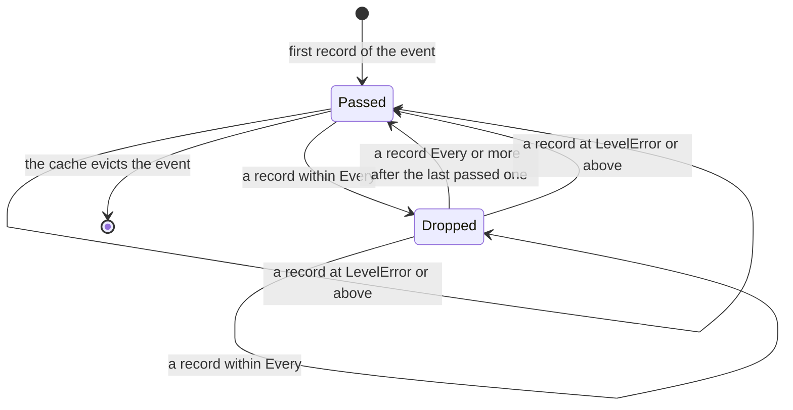

<!--
  ~ Copyright ThesmOS B.V. 2026
  ~ SPDX-License-Identifier: Apache-2.0
-->

# RFC-0051: Bounded Telemetry on Hot Paths

## Summary

We propose three types in `telemetry` that bound what a hot path costs
for its metrics and its logs:

- `ShardedCounter` spreads the adds to a `Counter` over cells of 128
  bytes, one per goroutine of the caller's choice, and adds their sum to
  the Counter once per export interval. With four goroutines, an add
  takes 0.88 ns, against 5.3 ns on one shared atomic counter.
- `BoundedHistogram` records every value of a failed call, and one value
  in N of the calls that succeeded. N is the smallest power of two that
  keeps the recorded successes at or below a rate per second, and each
  Flush recomputes it from the rate that it measured.
- `RateLimitHandler` is a `slog.Handler` that passes one record per
  interval of each message and subject value, passes every record at
  `slog.LevelError` and above, and counts the records that it drops. It
  remembers a bounded number of events in a `cache.Cache`.

Their hot paths allocate nothing.

## Motivation

### Contention costs more than the add

`Counter.Add` allocates nothing on any implementation of core, but every
add to one counter writes one cache line. Goroutines on different cores
that add to one counter move that line between their cores at each add.
On an AMD Ryzen 9 9950X3D with `GOMAXPROCS=4`, four goroutines that add
to one `atomic.Int64` take 5.3 ns per add, and one goroutine alone takes
4.6 ns. A Counter of an exporter adds the cost of its own atomic or its
own lock to that line.

### A histogram at the rate of the calls

A histogram that records the latency of every call of a hot path costs
one record per call, at the rate of the calls. Its percentiles need far
fewer values than that rate supplies. A failed call is rare and each
one matters, so a histogram that samples must not sample failures.

### Logs at the rate of the events

A hot path that logs an event about each request, such as a slow
dependency, logs one line per request while the condition lasts. The
lines repeat one message and one subject, and they cost the I/O of the
handler. Every error must still be logged.

### Why core

- `telemetry` defines the instruments and states their allocation rules.
  Contention and rate are part of the same cost, and every caller with a
  hot path faces them.
- `BoundedHistogram` and `RateLimitHandler` read time through
  `clock.Clock`, so core's fake clock controls them in tests.
- `log/slog` is the logging interface of core, and a limit on records is
  a handler.

## Detailed design

### Sharded counters

```go
package telemetry

// NewShardedCounter returns a ShardedCounter of c with cells cells,
// rounded up to a power of two. It returns ErrConfig for a nil c and for
// cells below 1 or above 65536.
func NewShardedCounter(c Counter, cells int) (*ShardedCounter, error)

// Cells returns the number of cells.
func (s *ShardedCounter) Cells() int

// Add adds n to cell i modulo the number of cells. A negative n adds
// nothing. Add takes no lock.
func (s *ShardedCounter) Add(i int, n int64)

// Flush adds the sum of the cells since the previous Flush to the
// Counter with ctx, and does not call the Counter when the sum has not
// changed.
func (s *ShardedCounter) Flush(ctx context.Context)
```

Each cell is an `atomic.Int64` padded to 128 bytes. The spatial
prefetcher of x86-64 fetches cache lines of 64 bytes in pairs, so cells
of 128 bytes do not share a pair. crossbeam-utils pads its `CachePadded`
to 128 bytes on x86-64, aarch64 and powerpc64 for the same reason. The
caller chooses the cell of each add, such as the index of a worker, and
the cells' count is a power of two so that Add selects its cell with a
mask. A negative index wraps to a cell, so Add does not panic.

Flush sums the cells under a mutex and calls `Counter.Add` with the
change since the previous Flush, after it releases the mutex. A cell's
sum wraps past 2^63-1, and Flush computes the change modulo 2^64, so
the change is right while one interval adds less than 2^63. A caller
flushes once per export interval and at shutdown.

### Rate-bounded histograms

```go
package telemetry

// Outcome is the outcome of the call whose value a BoundedHistogram
// records.
type Outcome uint8

const (
    OutcomeSuccess Outcome = 0 // the zero Outcome
    OutcomeFailure Outcome = 1
)

func (o Outcome) Valid() bool

// NewBoundedHistogram returns a BoundedHistogram of h that records about
// perSecond values of successful calls per second at most, and reads the
// time of each Flush from c. It returns ErrConfig for a nil h or c and
// for a perSecond below 1.
func NewBoundedHistogram(h Histogram, perSecond int, c clock.Clock) (*BoundedHistogram, error)

// Record records v when o is not OutcomeSuccess, and the value of every
// Nth call of OutcomeSuccess.
func (b *BoundedHistogram) Record(ctx context.Context, v float64, o Outcome)

// Flush recomputes N from the rate of the successful calls since the
// previous Flush, and returns it.
func (b *BoundedHistogram) Flush() uint64
```

`Record` counts the successful calls in one `atomic.Uint64` and records
a call whose count is a multiple of N. N is 1 until the first Flush.
`Flush` divides the successful calls since the previous Flush by the
seconds between the two flushes and by the configured rate. N is the
smallest power of two at or above that ratio, at most 2^63. A Flush on a
clock that has not advanced keeps N. An Outcome that is not valid counts
as a failure, so `Record` does not drop a value of a call that did not
succeed.

`Record` takes the arguments of `Histogram.Record` and an Outcome, and
no cell, so a caller replaces a Histogram with a BoundedHistogram without
choosing cells. The callers then share the cache line of the count of
successes. An add to one atomic counter took 5.3 ns with four
goroutines, 0.7 ns more than with one goroutine alone.

The histogram's distribution of successful values is a sample, and its
count is the number of recorded values. A caller that needs the number of
calls counts them with a `ShardedCounter`, and reports N beside the
histogram, so a reader can scale the sample.

### Rate-limited log records

```go
package telemetry

type RateLimitConfig struct {
    Clock      clock.Clock   // the time of each record
    Suppressed Counter       // counts each dropped record
    Subject    string        // the key of the attribute that tells events apart
    Every      time.Duration // the interval of one record per event
    Keys       int           // the events that the handler remembers
}

// NewRateLimitHandler returns a RateLimitHandler that passes the records
// that it does not drop to next. It returns ErrConfig for a nil next,
// Clock or Suppressed, an Every that is not positive, and Keys below 1.
func NewRateLimitHandler(next slog.Handler, cfg RateLimitConfig) (*RateLimitHandler, error)

func (h *RateLimitHandler) Enabled(ctx context.Context, level slog.Level) bool
func (h *RateLimitHandler) Handle(ctx context.Context, r slog.Record) error
func (h *RateLimitHandler) WithAttrs(attrs []slog.Attr) slog.Handler
func (h *RateLimitHandler) WithGroup(name string) slog.Handler
```

An event is a message and the value of the Subject attribute. The
handler keys an event by a 64-bit hash of both, with a seed of
`hash/maphash`, so two events whose hashes collide share one interval,
with a probability of about one in 2^64 per pair. The handler stores the
time of the last passed record of each event in a `cache.Cache` of Keys
entries. A record passes when its level is `slog.LevelError` or above,
when the handler does not remember its event, or when its event's last
passed record is at least Every old. For every other record, `Handle`
adds 1 to Suppressed and returns nil.

A passed record does not carry the number of records of its event that
the handler dropped. Suppressed counts the dropped records of every
event. A count per event would add an atomic add to the entry of the
event on each drop, and an attribute to the next passed record. Copies of
a `slog.Record` share their attributes beyond the first five, so a
handler clones the record before it adds one, and the attribute allocates
for a record of five attributes or more.



The Subject value is that of the first attribute of the Subject key
outside every group: from a `WithAttrs` call before any `WithGroup`, or
else from the record, when the handler has no group. `WithAttrs` and
`WithGroup` return handlers that share the events of their parent. A
string, an int64 or a uint64 Subject value hashes without an allocation.
Another kind hashes its string form, which allocates.

When records of an event that the handler does not remember arrive at
once, more than one of them may pass. A clock that steps backward delays
an event's records until the clock passes the time of its last passed
record again.

### Errors

`ErrConfig`, classified Invalid, reports an argument that a constructor
refuses. No method that emits returns an error, apart from the error of
the handler that a `RateLimitHandler` wraps, which `Handle` returns as
it is.

### Allocation contract and cost

Measured with Go 1.27.1 on an AMD Ryzen 9 9950X3D, `GOMAXPROCS=4`, with
the instruments of `telemetry/noop` and `slog.DiscardHandler`:

| Call | Time | Allocations |
|---|---|---|
| `ShardedCounter.Add`, one goroutine | 4.0 ns | 0 |
| `ShardedCounter.Add`, four goroutines on their own cells | 0.88 ns per add | 0 |
| `atomic.Int64.Add`, four goroutines on one counter | 5.3 ns per add | 0 |
| `ShardedCounter.Flush` of 64 cells | 27 ns | 0 |
| `BoundedHistogram.Record` of a success that it skips | 4.7 ns | 0 |
| `BoundedHistogram.Record` of a failure | 2.4 ns | 0 |
| `BoundedHistogram.Flush` | 42 ns | 0 |
| `RateLimitHandler.Handle` of a dropped record | 40 ns | 0 |
| `RateLimitHandler.Handle` of a record at `slog.LevelError` | 7.3 ns | 0 |

`NewShardedCounter` allocates its cells, 128 bytes each. The first
passed record of an event allocates its entry in the cache.

## Alternatives considered

### A. Sharding inside each Counter of an exporter

Each implementation of `Counter` spreads its own adds over cells.

**Why not:** every exporter would repeat the cells, and core's
allocation and contention rules would apply only to the exporters that
implement them. An exporter also cannot know which goroutine adds, so it
would hash something per call to choose a cell.

### B. Cells chosen by the runtime

Choose the cell of an add by the processor of the goroutine, as the
runtime's per-P caches do.

**Why not:** the standard library does not expose the index of the
current P. A `sync.Pool` of cells approximates it, and costs a Get and a
Put per add.

### C. Random sampling of histogram values

Record a successful value with a probability of 1/N, drawn per call.

**Why not:** core reads randomness through `rand.Rand`. Its fast source
for sampling, `rand/pcg`, is not safe for concurrent use, and its
sources that are safe, `rand/crypto` and `rand/seeded`, cost a
cryptographic generator per random number. A count of the calls records exactly
one value in N.

### D. A `Logger` that rate-limits

A logging interface in core with a rate limit built in.

**Why not:** `log/slog.Handler` is core's logging interface, and every
logging backend implements it. A handler that wraps another composes
with them all.

### E. Rate limit by message alone

Key an event by its message, without a subject.

**Why not:** a message about one of many subjects, such as one slow
dependency of many, would hide the other subjects behind the first one
for the whole interval. An empty `Subject` keys by the message alone, for a
caller that wants that.

## Drawbacks

- `telemetry` gains 561 lines of source and 907 lines of tests, and
  imports `cache`, `clock` and `errs`, beside `log/slog`.
- A `ShardedCounter` of 64 cells takes 8 KiB.
- `BoundedHistogram.Record` adds to one atomic counter that every caller
  shares. Goroutines that record at once contend for it, as for any
  shared counter, which a `ShardedCounter` avoids.
- The sample of a `BoundedHistogram` has N recomputed once per Flush, so
  a burst within one interval records at N of the previous interval.
- Events whose 64-bit hashes collide share one interval.

## Open questions

None.

## Unresolved / future work

- This proposal has no sampled gauge.
- This proposal has no limit on the records of one event beyond one per
  interval, such as the first n records of a burst.

## References

- crossbeam-utils, `CachePadded`.
- Intel 64 and IA-32 Architectures Optimization Reference Manual, the
  spatial prefetcher.
- The ATM Forum, Traffic Management Specification 4.0.
