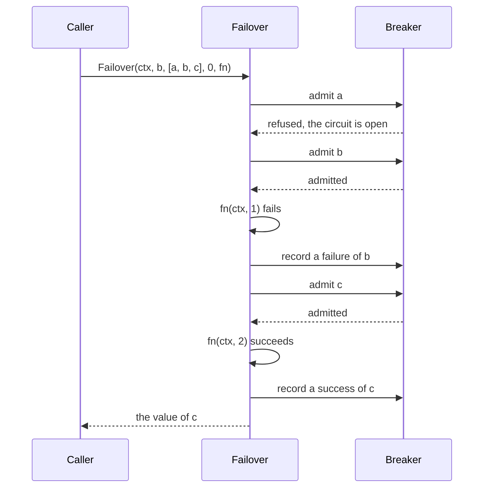

# RFC-0052: Failover Between Redundant Dependencies

## Summary

We propose `resilience.Failover`, which calls redundant dependencies of
one kind one after another until one succeeds. Each call runs under the
dependency's circuit of a `Breaker`. Failover skips a dependency whose
circuit refuses the call and records the outcome of each call that it
makes. When every dependency fails, its error contains the error of each.
The error classifies by the dependency nearest to a remedy, so a `Do`
around the failover retries while any dependency only timed out.

Failover runs each call as `Call` does. The proposal corrects two defects
of `Call` that a failover makes worse:

- `Call` recorded a success for a call whose context ended with an error.
  It now records no outcome. A half-open circuit then admits its next
  probe.
- A panic in the function of `Call` left a half-open circuit refusing
  every later call. `Call` now releases the probe and lets the panic
  continue.

## Motivation

### Redundant dependencies of one kind

A caller can depend on more than one service that does the same job:

- A deployment configures two or more time-stamp authorities, so a token
  comes from the first authority that issues one while another is down.
  A caller that rotates the authority it asks first also gets tokens from
  independent authorities, and a later token of one authority proves that
  an earlier token of another existed before that authority's key could
  have been compromised.
- RFC 5280 section 4.2.1.13 makes the names of one CRL distribution point
  alternative ways to obtain the same CRL, and the authority information
  access of a certificate can list more than one OCSP responder.

`Breaker` and `Call` guard one dependency. Each caller that chooses among
redundant dependencies writes the same loop over `Call`, and the loop has
four rules:

- Skip a dependency whose circuit refuses the call, without waiting for
  its timeout.
- Record each outcome in its dependency's circuit, and none for a call
  whose context has ended.
- Stop when the caller's context ends.
- Report the failure of every dependency when all fail.

A mistake in any of these rules shows only during an outage, when no test
runs.

### The outcome of an abandoned call

`Call` does not count an error as a failure when the caller's context has
ended, because the caller stopped waiting and the dependency did not fail.
It recorded a success instead, with two consequences:

- In a closed circuit, the success cleared the failure count. A
  dependency that hangs, whose callers all give up, never opened the
  circuit.
- In a half-open circuit, the success counted as the probe's. With a
  success threshold of one, a probe whose caller gave up closed the
  circuit, and the full load returned to a dependency that had not
  answered.

A panic in the function of `Call` recorded no outcome at all. A caller
that recovers from panics, such as an HTTP server, then left a half-open
circuit with its probe outstanding, and the circuit refused every later
call. A failover skips a target whose circuit refuses, so that target
would never be tried again.

### The class of a failed failover

`errors.Join` classifies under `errs.Classify` as the branch furthest
from a remedy, `errs.Retryable` reports true for a join only when every
branch is Transient, and `errs.RetryAfter` reports the longest delay
among the branches. For alternatives, each rule gives the wrong answer:

- One authority that a revocation denies, beside one that timed out,
  makes the join Denied, so a `Do` around the failover stops, although a
  later attempt can succeed through the second authority.
- An authority whose response sets a delay of an hour postpones a retry
  that another authority can serve after the backoff.

## Detailed design

### API

```go
package resilience

// Failover calls fn for one target after another, starting at
// targets[start % len(targets)] and wrapping around, until a call
// succeeds. fn receives the index of its target in targets. Each call
// runs under its target's circuit of b, as Call runs it.
//
// It returns the first success. When ctx ends during a call, it returns
// that call's error and calls no further target. When ctx has ended
// before a call, it returns context.Cause(ctx). When every target fails
// or refuses, it returns an error that contains the error of each
// target, ErrOpen for a refused one, in the order in which it tried
// them.
//
// An empty targets, a negative start, and a target named twice return
// ErrConfig, classified Invalid, and call no target.
func Failover[T any](
    ctx context.Context, b *Breaker, targets []string, start int,
    fn func(ctx context.Context, i int) (T, error),
) (T, error)
```

A caller rotates the first target by passing a counter as `start`:

```go
next := s.next.Add(1) - 1
token, err := resilience.Failover(ctx, s.breaker, s.names, int(next%uint64(len(s.names))),
    func(ctx context.Context, i int) ([]byte, error) {
        return s.authorities[i].Stamp(ctx, imprint)
    })
```

### A failover



Before its first call, Failover refuses a list of targets with a name in
it twice. Entries of one name would share one circuit, and Failover would
try that dependency twice.

### Outcomes of a call

`Call` and `Failover` record one of three outcomes of each call that a
circuit admits:

| Result of fn | Outcome | Effect on the circuit |
|---|---|---|
| An error whose class is in `TripOn` | Failure | Counts a failure, as before |
| An error after ctx has ended | None | Keeps the counts, and releases the probe of a half-open circuit |
| A panic | None | Keeps the counts, releases the probe, and the panic continues |
| Any other result | Success | Counts a success, as before |

A call whose function succeeds after its context ended records a
success. The dependency answered.

A circuit numbers the probes that it admits. `Call` keeps the number of
the probe that its admission claimed. To a half-open circuit, a late
outcome of a call admitted before the circuit opened looks like the
outcome of its probe, so a late success can end the probe. The call of
that earlier probe may still end without an outcome. Its number is not
the current probe's, so it cannot release the probe of another call. A
circuit that closes keeps its number. A probe of a later half-open
interval then cannot match a probe from before the circuit closed.

A caller of `Breaker.Allow` and `Breaker.Record`, which decides the
outcome itself, still records a success or a failure and has no third
outcome.

### The error of a failed failover

The error of a failover whose every target failed or refused contains the
error of each target, and `errors.Is` and `errors.As` find each of them.
Its message lists each target and its error in the order of the failover:

```text
resilience: every target failed: tsa-a: <error of a>; tsa-b: resilience: circuit open
```

The error classifies by the target nearest to a remedy:

| Errors of the targets | `errs.Classify` | `errs.RetryAfter` |
|---|---|---|
| At least one Transient, `ErrOpen` included | Transient | The shortest delay among the Transient errors, and none when one of them has none |
| None Transient | The class of their join | The longest delay among them |

The error has no `Unwrap` method. When the delay of an error is zero,
`errs.RetryAfter` reads the branches of its `Unwrap() []error`. It would
then report the delay of a target that is not the nearest to a remedy.
The error implements `Is` and `As` over the targets' errors instead. It
implements `Class` and `RetryAfter` for `errs`.

### Composing with a retry

A retry goes around a failover, so each attempt tries every target once:

```go
resilience.Do(ctx, retrier, func(ctx context.Context) (T, error) {
    return resilience.Failover(ctx, breaker, targets, start, fn)
})
```

`Do` retries while the failover's error is Transient, and waits the longer
of its backoff and the failover's delay: the shortest delay of a target
that can still succeed.

### Errors

| Result | Class | Cause |
|---|---|---|
| `ErrConfig` | Invalid | An empty list of targets, a negative start, or a target named twice |
| `context.Cause(ctx)` | as the context | A context that ended before a call |
| The error of the running call | that error's | A context that ended during a call |
| The error of a failed failover | the nearest remedy | Every target failed or refused |

### Allocation contract

Measured with Go 1.27.1 on an AMD Ryzen 9 9950X3D, `GOMAXPROCS=4`, over
three targets that have circuits:

| Call | Time | Allocations |
|---|---|---|
| `Call` that succeeds | 33 ns | 0 |
| `Failover` whose first target succeeds | 45 ns | 0 |
| `Failover` whose second target succeeds after the first fails | 82 ns | 0 |
| `Failover` whose every target fails with a Transient error | 183 ns | 2 |
| `Failover` whose every target fails without a Transient error | 236 ns | 5 |

Failover keeps the errors of up to eight failed targets on its stack, and
calls fn without keeping it, so the compiler can keep a closure of the
caller on the caller's stack. The error of a failed failover takes the
copy of the targets' errors and the error itself, and three more
allocations for the join that classifies it when no error is Transient.

## Alternatives considered

### A. A loop over `Call` in each caller

Each caller writes the loop of its own dependencies.

**Why not:** the loop is short, and each caller derives its four rules
again. A loop that counts an abandoned call as a failure, or that stops at
the first open circuit, fails only during an outage. Through `Call`, the
loop also inherits the success that `Call` recorded for an abandoned call.

### B. Hedged calls, or the first success of concurrent calls

Start the next dependency after a delay, as in "The Tail at Scale", or
call all of them at once and keep the first success, as `task.Quorum`
with a quorum of one does.

**Why not:** each call to a time-stamp authority obtains a token, and an
authority may charge for each token. Both approaches pay for two tokens on
every slow call, and a concurrent call loads every authority on every
token.

### C. A `Retrier` over a rotating target

Advance the target on each attempt of `Do`.

**Why not:** `Do` backs off between its attempts, which delays the switch
to a second dependency that responds. The retry budget also counts each
switch as a retry.

### D. `errors.Join` as the error of a failed failover

**Why not:** a join classifies by its branch furthest from a remedy, and
`Do` stops at the first dependency that a revocation denies while another
only timed out.

### E. A public release for callers of `Allow` and `Record`

Add `Breaker.Release(target)`, the third outcome for a caller that
decides the outcome itself.

**Why not:** `Allow` returns no probe number, so `Release` could not tell
the probe from a call admitted before the circuit opened, and would admit
a second probe while the first is outstanding. `Call` and `Failover` know
their probe, because each admits its own call. A caller of `Allow` that
must abandon calls is the case for a variant of `Allow` that returns the
probe number.

### F. A failure for an abandoned call

Count an error after the context ended as a failure.

**Why not:** when many callers cancel at once, the failures open the
circuit against a dependency that did not fail. The resulting `ErrOpen`
errors then report an outage that did not happen.

## Drawbacks

- `resilience` gains 253 lines of source in `failover.go` and 385 lines of
  its tests. `breaker.go` gains 120 lines and loses 29, and its tests gain
  245 lines.
- A failover tries its targets one at a time. A target that hangs delays
  the next one by its timeout, so a caller bounds each call with a
  deadline inside fn.
- Failover compares every pair of targets on each call to refuse a
  duplicate: three comparisons for three targets.
- The error of a failed failover has no `Unwrap` method. Code that walks
  an error tree through `Unwrap` sees one error, and `errors.Is` and
  `errors.As` still find each target's error.
- Each circuit keeps a probe number of 8 bytes.
- A caller of `Allow` and `Record` has no third outcome, and still records
  a success or a failure for a call that it abandons.

## Open questions

None.

## Unresolved / future work

- This proposal gives `ErrOpen` no delay. A `Do` around a failover whose
  circuits are all open backs off on its own schedule, not until the
  first circuit admits a probe.
- This proposal has no weights or priorities among the targets beyond
  their order and the start.

## References

- RFC 5280, sections 4.2.1.13 and 4.2.2.1: CRL distribution points and
  authority information access.
- RFC 3161, section 4: the validity of a token after the revocation of
  its authority's certificate.
- Jeffrey Dean and Luiz André Barroso, "The Tail at Scale",
  Communications of the ACM 56(2), 2013: hedged requests.
