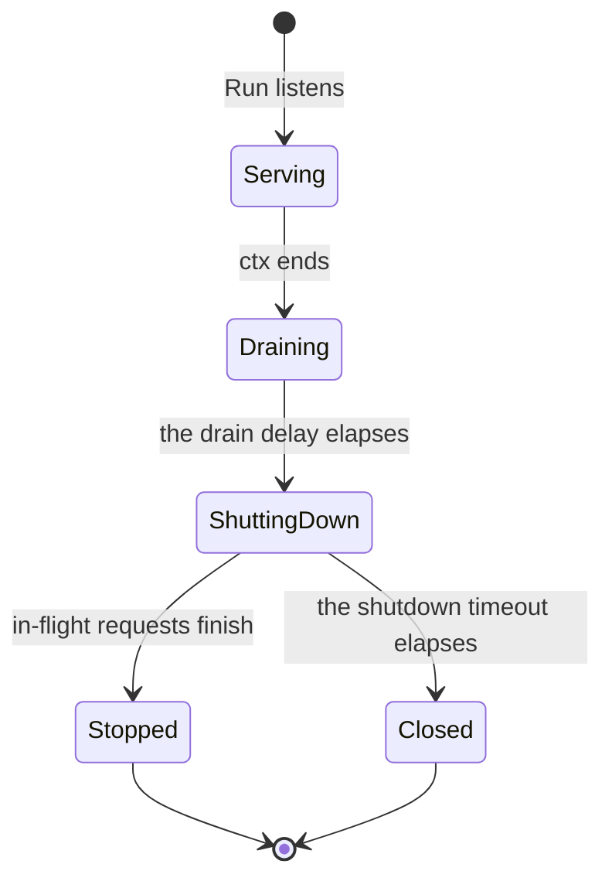

# RFC-0053: HTTP Servers and Clients

## Summary

We propose two packages built on `net/http` alone:

- `net/httpserver` serves HTTP. It limits every phase of a connection,
  drains gracefully, recovers from panics, refuses cross-origin requests
  from browsers, and records the telemetry of each request.
- `net/httpclient` calls one HTTP dependency. It bounds each attempt,
  checks every address that it connects to, retries and guards its calls
  with `resilience`, and classifies each response under `errs`.

Both take their settings as options, such as `WithWriteTimeout`. The
clock, the logger, the reporter and the propagator are required options,
because neither package reads a process-wide default. Each limit has a
default that protects the process. Hook options add a consumer's
behaviour, such as a middleware or the signing of each request, and a
consumer's own option can bundle several of core's.

`telemetry` gains a carrier over HTTP headers, and a span option that
starts a span as the child of a context extracted from another process.

## Motivation

### The zero values of `net/http`

`net/http` leaves most protections off until a caller sets them. In Go
1.27:

| Setting | Zero value | Effect |
|---|---|---|
| `Server.ReadHeaderTimeout`, `ReadTimeout`, `WriteTimeout` | No timeout | A client that sends its request slowly, or reads its response slowly, occupies a connection and a goroutine without end |
| `Server.IdleTimeout` | `ReadTimeout`, or no timeout | An idle keep-alive connection remains open |
| `Server.MaxHeaderBytes` | 1 MiB | Each connection can make the server read a megabyte of headers |
| Request bodies | No limit | A handler that reads a body reads as much as the client sends |
| `Client.Timeout` | No timeout | A call to a dependency that stops responding waits without end |
| `DefaultTransport.ResponseHeaderTimeout` | No timeout | The same, after the request was sent |
| `DefaultMaxIdleConnsPerHost` | 2 | A burst of concurrent calls opens connections that the pool then closes |
| `http.DefaultClient` | Shared | Every package of a process shares one client and its transport |

A handler that panics ends its connection, and the server logs the panic
to its `ErrorLog`, not to the process's logger.

### Each consumer hardens its own

Consumers of core build their own servers and clients. One consumer's
server sets the header timeout and leaves the other limits at their zero
values. Its client has its own circuit breaker and retry budget, and
counts a call that its caller cancelled as a failure of the dependency,
which core's breaker excludes. The clients of the protocols that core
implements, the time-stamp client of RFC 3161 and the witness client and
server of signed checkpoints, are outside core.

### Core has the mechanisms

`resilience.Breaker` separates `Allow` from `Record` for transports whose
failures arrive as a status code. `resilience.Do` waits for the delay
that `errs.RetryAfter` reports. `telemetry` defines the propagation of a
trace across a process boundary, and `telemetry/w3c` implements the W3C
`traceparent` header. No package of core connects them to HTTP, so each
consumer connects them again, or does not.

## Detailed design

### Packages

| Package | Contents |
|---|---|
| `net/httpserver` | `Server`, `Option` and its `With` functions, the chain of each request, `Annotate`, `Error`, and five sentinel errors |
| `net/httpclient` | `Client`, `Option` and its `With` functions, `Reach`, `StatusError`, and three sentinel errors |
| `net/internal/semconv` | The names of the OpenTelemetry semantic conventions for HTTP, and the bounded duration histogram that both packages record |
| `telemetry` | `HeaderCarrier`, `WithRemoteParent` and `RemoteParent`, beside the existing seams |

The packages import only the standard library and core.

### Options

Each package declares its option type over unexported settings:

```go
// Option configures a Server. New applies the options in order, so a
// later option overrides an earlier one, and then checks the result once.
type Option func(*settings)

// Options returns an Option that applies opts in order, so a consumer's
// own option can bundle several of this package's.
func Options(opts ...Option) Option
```

`net/httpclient` declares the same two. `New` starts from the defaults,
applies the options, and refuses the result with `ErrConfig`, whose
message names the first value that it refuses. An option function never
fails itself, so a caller checks one error, at `New`.

The options of both packages follow three rules:

- `WithClock`, `WithLogger`, `WithReporter` and `WithPropagator` are
  required. `New` refuses a missing one and a nil one. A process passes
  the same four to every server and client, bundled with `Options`.
- A negative duration or size turns its limit off. `New` refuses zero for
  every limit, because `net/http` reads a zero timeout as no timeout. A
  configuration that leaves a field unset would otherwise turn a
  protection off without notice.
- The server refuses a nil listener, TLS configuration, middleware and
  ready check, so a missing TLS configuration does not serve cleartext. A
  nil argument of an optional client option restores its default.

A consumer extends a server or a client with hooks and with options of
its own:

- **Hooks.** `WithMiddleware`, `WithReadyCheck`, `WithPrepare`,
  `WithClassify` and `WithDialContext` take the consumer's functions, and
  run them at a fixed place in each request, call or connection.
- **Its own options.** A function of the consumer returns one of core's
  options, or bundles several with `Options`:

```go
// WithBearer is an option of a consumer, built from one of core's.
func WithBearer(token func(context.Context) (string, error)) httpclient.Option {
    return httpclient.WithPrepare(func(r *http.Request) error {
        t, err := token(r.Context())
        if err != nil {
            return err
        }

        r.Header.Set("Authorization", "Bearer "+t)

        return nil
    })
}

deps := httpclient.Options(
    httpclient.WithClock(clk),
    httpclient.WithLogger(logger),
    httpclient.WithReporter(reporter),
    httpclient.WithPropagator(w3c.Propagator{}),
)

registry, err := httpclient.New("registry", deps,
    httpclient.WithHosts("registry.example.com"),
    httpclient.WithTimeout(5*time.Second),
    WithBearer(tokens.Current))
```

Because the settings are unexported, an option of a consumer cannot set
a value that `New` does not check. Each setting has one way to set it.

### The server

```go
package httpserver

// New returns a Server of h with opts, which include the four options
// that New requires. Without other options, the Server listens on ":8080"
// with the default limits.
func New(h http.Handler, opts ...Option) (*Server, error)

func WithClock(c clock.Clock) Option               // required: times each request, the drain delay and the shutdown timeout
func WithLogger(l *slog.Logger) Option             // required: the record of each request, and the errors of net/http
func WithReporter(r telemetry.Reporter) Option     // required: the duration histogram and the spans
func WithPropagator(p telemetry.Propagator) Option // required: extracts the caller's trace

func WithAddr(addr string) Option         // default ":8080"
func WithListener(ln net.Listener) Option // a listener of the caller, in place of the address
func WithTLS(cfg *tls.Config) Option      // default: HTTP/1.1, and HTTP/2 in cleartext

func WithReadHeaderTimeout(d time.Duration) Option // default 5s
func WithReadTimeout(d time.Duration) Option       // default 30s
func WithWriteTimeout(d time.Duration) Option      // default 30s
func WithIdleTimeout(d time.Duration) Option       // default 120s
func WithMaxHeaderBytes(n int) Option              // default 64 KiB; New refuses a value that is not positive
func WithMaxBodyBytes(n int64) Option              // default 4 MiB
func WithDrainDelay(d time.Duration) Option        // default 5s
func WithShutdownTimeout(d time.Duration) Option   // default 20s

// WithMaxInFlight bounds the requests that the handler serves at once to
// n, and the server responds to each request beyond the bound with 503
// and Retry-After: 1. Without it, or for a negative n, the server sets no
// bound. New refuses zero.
func WithMaxInFlight(n int) Option

// WithTrustedOrigins admits the cross-origin requests of origins, each of
// the form scheme://host[:port].
func WithTrustedOrigins(origins ...string) Option

// WithMiddleware adds mw to the chain of each request, inside the
// recovery, the span, the log record and the body limit, and outside the
// in-flight limit and the cross-origin protection. The first middleware is
// the outermost.
func WithMiddleware(mw ...func(http.Handler) http.Handler) Option

// WithReadyCheck adds check to readiness: Ready responds with 503 while
// check returns an error for the context of the probe's request.
func WithReadyCheck(check func(context.Context) error) Option

// Run listens, serves until ctx ends, and then drains. A drain that
// finishes returns nil.
func (s *Server) Run(ctx context.Context) error

// Addr returns the address that Run listens on, and nil before it listens.
func (s *Server) Addr() net.Addr

// Live returns a handler that responds with 200 while the process runs.
func (*Server) Live() http.Handler

// Ready returns a handler that responds with 200 while Run serves and every
// ready check returns nil, and with 503 otherwise.
func (s *Server) Ready() http.Handler

// Annotate adds attrs to the log record and to the span of the request of
// ctx, such as the tenant of the request.
func Annotate(ctx context.Context, attrs ...telemetry.Attr)

// Error writes the problem details of RFC 9457 for err, with the status of
// its class, and records err in the log record and the span of the request
// of r. The response contains no text of err.
func Error(w http.ResponseWriter, r *http.Request, err error)
```

The defaults of the limits:

| Option | Default | Reason |
|---|---|---|
| `WithReadHeaderTimeout` | 5 s | A client that sends its headers slowly occupies a connection and a goroutine |
| `WithReadTimeout` | 30 s | Bounds the read of a request, its body included |
| `WithWriteTimeout` | 30 s | Bounds the write of a response to a client that reads slowly |
| `WithIdleTimeout` | 120 s | Closes a keep-alive connection that idles between requests |
| `WithMaxHeaderBytes` | 64 KiB | `net/http` allows 1 MiB per connection, and 64 KiB fits large cookies and tokens |
| `WithMaxBodyBytes` | 4 MiB | Bounds every request body |
| `WithDrainDelay` | 5 s | Kubernetes removes a terminating pod from its EndpointSlices while the pod shuts down, so traffic keeps arriving for a moment |
| `WithShutdownTimeout` | 20 s | With the drain, the shutdown ends within 25 s, inside the 30 s that Kubernetes grants a pod by default |

A handler that streams a response sets its own write deadline with
`http.ResponseController.SetWriteDeadline`. For uploads larger than
4 MiB, a deployment raises `WithMaxBodyBytes`, because a reader of the
handler cannot raise the limit that the chain sets.

`WithMaxInFlight` has no default. The cost of a request is the handler's,
so a limit that core chose would either shed load that the server can
serve or protect nothing.

### The chain of a request

The server wraps the handler in these steps, outermost first:

1. **Recovery.** A panic before the handler wrote a header becomes a 500
   problem response, and the log record contains the value and the stack
   of the panic. A panic after the header, and a panic with
   `http.ErrAbortHandler`, abort the response. The chain then panics with
   `http.ErrAbortHandler`, which `net/http` recovers without a log, and
   `net/http` closes the connection or resets the HTTP/2 stream. The
   client sees the connection fail and does not read a partial body as a
   complete one.
2. **Telemetry.** The propagator extracts the caller's trace from the
   headers, and a server span starts as its child through
   `telemetry.WithRemoteParent`. The span is named by the method of the
   request.
3. **Body limit.** `net/http` stops a body at its declared length, for
   HTTP/1.1 and HTTP/2 alike. A request that declares a body beyond the
   limit receives 413 before the later steps run. A declared body within
   the limit does not need a reader of its own.
   `http.MaxBytesReader` bounds a body of unknown length as the later
   steps read it. A read beyond the limit fails with
   `*http.MaxBytesError`, which `Error` writes as 413.
4. **Middleware.** The functions of `WithMiddleware`, the first
   outermost.
5. **In-flight limit.** With `WithMaxInFlight`, an atomic count of the
   requests in flight admits a request, and the server responds to each
   request beyond the bound with 503 and `Retry-After: 1`.
6. **Cross-origin protection.** `http.CrossOriginProtection` refuses with
   403 a state-changing request that a browser sent from another origin.
   It admits the safe methods, requests without the `Sec-Fetch-Site` and
   `Origin` headers, which come from clients other than browsers, and the
   origins of `WithTrustedOrigins`.

When the request ends, the server records its duration, writes its log
record and ends its span:

- **Duration.** The histogram `http.server.request.duration`, in seconds,
  with the attributes `http.request.method`, `http.route`,
  `http.response.status_code` and `url.scheme` of the OpenTelemetry
  semantic conventions. The route is the path of the pattern that the
  `ServeMux` matched, such as `/items/{id}` for
  `GET example.com/items/{id}`, so a path parameter does not create a
  series of its own. A method other than those of RFC 9110 and PATCH
  records as `_OTHER`.
- **Log record.** One record per request, at `slog.LevelInfo`, and at
  `slog.LevelError` for a status of 500 and above. It contains the method,
  the route, the status, the duration, the bytes of the body, the trace
  ID, the error that `Error` recorded, the value and the stack of a panic,
  and the attributes of `Annotate`. A logger whose handler does not handle
  the level of a record receives none. A deployment that needs fewer
  records wraps its handler in `telemetry.RateLimitHandler`.
- **Span.** A span with a trace identity receives the attributes of the
  duration. A span of a status of 500 and above ends with the error that
  `Error` recorded, and a span of a handler that panicked ends with an
  error.

The histogram binds an attribute set the first time that it records one,
and keeps at most 2,048 bound sets in a cache of core's `cache` package.
The cache releases a set that it evicts, so a server that sees many
routes keeps a bounded number of series.

One object per request is the context of the request and its
`ResponseWriter`. It records the status and the bytes of the response,
and stores the attributes of `Annotate`, the error of `Error` and the
header values of a problem response. It forwards `Flush`, `Hijack`,
`ReadFrom`, `WriteString` and `Unwrap`, so `http.ResponseController`
finds the connection of `net/http`.

### The drain



In `Draining`, `Ready` responds with 503, and the server still accepts
connections, so a load balancer that probes readiness stops routing to
it. In `ShuttingDown`, `http.Server.Shutdown` stops accepting and waits
for the requests in flight. When the shutdown timeout elapses first, `Run`
closes the remaining connections and returns `ErrShutdown` joined with
`context.DeadlineExceeded`. The drain delay and the shutdown timeout run
on the clock of `WithClock`, so a test drains on a fake clock without
waiting.

A deployment serves `Live` and `Ready` on a second `Server` on its own
port, so the probes are not reachable on the port that serves traffic:

```go
deps := httpserver.Options(
    httpserver.WithClock(clk),
    httpserver.WithLogger(logger),
    httpserver.WithReporter(reporter),
    httpserver.WithPropagator(w3c.Propagator{}),
)
api, err := httpserver.New(mux, deps, httpserver.WithAddr(":8443"), httpserver.WithTLS(cfg))

probes := http.NewServeMux()
probes.Handle("GET /healthz", api.Live())
probes.Handle("GET /readyz", api.Ready())
ops, err := httpserver.New(probes, deps, httpserver.WithAddr(":9090"))
```

The ops server runs until the API server's `Run` returns, so its
readiness check responds with 503 for the whole drain.

### The errors of a handler

`Error` writes the status of the error's class and a problem details body
of RFC 9457, with the `type` `about:blank`, the `title` of the status and
the `status`. The package encodes each body once, when it loads. The text
of the error is only in the log record of the request, with the trace
ID, because it can contain what a client must not see.

| `errs.Classify(err)` | Status |
|---|---|
| Invalid | 400 Bad Request |
| Denied | 403 Forbidden |
| NotFound | 404 Not Found |
| Conflict | 409 Conflict |
| Unsupported | 501 Not Implemented |
| Transient | 503 Service Unavailable, with `Retry-After` of the delay of `errs.RetryAfter`, rounded up to whole seconds |
| Integrity | 500 Internal Server Error |
| Unspecified | 500 Internal Server Error |

An error that wraps an `*http.MaxBytesError` is 413 Content Too Large,
whatever its class. Integrity maps to 500 because the class does not tell
whether the client sent the corrupt data or the server stores it. A
handler that knows the client sent it returns an Invalid error.

`Error` records the first error of a request. When the handler has
written the header of the response already, `Error` does not write a
response and only records the error.

### The client

```go
package httpclient

// Reach states the addresses that a Client may connect to.
type Reach uint8

const (
    // ReachPublic refuses a connection to an address that is not public.
    // It is the zero value of Reach.
    ReachPublic Reach = 0

    // ReachPrivate admits every address, for calls inside a deployment.
    ReachPrivate Reach = 1
)

// Valid reports whether r is one of the constants of Reach.
func (r Reach) Valid() bool

// New returns a Client of the dependency name with opts and a transport of
// its own. opts include the five options that New requires. name labels
// the dependency in errors, metrics and logs.
func New(name string, opts ...Option) (*Client, error)

func WithClock(c clock.Clock) Option               // required: times each attempt, and dates a Retry-After without a Date header
func WithLogger(l *slog.Logger) Option             // required: the record of each call that fails
func WithReporter(r telemetry.Reporter) Option     // required: the duration histogram and the spans
func WithPropagator(p telemetry.Propagator) Option // required: injects the trace of each attempt

// WithHosts admits the hosts that the client may call: an IP address, a
// DNS name, or a DNS name after a dot, such as ".example.com", which admits
// example.com and its subdomains. Required.
func WithHosts(hosts ...string) Option

func WithReach(r Reach) Option                 // default ReachPublic
func WithBreaker(b *resilience.Breaker) Option // a circuit per host; default: none
func WithRetrier(r *resilience.Retrier) Option // default: one attempt
func WithTLS(cfg *tls.Config) Option           // default: the configuration of net/http's Transport
func WithProxy(u *url.URL) Option              // default: no proxy, whatever the environment sets
func WithResolver(r *net.Resolver) Option      // default net.DefaultResolver

// WithDialContext connects the client through dial in place of its
// net.Dialer, such as a function that returns one end of a net.Pipe that a
// test serves. The context of each dial ends when dial returns, and at the
// dial timeout. New refuses dial for a client of ReachPublic, and together
// with WithResolver.
func WithDialContext(dial func(ctx context.Context, network, address string) (net.Conn, error)) Option

func WithTimeout(d time.Duration) Option             // one attempt; default 10s
func WithDialTimeout(d time.Duration) Option         // default 5s
func WithTLSHandshakeTimeout(d time.Duration) Option // default 5s
func WithIdleConnTimeout(d time.Duration) Option     // default 90s
func WithMaxIdleConnsPerHost(n int) Option           // default 32; New refuses a value that is not positive
func WithMaxResponseBytes(n int64) Option            // the bodies that Fetch and AppendFetch read; default 8 MiB

// WithPrepare calls prepare on the request of each attempt, after the
// client injected the trace and before it sends the request, so a token or
// a signature with a timestamp is fresh on every retry. An error of
// prepare ends the call with that error.
func WithPrepare(prepare func(*http.Request) error) Option

// WithClassify replaces the classification of the responses. classify
// returns nil for a response that succeeded and an error otherwise, whose
// class decides the breaker and the retries, and which Fetch and
// AppendFetch return.
func WithClassify(classify func(*http.Response) error) Option

// Do sends req as http.Client.Do does, under the guards of the client, and
// returns the response of the last attempt, whatever its status.
func (c *Client) Do(req *http.Request) (*http.Response, error)

// Fetch sends req as Do does, and returns the body of a response that
// succeeded, at most the bytes of WithMaxResponseBytes. It calls
// AppendFetch with a nil dst.
func (c *Client) Fetch(req *http.Request) ([]byte, error)

// AppendFetch sends req as Do does, and appends to dst the body of a
// response that succeeded, at most the bytes of WithMaxResponseBytes. Each
// attempt appends to dst at the length that dst had at the call. With an
// error, AppendFetch returns dst unchanged.
func (c *Client) AppendFetch(dst []byte, req *http.Request) ([]byte, error)

// StatusError is the error of a response with a status other than 2xx,
// under the default classification.
type StatusError struct {
    Dependency string
    Body       []byte // the first 1 KiB of the body, which Fetch and AppendFetch read
    Status     int
}

func (e *StatusError) Error() string
func (e *StatusError) Class() errs.Class
func (e *StatusError) RetryAfter() time.Duration
```

The defaults of the limits:

| Option | Default | Reason |
|---|---|---|
| `WithTimeout` | 10 s | Bounds one attempt. A caller bounds the whole call with the deadline of its context |
| `WithDialTimeout` | 5 s | `DefaultTransport` waits 30 s for a connection |
| `WithTLSHandshakeTimeout` | 5 s | `DefaultTransport` waits 10 s |
| `WithIdleConnTimeout` | 90 s | As `DefaultTransport` |
| `WithMaxIdleConnsPerHost` | 32 | `net/http` keeps 2, and closes the connections of a burst that it opened |
| `WithMaxResponseBytes` | 8 MiB | Bounds the memory of `Fetch` and `AppendFetch` |

Each `Client` has its own `http.Transport`, never `DefaultTransport`. The
transport negotiates HTTP/2 over TLS and HTTP/1.1 otherwise. Its HTTP/2
connections send a ping after 30 s without a frame, and close after 15 s
without its response. It waits 1 s for the `100 Continue` of a request
that expects one.

### A call

`Do` runs these steps for a request:

1. The scheme is `http` or `https`, and `WithHosts` admits the host, or
   the call returns `ErrBlocked` without a circuit outcome. A blocked
   request tells nothing about the health of the dependency.
2. With `WithBreaker`, each attempt runs through `resilience.Call` with
   the host as its target, which returns `resilience.ErrOpen` when the
   circuit refuses it.
3. Each attempt starts a client span, injects its trace into a copy of
   the request's headers, calls the function of `WithPrepare`, and sends
   the copy under the timeout of `WithTimeout`. The copies leave the
   caller's request unchanged.
4. With `ReachPublic`, the dialer checks every address that it connects
   to, after the resolver returned it and before the connection starts,
   through `net.Dialer.ControlContext`. A name that resolves to an
   address that is not public fails with `ErrBlocked`, whatever an earlier
   resolution returned. The dialer then tries the next address of the
   name.
5. An attempt fails for an error of the transport and for a response that
   the classification refuses. `resilience.Call` records a failure for
   both when the breaker's `TripOn` lists their class, and no outcome when
   the context of the request ended.
6. With `WithRetrier`, `resilience.Do` retries an attempt that failed with
   a Transient error, and waits at least the delay of its `Retry-After`.

The retrier retries only a request that is safe to send again:

- The method is idempotent under RFC 9110, or the request has an
  `Idempotency-Key` or `X-Idempotency-Key` header. `net/http` replays a
  request by the same rule.
- A request with a body has a `GetBody` that produces the body again.

`Do` closes the response of each attempt before the next one, and returns
the response of the last attempt, whose body its caller closes. `Do` logs
a call that fails at `slog.LevelWarn`, unless the context of the request
ended.

`Fetch` reads the body within the attempt, so the timeout, the breaker and
the retries cover the read. It returns `ErrTooLarge` for a body beyond the
limit, without a read when the response declares its length. It returns
nil for a response to `HEAD`, whose declared length is the length of the
body that a `GET` returns.

`AppendFetch` appends the body to a buffer of the caller and reads it as
`Fetch` does, so a caller that reads one response per call reuses one
buffer. Each attempt appends at the length that the buffer had at the
call, so the bytes of an attempt that failed are not in the result. Under
the limit, `AppendFetch` grows the buffer at most once for a declared
length. It reads a body of unknown length in steps into the room of the
buffer, and grows the buffer before a step with less than 512 bytes of
room. `Fetch` calls `AppendFetch` with a nil buffer.

The client follows at most 5 redirects, and returns the sixth redirect
response as it is. Each redirect goes to a host that `WithHosts` admits,
and none goes from `https` to `http`.

With `WithProxy`, the dialer connects to the proxy, so the client does not
check the addresses that it connects to. It still checks the host against
`WithHosts`. The proxy enforces the addresses that the deployment admits.

`WithDialContext` replaces the dialer with a function of the caller, which
receives the host and the port before any resolution. `New` refuses it for
a client of `ReachPublic`, because the function replaces the dialer that
checks the addresses. It also refuses it together with `WithResolver`,
which would have no effect. `net/http` dials under a context that the
cancellation of a request does not end. The client ends the context of
each dial at the dial timeout, and when the function returns. A
test connects a client through one end of a `net.Pipe`, and counts the
allocations of a call without those of a server.

### The addresses of `ReachPublic`

`ReachPublic` refuses an address that `netip` does not report as global
unicast, an address of the private ranges, and the special-purpose ranges
of the IANA registries that are not globally reachable and that `netip`
reports as global unicast:

| Range | Purpose |
|---|---|
| `0.0.0.0/8` | This network |
| `100.64.0.0/10` | Shared address space of carrier-grade NAT |
| `192.0.0.0/24` | IETF protocol assignments |
| `192.0.2.0/24`, `198.51.100.0/24`, `203.0.113.0/24` | Documentation |
| `192.88.99.0/24` | The deprecated relays of 6to4 |
| `198.18.0.0/15` | Benchmarking |
| `240.0.0.0/4` | Reserved |
| `64:ff9b:1::/48` | Local-use NAT64 |
| `100::/64` | Discard-only |
| `2001::/23` | IETF protocol assignments, Teredo among them |
| `2001:db8::/32` | Documentation |
| `2002::/16` | 6to4 |
| `fec0::/10` | Deprecated site-local |

It checks an IPv4 address that IPv6 maps as that IPv4 address. It checks
a NAT64 address of `64:ff9b::/96` as the IPv4 address in its last four
bytes, which a NAT64 gateway connects to.

### The classes of a response

The default classification refuses every status other than 2xx with a
`*StatusError`, whose class follows the status:

| Status | `StatusError.Class` |
|---|---|
| 400, 405, 406, 411, 413, 414, 415, 422 | Invalid |
| 401, 403 | Denied |
| 404, 410 | NotFound |
| 409, 412 | Conflict |
| 408, 425, 429 | Transient |
| 501 | Unsupported |
| 500, 502, 503, 504 and the other 5xx | Transient |
| Any other status | Unspecified |

`RetryAfter` reads both forms of RFC 9110. It returns a delay in seconds
as it is, cut to the longest `time.Duration`. It counts a date from the
response's `Date` header when the response has one, so the clocks of the
client and the server need not agree, and from the clock of `WithClock`
otherwise.

An error of the transport classifies as Transient unless its cause has a
class. A certificate that fails verification classifies as Integrity,
because it fails the same way on every attempt. The error of a context
that ended keeps the class of the context's error.

The client records `http.client.request.duration` in seconds, per
attempt, with the attributes `http.request.method`, `server.address`,
`server.port`, `http.response.status_code` and `error.type`.
`error.type` is the class of the error of an attempt that failed, such as
`Transient`. A span of an attempt with a trace identity receives the same
attributes, and ends with the error of the attempt.

### Additions to `telemetry`

```go
package telemetry

// HeaderCarrier is a Carrier over the headers of an HTTP message. An
// http.Header converts to it without a copy: telemetry.HeaderCarrier(r.Header).
type HeaderCarrier map[string][]string

func (c HeaderCarrier) Get(key string) string
func (c HeaderCarrier) Set(key, value string)
func (c HeaderCarrier) Keys() []string

// WithRemoteParent starts the span as a child of sc, a context that a
// Propagator extracted from another process, in place of the span of the
// context of Start.
func WithRemoteParent(sc SpanContext) SpanOption

// RemoteParent returns the remote parent that WithRemoteParent set in
// opts, and reports whether an option set one.
func RemoteParent(opts []SpanOption) (SpanContext, bool)
```

`HeaderCarrier` has the type of `http.Header` without importing
`net/http`. It canonicalises its keys as `net/textproto` does, in a buffer
on its stack, so `Get` does not allocate. `Set` interns the canonical keys
of `traceparent` and `tracestate`. A tracer adapter reads the remote
parent with `RemoteParent` beside `ApplySpanOptions`, and an adapter that
does not read it starts the span under the span of the context, as
before.

### Allocation contract

The benchmarks of the packages state each count as a ceiling with
`go.dokimi.dev/assert/bench`, and fail a run above it. The counts are
measured with Go 1.27.1.

The chain of the server, with the noop reporter:

| Request | Objects | Sites |
|---|---|---|
| Without a body, or with a declared body | 2 | The exchange, and the copy of the request that `Request.WithContext` makes |
| With a body of unknown length | 3 | The reader of `http.MaxBytesReader` as well |
| Traced, with a route | 3 | The attributes of the span as well |

A problem response of the chain or of `Error` does not allocate an object
of its own for a request of a `Server`. `Error` for a request of another
server allocates the storage of its header values, one object.

The client, on a connection that `net/http`'s `Transport` reuses:

| Call | Objects | Sites |
|---|---|---|
| `Do` | 54 | 2 of the client, the copies of the request and of its headers, and 52 of `net/http`'s `Client` and `Transport` |
| `Do` of a traced request | 60 | The attributes of the span, the `traceparent` value and its slice, the storage of the copied header map at its first key, and 2 more in `net/http`'s copies of the header |
| `Do` with a breaker and a retrier | 54 | The guards allocate nothing |
| `Fetch` | 55 | The body as well |
| `AppendFetch` into a buffer with room for the body | 54 | As `Do`. The body goes into the caller's buffer |
| `AppendFetch` of a chunked response into a buffer with room | 57 | 3 more in `net/http`: the key and the value of the `Transfer-Encoding` header, and the `TransferEncoding` of the response |

`HeaderCarrier.Get` does not allocate for a key of at most 64 bytes.
`Set` allocates the slice of the value, and the string of a key that is
not canonical unless it interns the key. `RemoteParent` and
`ApplySpanOptions` do not allocate. Each option allocates its closure
when `New` is called, outside any request.

### Errors

| Error | Class | Cause |
|---|---|---|
| `httpserver.ErrConfig`, `httpclient.ErrConfig` | Invalid | An option value that `New` refuses, or a missing required option |
| `httpserver.ErrClosed` | Invalid | A second `Run` of a `Server`, which serves once |
| `httpserver.ErrListen` | Transient | An address that `Run` cannot listen on |
| `httpserver.ErrServe` | Transient | Serving failed, such as a listener whose `Accept` fails |
| `httpserver.ErrShutdown` | None | A drain that did not finish within the shutdown timeout, or a listener that failed to close |
| `httpclient.ErrBlocked` | Denied | A host that `WithHosts` does not admit, a scheme other than http and https, a redirect from https to http, or an address outside the `Reach` |
| `httpclient.ErrTooLarge` | Invalid | A body beyond the limit of `Fetch` and `AppendFetch` |
| `*httpclient.StatusError` | By status | A response with a status other than 2xx, under the default classification |
| `resilience.ErrOpen` | Transient | A circuit that refused the attempt |
| A certificate that fails verification | Integrity | The certificate fails the same way on every attempt |
| Another error of the transport | Transient | A connection, a TLS handshake or a read that failed |
| The context's error | As the context | A caller that stopped waiting |

`Run` joins each sentinel with the error that caused it, so `errors.Is`
matches both, and the class of the cause applies when it ranks higher.
`ErrShutdown` has no class. `Run` has ended when it returns
`ErrShutdown`, so no caller retries it, and the server served every
request that finished before the timeout.

### Testing

The tests run over loopback listeners of `WithListener` and
`net/http/httptest`, with `ReachPrivate` for the client. The drain and the
shutdown timeout run on a fake clock. Each wait of a test is bounded at
5 s. A defect fails the test within that bound instead of leaving it
waiting.

A table checks an address of every blocked class and range of
`ReachPublic`. A test of the hosts resolves a name through the resolver of
`WithResolver`. The benchmarks of the client send through `net/http`'s
`Transport`, and through `WithDialContext` over `net.Pipe` to a responder
that does not allocate. They count the allocations of a real call.

## Alternatives considered

### A. Retries and the breaker as a chain of `RoundTripper`s

Wrap the transport in decorators that retry and guard each round trip.
Many Go libraries take this approach.

**Why not:** `net/http` states that a `RoundTripper` should not
interpret the response. A `RoundTripper` must return a response without
an error for any status. A retry inside a round trip also runs under the
redirect policy and the deadline of each hop of `http.Client`, not of the
call. The client applies the breaker and the retries in `Do`, and keeps
the transport for the dialer, TLS and pooling.

### B. Wrap `go-retryablehttp` and `go-cleanhttp`

`go-cleanhttp` gives each client a transport of its own, and
`go-retryablehttp` retries 429 and the 5xx statuses other than 501, and
reads both forms of `Retry-After`.

**Why not:** core does not import a module outside the standard library
and the dependency-free golang.org/x modules. The retry of `go-retryablehttp` is
a count of 4 by default, without a budget across callers. Core's
`Retrier` already has the budget.

### C. A `Config` struct

Take every setting as a field of a `Config`, as core's `cache`,
`resilience` and `crypto/tsp` do.

**Why not:** a server with the default limits is the common case, and
options state it as `New(h, deps)`. A hook is one more option, where a
`Config` grows a field that every literal of it shows. A consumer bundles
its settings as an option of its own. That option composes with core's
and with the options of other consumers. These two packages are the
first in core with options. Core's existing `Config` structs remain as
they are.

### D. An open option type over an exported `Config`

Declare `Option` as `func(*Config)`. A consumer's option could then set
any field.

**Why not:** every setting becomes public API twice, as a field and as
its option. An option of a consumer could also set a field in a way that
the package does not expect. A consumer adds behaviour through the hooks
and bundles settings through `Options`.

### E. Every limit required at construction

Refuse a server without a value for each limit, as `resilience` refuses a
configuration without a threshold.

**Why not:** a threshold of `resilience` describes a dependency. No one
value suits every caller. These limits protect the process from its
clients, and one value suits most servers. A required value makes every
caller restate the same numbers. The caller who skips the package to
avoid them gets the unbounded zero values of `net/http`. The breaker and
the retrier keep their required thresholds, because the caller builds
them.

### F. Defaults for the logger, the reporter and the propagator

Fall back to `slog.Default()`, the noop reporter and the W3C propagator
when the caller passes none, so that `New(h)` builds a server.

**Why not:** a fallback reads a process-wide default that the caller did
not choose. A server that logs to `slog.Default()` logs wherever another
package of the process configured it. A server that falls back to the
noop reporter does not export a metric or a trace, and nothing reports
the gap. Each dependency is a decision of the deployment, which states it
once in a bundle of `Options`.

### G. `resilience.Bulkhead` for the in-flight limit

Admit each request through a `Bulkhead`.

**Why not:** `Bulkhead.Acquire` allocates 2 objects for each request that
it admits: the release function and its one-shot guard. Its queue also
makes a request wait for a permit. The server refuses each request beyond
the bound at once with 503. An atomic count admits a request without an
allocation.

### H. `otelhttp` for the telemetry

Instrument the server and the client with the OpenTelemetry
contribution package for `net/http`.

**Why not:** it is a module outside core, and it binds the instrumented
code to OpenTelemetry. Core's `Reporter` and `Propagator` keep the
backend a choice of the deployment.

### I. Probes inside the server

Give the server a second listener for liveness and readiness, as an
option.

**Why not:** a second `Server` with the `Live` and `Ready` handlers does
the same with one type, and lets a deployment add its own endpoints to
the probe port.

### J. A context marker for idempotency

Mark a request as safe to retry through its context.

**Why not:** the server cannot see a mark in the client's context. It is
the server that deduplicates. The `Idempotency-Key` header is sent to the
server. `net/http` already treats it as the mark of a request that is
safe to replay.

### K. A pool of bodies in the client

Keep the buffers of the bodies that `Fetch` returns in a pool of the
`Client`, and take each back through a release method.

**Why not:** the pool would give a body to a later call once its caller
releases it. A caller that reads a body after the release would read the
bytes of another call, and a body released twice would go to two later
calls at once. With an append to its own slice, the caller decides when
the buffer is reused, as with the `Append` functions of the standard
library and `tsp.AppendRequest`.

### L. An `io.Writer` as the destination of the body

Write the body to a writer of the caller.

**Why not:** a writer cannot take back the bytes of an attempt that failed
before the client retries. A slice drops them, because each attempt
appends at the length that the slice had at the call.

### M. A `WithTransport` option

Let a caller pass an `http.RoundTripper` in place of the client's
transport, such as one that responds from memory in a test.

**Why not:** the caller's transport replaces the limits, the address
check and the connection pool that every client has. For a
`RoundTripper` other than its own `Transport`, `net/http` adds a
goroutine, two channels, a timer and a `sync.OnceFunc` to each call with
a timeout. A test over such a transport does not count the allocations of
a real call.

### N. A test server in the same process or in another

Count the allocations of a call to a server over loopback.

**Why not:** a server in the same process adds its own allocations to the
count, and they change with the version of `net/http` and with the
configuration of the server. A server in another process keeps them out.
Every consumer that measures then needs a test binary that runs again as
the server, a port per test, and the cleanup of the process. A dial
option in core removes that work from every consumer.

## Drawbacks

- The proposal adds three packages and three declarations to
  `telemetry`. The packages under `net` have 3,272 lines of source and
  5,958 lines of tests. `HeaderCarrier` has 143 lines of source and 291
  lines of tests.
- Core then has two styles of configuration: options in the HTTP
  packages, and `Config` structs in the others.
- A default does not suit every server. A server of streaming responses
  or large uploads changes the write timeout or the body limit.
- Every call of `New` names four dependencies, which a process bundles
  once with `Options`.
- `net/http` measures its timeouts in real time, so the tests of the
  timeouts wait for them over loopback sockets, 50 ms each.
- One log record per request costs the time and the allocations of the
  logger's handler.
- A tracer adapter reads `RemoteParent`, or its server spans start new
  traces instead of continuing the caller's.
- `ReachPublic` behind a proxy checks hosts, not addresses.
- A call of the client allocates 54 objects on a reused connection, 52 of
  them in `net/http`, which the client cannot reduce.

## Open questions

None.

## Unresolved / future work

- This proposal has no HTTP/3, which `net/http` does not implement.
- This proposal has no WebSocket support, no CORS headers, no
  authentication and no rate limit per client on the server.

## References

- RFC 9110, HTTP Semantics: section 9.2.2, idempotent methods, section
  10.2.3, Retry-After, and section 15, status codes.
- RFC 9457, Problem Details for HTTP APIs.
- RFC 6052, IPv6 Addressing of IPv4/IPv6 Translators: the well-known
  prefix `64:ff9b::/96`.
- RFC 8215, Local-Use IPv4/IPv6 Translation Prefix: `64:ff9b:1::/48`.
- The IANA IPv4 and IPv6 Special-Purpose Address Registries.
- The OpenTelemetry semantic conventions for HTTP metrics:
  `http.server.request.duration` and `http.client.request.duration`.
- W3C Trace Context.
- The Kubernetes documentation of the pod lifecycle: the termination of
  pods and the default grace period of 30 seconds.
- The OWASP Server-Side Request Forgery Prevention Cheat Sheet.
- The IETF draft "The Idempotency-Key HTTP Header Field".
- Filippo Valsorda, "The complete guide to Go net/http timeouts",
  Cloudflare, 2016.
- `github.com/hashicorp/go-cleanhttp` and
  `github.com/hashicorp/go-retryablehttp`.
