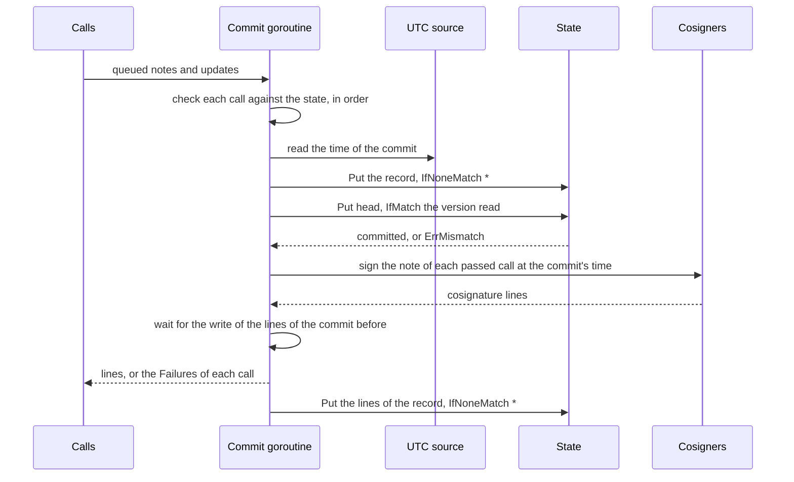

<!--
  ~ Copyright ThesmOS B.V. 2026
  ~ SPDX-License-Identifier: Apache-2.0
-->

# RFC-0054: Checkpoint Witnesses

## Summary

We propose `tlog/witness`, both sides of C2SP tlog-witness over core's
formats:

- `Client` asks one witness to cosign a checkpoint with
  `add-checkpoint`, verifies the cosignatures that the witness returns,
  and reads the checkpoint that the witness serves on its monitor
  retrieval route.
- `Server` is a witness. It verifies a log's checkpoint and a
  consistency proof from the checkpoint that it cosigned last for the
  origin, commits the new checkpoint to a journal in a `blob.Store`, and
  cosigns only after the commit. `Server.Advance` advances the origins
  of up to 4,096 checkpoints under one note in one commit, for a log
  format that signs many checkpoints with one note.

The journal is a hash chain of immutable records and a head object that
the server replaces under `IfMatch`. Processes that share one store
commit through that head, so no two calls advance one origin from one
stored state. Each commit reads the time of its cosignatures before it
writes, and the server signs at that time after the commit. A crash or a
failed head replacement never leaves a cosignature on a checkpoint that
the journal does not contain.

Snapshots move the latest checkpoints of idle origins out of their
records into compacted groups, and retire the origins that the witness
no longer accepts. The store grows with the number of origins and the
rate of commits, and not with time. A circuit breaker in front of the
cosigners stops the commits while a cosigner fails.

`tlog/checkpoint` gains `Cosigner`, the interface of a cosigner that
signs at a timestamp of its caller. `CosignatureV1Signer` and
`SubtreeV1Signer` implement it.

## Motivation

### Core has the formats and not the protocol

`note` parses and signs signed notes. `tlog/checkpoint` implements the
bodies, the cosignatures and the policies of checkpoints, and `tlog`
verifies consistency proofs. A log on core still writes its own client
of tlog-witness to collect cosignatures, and a witness on core writes
its own server. Core admits IO that builds only on the standard
library, and `net/httpclient` and `net/httpserver` give both sides their
transport.

### The state machine is the security property

A witness exists to never cosign two inconsistent checkpoints of one
origin. tlog-witness requires the check of the old size and the write
of the new checkpoint to be one atomic step. It describes the race that
rolls the stored size back without that step
(`tlog-witness.md:192-201`). A witness that runs more than one process,
or that stops during a request, has more such races.

Every implementation repeats this analysis, and the open
implementations that we read order the signature and the write
differently:

- litewitness updates its row of the origin on a compare with the old
  size, and signs after the update.
- transparency-dev/witness and the Armored Witness, which runs its code,
  sign inside the callback of their update, before the write commits.
  They drop the signature of a write that fails.
- sigsum-go's witness signs under a lock before it writes its state
  file. Its usage text states that it serves internal testing.

transparency-dev/witness also cosigns the first checkpoint of an origin
without checking the old size. One implementation in core gets one
review, and every witness on core uses it.

A cosignature also states a time. A cosignature at timestamp T states
that, as of T, the checkpoint is the largest consistent checkpoint that
the cosigner has observed for the origin (`tlog-cosignature.md:135-137`
and `:184-188`). A witness that signs an older checkpoint of an origin
after a newer one, at the time of the signature, makes that statement
false.

### Cosignatures with other algorithms

tlog-cosignature defines cosignatures with Ed25519 and with ML-DSA-44,
and tlog-witness recommends ML-DSA-44. Core also signs with ML-DSA-87
and ECDSA P-384, and `note.NewType` encodes the 0xff types of their
cosignatures. A deployment whose suite needs one of these cosignatures,
or whose network has no route to public witnesses, runs its own
witness.

### Some logs sign many checkpoints with one note

A deployment that runs many logs can sign one note over the checkpoints
of many origins, such as a note over the root of a tree of their bodies.
A witness of such a deployment checks every checkpoint under the note
against its state, and cosigns the note once. It advances every origin
of the note in one step. A note whose origins advance one at a time can
fail halfway, and leaves some origins at sizes that the witness never
cosigned. tlog-witness defines the 409 of each origin by the size that
the witness cosigned last.

### Most logs are rarely active

tlog-witness designs witnesses to scale to many rarely active logs
(`tlog-witness.md:62-64`). A witness serves the latest checkpoint of
every log on its monitor retrieval route, whatever the age of that
checkpoint. Its storage has to grow with the number of logs. The time
since a log last advanced must not add to it.

## Detailed design

### Components

| Component | Responsibility |
|---|---|
| `Client`, `ClientConfig`, `NewClient` | One witness's prefixes, its keys and the HTTP client that calls it |
| `Client.AddCheckpoint` | Sends a checkpoint and a consistency proof, and returns the witness's verified cosignature lines |
| `Client.Checkpoint` | Reads the checkpoint that the witness serves for an origin to monitors |
| `AppendRequest`, `ParseRequest` | Write and check the lines of an `add-checkpoint` body before its note |
| `Client.AppendCosignatures` | Checks the cosignature lines of a response over the text of a note, as `AddCheckpoint` does |
| `Server`, `ServerConfig`, `Log`, `NewServer` | A witness: its cosigners and their circuits, its UTC source, the logs that it accepts, and its journal |
| `Server.AddCheckpoint`, `Server.Checkpoint` | The HTTP handlers of `add-checkpoint` and of the monitor retrieval route |
| `Server.Advance`, `Update`, `Failure` | One atomic advance of up to 4,096 origins under one note |
| `SizeError` and eight sentinels | The errors of both sides, each with a class of `errs` |
| `checkpoint.Cosigner` | A cosigner that reports whether it signs a text, and signs at a timestamp of its caller |
| The journal | The head, the records, the cosignature lines, the snapshots, the groups and the retired origins in the server's `blob.Store` |

`tlog/witness` imports `note`, `tlog/checkpoint`, `tlog`, `crypto`,
`blob`, `version`, `page`, `clock`, `errs`, `task`, `btree`, `cache`,
`pool`, `resilience`, `telemetry`, `net/httpclient` and
`net/httpserver`, and the standard library. The kanon codecs of the
journal's objects import the kanon runtime.

### The protocol

A witness has a submission prefix for `add-checkpoint` and a monitoring
prefix for the monitor retrieval route, which may be equal. The body of
an `add-checkpoint` request is an old size line, zero to 63 consistency
proof lines, a blank line and a checkpoint note:

```text
old 20852014
PlRNCrwHpqhGrupue0L7gxbjbMiKA9temvuZZDDpkaw=
jrJZDmY8Y7SyJE0MWLpLozkIVMSMZcD5kvuKxPC3swk=

example.com/behind-the-sofa
20852163
CsUYapGGPo4dkMgIAUqom/Xajj7h2fB2MPA3j2jxq2I=

— example.com/behind-the-sofa Az3grlgtzPICa5OS8npVmf1Myq/5IZniMp+ZJurmRDeOoRDe4URYN7u5/Zhcyv2q1gGzGku9nTo+zyWE+xeMcTOAYQ8=
```

Each proof line is one hash in canonical base64, which a decoder must
refuse otherwise. A response of 200 contains one signature line per key
of the witness. The server runs the checks of the specification in this
order, and stops at the first that fails:

| Order | Check | Status | Server error | Client error |
|---|---|---|---|---|
| 1 | The body has an old size line in decimal without leading zeros, at most 63 proof lines of canonical base64, a blank line, and a note of at most 64 signature lines whose text is a checkpoint body | 400 | `ErrRequest` | `*httpclient.StatusError`, `Invalid` |
| 2 | The witness accepts the origin of the checkpoint | 404 | `ErrUnknownOrigin` | `*httpclient.StatusError`, `NotFound` |
| 3 | Every line of a key of the origin's log verifies, and every key of one key set of the log signed | 403 | `ErrSignature` | `*httpclient.StatusError`, `Denied` |
| 4 | The old size is at most the checkpoint's size, the root and each proof hash have the size of the log's digests, and every cosigner of the witness signs the checkpoint's text | 400 | `ErrRequest` | `*httpclient.StatusError`, `Invalid` |
| 5 | The state contains the origin, or has room for one more | 404 | `ErrUnknownOrigin` | `*httpclient.StatusError`, `NotFound` |
| 6 | The old size is the size that the witness committed last for the origin, and 0 for an origin that it never committed | 409, with that size | `*SizeError` | `*SizeError`, `Conflict` |
| 7 | A checkpoint of size 0 has the root of the empty tree, an old size of 0 has an empty proof, equal sizes have equal roots, and otherwise the proof verifies | 422 | `ErrInconsistent` | `ErrInconsistent`, `Integrity` |
| 8 | The witness committed the checkpoint and cosigned it | 200, with the lines | none | none |

Checks 1 to 4 read only the request and the configuration. Checks 5 to
7 read the state, and a commit runs them against the state of the head
that it replaces. For an origin that the state does not contain, they
also read the origin's retired objects.

The body of a 409 is the committed size in decimal and a newline, with
the content type `text/x.tlog.size`. The monitor retrieval route is
`GET <monitoring prefix>/<origin hash>/checkpoint`, where the origin
hash is the lowercase hexadecimal SHA-256 of the origin. It returns the
latest checkpoint of the origin whose cosignature lines the witness
stored. That checkpoint contains the log's signatures and the witness's
cosignature lines. An origin that the witness never cosigned gets a
404. tlog-witness permits a delay of up to an hour before the route
serves a new checkpoint (`tlog-witness.md:310-311`).

### The client

```go
package witness

// ClientConfig configures a Client. Every field is required.
type ClientConfig struct {
    // HTTP calls the witness. It admits the witness's hosts, and keeps
    // the default classification of the responses, which the client
    // reads.
    HTTP *httpclient.Client

    // Resolver builds the Verifier of each key of Keys.
    Resolver note.Resolver

    // Submission is the witness's submission prefix: an absolute http or
    // https URL without a query, a fragment or a trailing slash. The
    // client sends add-checkpoint to Submission followed by
    // "/add-checkpoint".
    Submission string

    // Monitoring is the witness's monitoring prefix, an absolute http or
    // https URL of the form of Submission, which may equal Submission.
    Monitoring string

    // Keys are the witness's cosignature keys, whose signatures start
    // with a timestamp: one key for a witness that cosigns with one
    // algorithm, and one key per algorithm for a hybrid witness.
    Keys []note.Key
}

// Client calls one witness.
//
// # Concurrency
//
// Safe for concurrent use.
type Client struct{ /* the URLs of the prefixes, the Verifiers of the keys, the HTTP client */ }

// NewClient returns a Client of cfg. It checks the prefixes, and builds
// the Verifier of each key through cfg.Resolver.
//
// Error modes:
//   - ErrConfig, classified Invalid, for a nil cfg, a missing field, a key
//     that is not Valid, two keys with one name and one key ID, and a
//     prefix that is not an absolute http or https URL without a query, a
//     fragment or a trailing slash.
//   - The error of the Resolver for a key that it does not resolve.
func NewClient(cfg *ClientConfig) (*Client, error)

// AddCheckpoint asks the witness to cosign msg, a checkpoint note that
// the log signed, with proof, a consistency proof from oldSize to the
// checkpoint's size. It appends the witness's cosignature lines to dst:
// for each key of Keys in order, the first line of that key, verified
// over the text of msg. It ignores the lines of other keys.
//
// Error modes:
//   - A *SizeError, classified Conflict, for a 409, with the size that
//     the witness committed last. The caller sends a proof from that size.
//   - ErrInconsistent, classified Integrity, for a 422: the witness
//     refused the proof, or committed another root at an equal size.
//   - ErrCosignature, classified Integrity, for a 200 without a valid
//     line of every key, with an invalid line of a key, or with a line
//     whose timestamp is 0.
//   - ErrRequest, classified Invalid, before any request, for a msg that
//     is not a note and a proof of more than 63 hashes.
//   - The errors of the HTTP client's AppendFetch, such as a
//     *httpclient.StatusError for 400, 403 and 404.
//
// With an error, AddCheckpoint returns dst unchanged.
func (c *Client) AddCheckpoint(ctx context.Context, msg []byte, oldSize uint64, proof []crypto.Digest, dst []byte) ([]byte, error)

// Checkpoint appends to dst what the witness serves for origin on its
// monitor retrieval route, and reports false without an error for a 404,
// with which the witness states that it never cosigned the origin. It
// does not verify the response.
func (c *Client) Checkpoint(ctx context.Context, origin checkpoint.Origin, dst []byte) ([]byte, bool, error)

// AppendCosignatures checks lines, the cosignature lines of a response of
// the witness, over text, as AddCheckpoint checks the lines of a 200, and
// appends the first line of each key to dst. It returns dst unchanged with
// ErrCosignature as AddCheckpoint does.
func (c *Client) AppendCosignatures(dst, text, lines []byte) ([]byte, error)

// AppendRequest appends to dst the body of an add-checkpoint request: the
// old size line, one line of padded standard base64 per hash of proof, a
// blank line, and msg.
func AppendRequest(dst []byte, oldSize uint64, proof []crypto.Digest, msg []byte) []byte

// ParseRequest checks the lines of body before its note, as check 1
// requires them, and returns the old size, the hashes appended to proof,
// and the rest of body after the blank line. It returns ErrRequest for
// any other body, with proof unchanged.
func ParseRequest(body []byte, proof []crypto.Digest) (oldSize uint64, hashes []crypto.Digest, rest []byte, err error)

// SizeError is the error of a 409: the witness committed another size of
// the origin last.
type SizeError struct {
    // Size is the size of the checkpoint that the witness committed last.
    Size uint64
}

func (e *SizeError) Error() string
func (e *SizeError) Class() errs.Class // Conflict
```

`AddCheckpoint` writes the request body into a pooled buffer, and sends
a copy of it with `httpclient.Client.AppendFetch`. The transport of
net/http can read a request body until it closes the body, after the
call returns (`net/http/client.go:136-140` in Go 1.27.1), so the body
has memory of its own. The client reads the response into a pooled
buffer. The HTTP client's default classification
refuses every status other than 2xx with a `*httpclient.StatusError`.
That error contains the first KiB of the body, from which the client
reads the size of a 409. The `StatusError` of a 422 becomes the cause of
an `ErrInconsistent`.

The HTTP client sends a POST without an idempotency key once, and
`AddCheckpoint` does not send it again. A caller that lost a response
and sends the checkpoint again with the old size receives a 409 with the
new size. It then sends the checkpoint with that size as the old size
and an empty proof. The witness cosigns a checkpoint of an equal size
and an equal root again.

The client verifies the lines that it returns, because a caller counts
them toward a quorum. A witness with two keys returns two lines, and the
client requires both, so a hybrid witness counts only with both
algorithms. The client reads the timestamp of each line with
`checkpoint.Timestamp`, and refuses the timestamp 0, which tlog-witness
forbids in a response (`tlog-witness.md:178-179`). `Checkpoint` returns
the served bytes as they are. A monitor
verifies them against its policy, and a log format with a prefix before
its note serves bytes that only that format's monitors parse.

A protocol that extends `add-checkpoint`, such as a request with the
checkpoints of many origins, writes and checks the same lines before each
of its bodies, and checks the cosignature lines of its responses by the
same rules. `AppendRequest`, `ParseRequest` and
`Client.AppendCosignatures` export the encoding, the parse and the check,
so such a protocol and this package share one implementation of each.
The server parses each request with `ParseRequest`.

### The server

```go
// ServerConfig configures a Server. Every field is required.
type ServerConfig struct {
    // Logs returns the log of an origin, and false for an origin that the
    // witness does not accept. It is a function, so a deployment can
    // accept every origin under a prefix.
    Logs func(checkpoint.Origin) (Log, bool)

    // Breaker keeps one circuit per cosigner, whose target is the key
    // name of the cosigner, a plus sign, and its key ID in eight lowercase
    // hexadecimal digits. A commit does not write while the circuit of a
    // cosigner is open.
    Breaker *resilience.Breaker

    // Logger receives a record of each inconsistent checkpoint, each
    // commit or snapshot that fails, each new origin beyond MaxOrigins,
    // and each snapshot of a state above 90% of MaxOrigins.
    Logger *slog.Logger

    // Resolver builds the Verifier of each key of the logs.
    Resolver note.Resolver

    // State keeps the journal. The Server writes only the keys of the
    // journal, and no other writer may write them.
    State blob.Store

    // UTC times the cosignatures. Each commit reads it once.
    UTC clock.UTCSource

    // Clock measures the durations of the metrics and the age of the
    // state that the monitor retrieval route serves.
    Clock clock.Clock

    // Reporter records the witness's metrics.
    Reporter telemetry.Reporter

    // Cosigners sign each cosignature at the time of its commit, one per
    // algorithm of the witness, such as a checkpoint.CosignatureV1Signer
    // or a checkpoint.SubtreeV1Signer.
    Cosigners []checkpoint.Cosigner

    // MaxOrigins bounds the number of origins in the state. A checkpoint
    // of a new origin beyond it gets a 404.
    MaxOrigins int

    // Retention is how long an origin that Logs refuses remains in the
    // state after its latest update. A snapshot retires it after that.
    Retention time.Duration

    // MaxError is the largest error bound of a reading that a commit
    // signs with.
    MaxError time.Duration

    // Timeout bounds the work of each commit, repair, snapshot and
    // refresh on the store. Each runs under a context of its own. A
    // commit, a repair and a snapshot can sign between their writes, so
    // their context has the deadline Timeout + SignTimeout.
    Timeout time.Duration

    // SignTimeout bounds the signatures of each commit and each repair,
    // under a context that no work on the store shares.
    SignTimeout time.Duration
}

// Log is a log that the witness accepts.
type Log struct {
    // Hasher is the hash of the log's tree, which its consistency proofs
    // use. A C2SP log uses SHA-256.
    Hasher crypto.Hasher

    // Keys are the key sets of the log. A checkpoint needs a valid
    // signature of every key of one set. A set contains one key for a
    // log that signs with one algorithm, and one key per algorithm for a
    // hybrid log. The sets are alternatives, such as the keys before and
    // after a rotation.
    Keys [][]note.Key
}

// Server is a witness of C2SP tlog-witness. The calls of a commit
// receive their lines once the signatures exist. The commit stores the
// lines after that, while the next commit runs. The monitor retrieval
// route serves an update once its lines are stored.
//
// # Concurrency
//
// Safe for concurrent use. Processes that share one State commit
// through the journal's head, and never advance one origin from one
// stored state twice. A Server starts one goroutine per commit, per
// repair and per refresh of its state. Each cosigner signs the notes of
// one commit on up to GOMAXPROCS goroutines. One write of lines runs at
// a time. Each commit, repair and snapshot ends within Timeout +
// SignTimeout. The deadline of a commit covers the write of its lines.
// Each refresh ends within Timeout, so a Server has no Close.
type Server struct{ /* the configuration, the state of each origin, the queue of calls */ }

// NewServer returns a Server of cfg, with the state that the journal in
// cfg.State commits: the installed snapshot and the records after it.
//
// Error modes:
//   - ErrConfig, classified Invalid, for a missing field, no cosigner, two
//     cosigners with one key name and key ID, a negative MaxError, and a
//     MaxOrigins, Retention, Timeout or SignTimeout that is not positive.
//   - ErrJournal, classified Integrity, for an object of the journal that
//     does not decode or whose hash is not its name, and for a chain that
//     ends before its snapshot, each found twice from one version of the
//     head.
//   - The errors of State.
func NewServer(ctx context.Context, cfg *ServerConfig) (*Server, error)

// AddCheckpoint returns the handler of add-checkpoint, which a caller
// mounts for POST at the submission prefix followed by "/add-checkpoint".
func (s *Server) AddCheckpoint() http.Handler

// Checkpoint returns the handler of the monitor retrieval route, which a
// caller mounts for GET at the monitoring prefix followed by
// "/{hash}/checkpoint". It reads the origin hash from the path element
// before the last.
func (s *Server) Checkpoint() http.Handler

// Advance commits updates, the checkpoints of distinct origins that msg
// covers, in one commit, cosigns msg with every cosigner, and appends the
// cosignature lines to dst. When an update fails, Advance commits nothing
// and signs nothing, and returns one Failure for each update that failed.
//
// Advance returns once the signatures exist. The commit then stores the
// lines, and the monitor retrieval route serves the updates only after
// that. When the store refuses the lines, the route serves the earlier
// update of each origin until a repair stores them.
//
// Advance verifies the signatures of msg for the log of each update, as
// add-checkpoint verifies them. The caller verifies that msg covers each
// update: that the note's text is the update's body, or that the note
// commits to the body by the rules of its format.
//
// Error modes:
//   - ErrRequest, classified Invalid, for no update, more than 4,096
//     updates, two updates of one origin, a body that is not Valid, an old
//     size above the size of its update, a root or a proof hash of another
//     size than the log's digests, a msg that is not a signed note, a msg
//     of more than 64 signature lines, a msg that a cosigner does not
//     sign, and a call whose encoding in a record exceeds 16 MiB.
//   - ErrUnknownOrigin, classified NotFound, for an origin that Logs
//     refuses.
//   - ErrSignature, classified Denied, for a msg without the signatures
//     of an update's log, and ErrConfig, classified Invalid, for a Log
//     that Logs returns without a hasher or a key set.
//   - resilience.ErrOpen, classified Transient, while the circuit of a
//     cosigner is open. The call committed nothing.
//   - An error that wraps checkpoint.ErrClock, classified Transient, for a
//     reading of UTC outside MaxError, and for a head whose time is ahead
//     of the reading by more than twice MaxError. The call committed
//     nothing.
//   - ErrContention, classified Transient, when other processes commit
//     first 16 times.
//   - The errors of State and of the cosigners, after which the call may
//     have committed without a cosignature, and the error of the
//     Resolver for a key of a log that it does not resolve.
//   - The cause of ctx when ctx ends first, after which the call may
//     still commit.
func (s *Server) Advance(ctx context.Context, msg []byte, updates []Update, dst []byte) ([]byte, []Failure, error)

// Update advances one origin.
type Update struct {
    // Prefix is what the monitor retrieval route serves for the origin
    // before msg, such as the proof that links the body to msg. It is
    // empty for a checkpoint whose note is msg.
    Prefix []byte

    // Proof is the consistency proof from OldSize to Body.Size.
    Proof []crypto.Digest

    // Body is the checkpoint: the origin, the size and the root.
    Body checkpoint.Body

    // OldSize is the size that the caller last saw at the witness.
    OldSize uint64
}

// Failure is an update that did not pass its checks against the state.
type Failure struct {
    // Err is ErrUnknownOrigin for a new origin beyond MaxOrigins, a
    // *SizeError, or an error that wraps ErrInconsistent.
    Err error

    // Index is the index of the update in the call.
    Index int
}
```

The package declares eight sentinels:

```go
var (
    // ErrConfig reports a configuration that NewClient or NewServer
    // refuses.
    ErrConfig = errs.WithClass(errors.New("witness: invalid configuration"), errs.Invalid)

    // ErrRequest reports a request that is malformed or that exceeds a
    // bound of the protocol, and a checkpoint that a cosigner does not
    // sign.
    ErrRequest = errs.WithClass(errors.New("witness: invalid request"), errs.Invalid)

    // ErrUnknownOrigin reports an origin that the witness does not
    // accept: an origin that Logs refuses, and a new origin beyond
    // MaxOrigins.
    ErrUnknownOrigin = errs.WithClass(errors.New("witness: unknown origin"), errs.NotFound)

    // ErrSignature reports a note with an invalid line of a key of its
    // log, or without a valid line of every key of one key set.
    ErrSignature = errs.WithClass(errors.New("witness: invalid log signature"), errs.Denied)

    // ErrInconsistent reports a checkpoint that is not consistent with
    // the checkpoint that the witness committed last for its origin.
    ErrInconsistent = errs.WithClass(errors.New("witness: inconsistent checkpoint"), errs.Integrity)

    // ErrCosignature reports a response of a witness without a valid
    // line of each of its keys, or with an invalid line of one.
    ErrCosignature = errs.WithClass(errors.New("witness: invalid cosignature"), errs.Integrity)

    // ErrJournal reports a journal that the server cannot read: an object
    // that does not decode or whose hash is not its name, or a chain that
    // ends before its snapshot.
    ErrJournal = errs.WithClass(errors.New("witness: corrupt journal"), errs.Integrity)

    // ErrContention reports a commit that the commits of other processes
    // overtook 16 times.
    ErrContention = errs.WithClass(errors.New("witness: commit contention"), errs.Transient)
)
```

The `add-checkpoint` handler reads at most 1 MiB of the body, parses
it, runs checks 1 to 4, and queues one update whose note is the
request's note and whose prefix is empty. A body above 1 MiB gets a 413.
The handler maps each error to the status of the protocol table. A
failure that the table does not list, such as an error of the clock, of
the state store or of a cosigner, goes through `httpserver.Error` with
its class. The handler writes the 200 once the signatures exist, before
the commit stores the lines.

#### The signatures of a log

`Note.Check` stops once its policy is decided, and does not refuse a
note with an invalid line of a known key. tlog-witness requires a 403
for a note with an invalid line of a trusted key
(`tlog-witness.md:127-134`). The server checks each signature line of
the note itself:

1. It refuses a note of more than 64 signature lines with
   `ErrRequest`, before it verifies any line.
2. It collects the keys of every set of the origin's log.
3. It verifies each line whose key name and key ID equal one of those
   keys. One invalid line refuses the note with `ErrSignature`.
4. It accepts the note when every key of one set has a valid line.

signed-note requires a verifier to accept 16 signature lines, and lets
it limit their number (`signed-note.md:72-75`). Without a limit, a body
of 1 MiB fits one valid Ed25519 line about 8,000 times, and each copy
costs a verification. The limit of 64 bounds the verifications of one
note at 64.

The server builds the `note.Verifier` of each key once through the
resolver, and keeps it for the key. A note of many updates under one key,
such as a note over the checkpoints of 1,000 origins, verifies each line
once.

#### Consistency

The server applies the rules of tlog-witness through `tlog`:

- A checkpoint of size 0 has the root `tlog.Root(h, nil)`, the hash of
  the empty string under the log's hasher.
- An old size of 0 needs an empty proof, because every tree extends the
  empty tree.
- An old size equal to the checkpoint's size needs an empty proof and
  the committed root.
- Otherwise `tlog.VerifyConsistency` checks the proof from the committed
  size and root to the checkpoint's.

Check 4 requires the checkpoint's root and each proof hash to have the
size of `tlog.Root(h, nil)`. `checkpoint.ParseBody` accepts roots of 32,
48 and 64 bytes. A first checkpoint with a root of another size than
the log's digests would commit at old size 0, where no proof runs. Every
later checkpoint of the origin would then fail check 7.

#### Cosignature times

tlog-witness forbids the timestamp 0 in the cosignature of a witness
(`tlog-witness.md:178-179`). The server gives every cosignature of one
commit the time of that commit:

1. After the commit checks its calls, it reads `UTC` once. A reading
   that is not synchronised within `MaxError`, or whose whole seconds
   since the Unix epoch are not positive, fails every call of the
   commit with an error that wraps `checkpoint.ErrClock`.
2. A head whose time is ahead of the reading by more than twice
   `MaxError` fails the commit in the same way. The check compares the
   head's time, in whole seconds, with the reading at its full
   precision. Readings within their error bounds differ by at most
   twice `MaxError`, so one of the two clocks is wrong. The commit does
   not pass that time on to the cosignatures of every later commit.
   Both failures occur before the commit writes.
3. The commit's time T is the reading in whole seconds since the Unix
   epoch, or the time of the head's record when that is later. Times
   along the chain never decrease. A process whose clock is behind
   another's, within their error bounds, never signs a later checkpoint
   of an origin at an earlier time.
4. The record contains T. Every cosignature of the record's calls has
   the timestamp T, the cosignatures of a repair included.

The head's time is the whole-second part of an earlier reading, which
is at most that reading. Compared with the full reading, two correct
clocks always pass the check of step 2. Compared with the whole seconds
of the reading, two correct clocks a millisecond apart on either side
of a second boundary would differ by a full second, and every
`MaxError` below half a second would refuse the commit.

The statement of a cosignature at T is true, to one second, whenever
the server signs it. The record commits through the head that its
checks read, so no other record advanced the origin between the checks
and the commit. Every later record of the origin has a time at or after
T, and every time is at least 1. A POSIX timestamp counts whole seconds
(`tlog-cosignature.md:46-47`), so two commits of one origin within one
second share T. Their cosignatures then each state a different
checkpoint as the largest at T.

The cosigners sign at T through an interface that `tlog/checkpoint`
adds, and that both of its cosigners implement:

```go
package checkpoint

// Cosigner is a [note.Signer] of timestamped signatures that also signs
// at a timestamp of its caller, and reports whether it signs a text. A
// witness checks before a commit that each Cosigner signs the note of
// every call, and signs after the commit at the commit's time.
// *CosignatureV1Signer and *SubtreeV1Signer implement it.
//
// # Concurrency
//
// Implementations must be safe for concurrent use.
type Cosigner interface {
    note.Signer

    // AppendSignAt appends to dst the value of a signature line for text
    // with the timestamp of t, in whole seconds since the Unix epoch, and
    // returns the extended slice. The value is the timestamp, then the
    // signature of the wrapped signer over the message of that timestamp
    // and text. AppendSignAt does not read a clock.
    //
    // Error modes, each with dst unchanged:
    //   - ErrTimestamp, classified Invalid, for a t whose whole seconds
    //     since the Unix epoch are not positive, because the timestamp 0
    //     states no time.
    //   - note.ErrKey, classified Invalid, for the zero cosigner.
    //   - An error that wraps ErrBody, classified Invalid, for a text that
    //     the format does not sign.
    //   - The error of the wrapped signer.
    //
    // # Allocation contract
    //
    // The allocation contract of AppendSign.
    AppendSignAt(ctx context.Context, dst, text []byte, t time.Time) ([]byte, error)

    // CheckText returns nil when AppendSignAt signs text, and the error
    // that AppendSignAt returns for a text that the format does not sign.
    // It neither signs nor reads a clock.
    //
    // # Allocation contract
    //
    // Zero-alloc, apart from the error of a text that it refuses.
    CheckText(text []byte) error
}
```

A `CosignatureV1Signer` signs every text. A `SubtreeV1Signer` signs a
checkpoint body without extension lines, with a root of 32 bytes and an
origin of at most 255 bytes, and a body of size 0 only with the root of
the empty tree (`tlog/checkpoint/subtree.go:172-193`). Check 4 calls
`CheckText` of every cosigner on the text of the note. A text that a
cosigner does not sign gets a 400 before the commit. A signature after
the commit then fails only when the signer itself fails, such as an
unreachable HSM.

The server passes the time of each commit, so it never uses the UTC
source of a cosigner. A `SubtreeV1Signer` without a UTC source writes
the timestamp 0 through `AppendSign`, and the commit's time through
`AppendSignAt`.

### The journal

Every object of the journal except the head is immutable. The server
creates each with `IfNoneMatch: version.Wildcard`, and never writes it
again.

| Key | Content | Written |
|---|---|---|
| `head` | The name of the latest committed record and of the installed snapshot | Created, then replaced with `IfMatch` on the version that the writer read |
| `records/<seq>-<hash>` | One commit: its sequence number, its predecessor's name, its time, its offset in the chain, and for each call its note and its updates | Before the head that references it |
| `lines/<record name>` | The cosignature lines of every call of the record | After the calls of the record receive their lines |
| `snapshots/<seq>-<hash>` | The state as of a record: for each origin its size, its root and the position of its latest update | When the records after the installed snapshot amount to its size, and to at least 64 MiB |
| `groups/<seq>-<hash>` | The notes, the lines and the updates of idle origins, up to 1 MiB | With the snapshot that refers to it |
| `retired/<origin hash>-<size>` | The origin, the size and the root of an origin that a snapshot retired | Before the snapshot that retires the origin. Never deleted |

`<seq>` is a sequence number in 20 decimal digits: a record's own, and
for a snapshot or a group the sequence number of the snapshot's record.
`<hash>` is the lowercase hexadecimal SHA-256 of the object's encoding.
`<origin hash>` is the lowercase hexadecimal SHA-256 of the origin, as
in the path of the monitor retrieval route. `<size>` is the retired size
in 20 decimal digits.
A record contains the name of its predecessor, so the name of the
head's record commits to the whole chain. The server checks the hash of
every object that it reads against the object's name.

A name derived from the content does not need a randomness source, and
makes each create-only write idempotent. Processes that create one name
create the same bytes. `version.ErrExists` on a record, a snapshot, a
group or a retired object means that the object is stored. The lines
object takes the name of its record. It contains the signatures of the
process or the repair that created it first. On the lines, `ErrExists`
means that another process or a repair created them first. Both sets of
lines state the same checkpoints with the same timestamp. Ed25519
signatures are deterministic, so the two sets are the same bytes.
ML-DSA signatures of `crypto/sign/mldsa` are hedged
(`crypto/sign/mldsa/doc.go:31-33`), so the two sets differ in their
bytes.

The nine types of the objects have kanon codecs. They are the persistent
format of a witness, and a change of a field is a migration of every
witness's store. A retired object is the `entry` of the origin's latest
update, without its prefix.

```go
// head names the latest committed record and the installed snapshot.
type head struct {
    Record   string // the name of the latest committed record
    Snapshot string // the name of the installed snapshot, empty before the first
}

// record is one commit of the journal.
type record struct {
    Prev   string // the name of the predecessor, empty for the first record
    Calls  []call // the calls of the commit that passed its checks
    Seq    uint64 // the predecessor's Seq + 1, and 1 for the first record
    Time   uint64 // the timestamp of every cosignature of the record's calls
    Offset uint64 // the sum of the encoded sizes of the records before it on the chain
}

// call is the note and the updates of one Advance or add-checkpoint.
type call struct {
    Note    []byte  // the note that the witness cosigns, with the log's signatures
    Lines   []byte  // the cosignature lines in a group, and empty in a record
    Updates []entry
}

// entry is the new checkpoint of one origin.
type entry struct {
    Origin checkpoint.Origin
    Prefix []byte
    Root   crypto.Digest
    Size   uint64
}

// group is the calls of the updates that one snapshot moved out of their
// records and out of other groups.
type group struct {
    Calls []call // each with its lines, and with the moved updates only
}

// lines is the cosignature lines of the calls of one record.
type lines struct {
    Calls [][]byte // the lines of each call, in the order of the calls of the record
}

// snapshot is the state as of one committed record.
type snapshot struct {
    Record  string       // the name of the record
    Base    string       // the name of the snapshot that the writer started from, empty for the first
    Retired []uint64     // the first 8 bytes of the SHA-256 of each origin that the snapshot retired
    Objects []object     // the records and groups that the positions refer to
    Origins []snapOrigin // in the order of the hashes of their origins
    End     uint64       // the Offset of the record plus its encoded size
}

// object is a record or a group that the positions of a snapshot refer to.
type object struct {
    Key     string // the key of the record or the group
    Updates uint32 // the number of updates of a group, and 0 for a record
}

// snapOrigin is the latest committed checkpoint of one origin, and the
// position of its update.
type snapOrigin struct {
    Origin checkpoint.Origin
    Size   uint64
    Time   uint64 // the Time of the record of the update
    Object uint32 // the index of the record or group in Objects
    Call   uint32 // the index of the call in the object
    Update uint32 // the index of the update in the call
    Root   crypto.Digest
}
```

The server writes no object above its read limit, so a larger object
fails the read with `ErrJournal`:

| Object | Read limit |
|---|---|
| The head | 1 KiB |
| A record, a group, the lines of a record | 64 MiB |
| A snapshot | 1 KiB per origin of `MaxOrigins`, and at least 64 MiB |
| A retired object | Its origin and 128 bytes |

A record commits when the head that references it replaces the head
that its predecessor's name came from. The committed records form one
chain, from the record that the head references back through each
`Prev`. A record off that chain never committed, whatever else the store
contains.

#### A commit

Concurrent calls of one process commit together. A call joins the queue
of the calls that wait. When no commit runs, the call starts a goroutine
that commits the queued calls, as `batch.Loader` starts the goroutine
of a batch. A commit stops taking calls at 16 MiB of their encoding in
a record, or at 4,096 updates, so the lines object of a record covers at
most 4,096 calls. `Advance` refuses a call whose encoding exceeds 16 MiB
with `ErrRequest`, so every call fits one commit.

The commit runs under a context of its own: `context.Background()` with
the deadline `Timeout` + `SignTimeout`. No caller's context ends it, so
the end of one call does not fail the others. It takes no values from
the context of a caller, as the batches of `batch.Loader` take none.
The write of the lines at step 8 runs under the same context.

The signatures of step 6 run under a second context:
`context.Background()` with the deadline `SignTimeout`. A slow store
then cannot take the time of the cosigners. Step 6 lies between the
writes of steps 4 and 8. So the first deadline includes its
`SignTimeout`. The summed deadline allocates nothing more. A third
context for step 8 would allocate four objects.

Commits run as a two-stage pipeline. A commit takes steps 1 to 6 while
the commit before it takes steps 8 and 9. The pipeline keeps four
invariants in each process:

- One commit at a time takes steps 1 to 6.
- One write of lines at a time is in flight.
- A call returns only after the write of the lines of the commit before
  its own has ended, with the lines stored or the write failed.
- The route serves an update only after the lines of its record are
  stored.

Step 7 waits for the write of the commit before. The wait counts against
the deadline of the waiting commit. The earlier write ends by its own
deadline, which comes first. A commit whose writes take at most
`Timeout` and whose signatures take at most `SignTimeout` stores its
lines in time if the write of the commit before ends before its own
signatures end. In steady state the earlier write ends first, because a
write of lines takes one round trip to the store and steps 3 and 4 take
two.

A call waits for its result or for the end of its own context. A call
whose context ends before a commit takes it leaves the queue. A call
whose context ends later returns the context's cause, and its updates
may still commit.



Each commit takes these steps:

1. Check each call against the state in memory and the effects of the
   calls before it in the commit: checks 5 to 7 of the protocol. A call
   whose updates all pass applies its updates. A call with a failed
   update applies none, and returns its Failures. A commit whose calls
   all fail writes nothing, so no failed head replacement reveals a
   state that another process overtook. It reads the head instead, and
   when the head is newer than its state, it catches up and checks the
   calls again. A 409 then states the size that the head commits.
2. Check the circuits of the cosigners, as the section on cosigner
   failures describes. Then read `UTC`, and take the commit's time T as
   the section on cosignature times describes.
3. Create the record of the passed calls.
4. Replace the head with `IfMatch` on the version that the commit read.
   - On `version.ErrOutcomeUnknown`, the commit reads the head. A head
     that still references its predecessor means that the write did not
     apply, and the commit writes the head again. A write of the head
     that fails after an unknown outcome reads the head in the same
     way, because the first write may have applied meanwhile.
   - On `version.ErrMismatch`, and on an unknown outcome with any other
     head, the commit applies the records between its state and the
     head in order. Those records can include its own: a process that
     commits the same calls from the same head in the same second
     creates a record of the same name. The commit then happened, and
     it continues at step 6. Otherwise its record never commits, and
     the commit starts again at step 1 with the same calls.
5. Apply the commit to the state in memory.
6. Sign the note of each passed call with every cosigner at T, under
   the context of the signatures. One cosigner signs on the commit's
   goroutine. Two or more cosigners sign concurrently with `task.Each`.
   A cosigner signs one note on its own goroutine. It signs two or more
   notes with `task.Each` on up to GOMAXPROCS goroutines, the value
   that `NewServer` read. Each cosigner signs through its circuit. When
   one signature fails, the commit does not store lines, and every
   passed call fails with that error.
7. Wait for the write of the lines of the commit before. Then return
   the result of each call: the lines of a passed call, the Failures of
   a failed one, or the error of the commit.
8. Start the next commit when calls wait, so that it runs during this
   write. Create the lines object of the record. On
   `version.ErrExists`, another process or a repair created the lines
   first, and the route serves those. When the write fails, the commit
   logs it at `slog.LevelWarn` and leaves the record to a repair. A
   commit without lines skips the write.
9. Move the served positions of the committed origins, when step 8
   created the lines or found them.
10. Write a snapshot when one is due.

A store error at step 3 or 4 fails every call of the commit with that
error, and the log sends its checkpoint again. A commit that starts
step 1 more than 16 times fails its calls with `ErrContention`,
classified `Transient`: other processes commit faster than this one
catches up. A call that passed step 5 and fails at step 6 has advanced
its origins without a cosignature. Its log sends the checkpoint again,
receives a 409 with the new size, and then sends it with an equal old
size. The server cosigns it then. A write of the lines that fails at
step 8 fails no call, because each call returned its lines at step 7.
The route serves the earlier update of each origin until a repair
stores the lines.

Signing is all-or-nothing per commit, because one lines object serves
every call of a record. A commit that stored the lines of some of its
calls would leave the others without lines, and a repair could not add
them to an object that exists. A commit that stores none lets a repair
store the lines of every call.

#### Cosigner failures

A cosigner that is down, such as an unreachable HSM, fails every commit
at step 6, after the record committed. The log then sends its
checkpoint again with the committed size as its old size, which passes
checks 6 and 7. Without a circuit, each such resend would commit
another record and replace the head, which the other processes retry
against, and no origin would advance. `ServerConfig.Breaker`
keeps one circuit of core's `resilience.Breaker` per cosigner, whose
target is the cosigner's key name and key ID:

- At step 2, before it writes, a commit fails its calls with
  `resilience.ErrOpen`, classified `Transient`, when `Breaker.State`
  reports the circuit of a cosigner `Open`.
- At step 6, each cosigner signs the notes of the commit after
  `Breaker.Allow` admits it. The commit reports the outcome of those
  signatures with one `Breaker.Record` per cosigner. Every error of the
  cosigner counts as a failure, the end of `SignTimeout` included. A
  signature that fails ends the context of the other signatures of its
  cosigner.
  The work on the store and the signatures have separate deadlines, and
  the checks before the commit leave the signer itself as the only
  cause of a failed signature. A store too slow for its deadline fails
  the commit at a step that writes, and no circuit counts that failure.
- A circuit whose open interval has elapsed admits one commit as its
  probe. The probe writes its record, and its signatures close the
  circuit or open it again.
- A repair signs through the circuits in the same way. A circuit that
  refuses a repair leaves the route on the served position.

`Breaker.Allow` can still refuse at step 6 when a repair claimed the
probe of the circuit first. The calls of the commit then fail with
`ErrOpen` after their record committed, as for a failed signature.

#### Crashes and concurrent processes

The server signs only after step 5. Every cosignature that it makes
covers a checkpoint of the committed chain, at the time of its record. A
process that stops at any step leaves one of these states:

| The process stops after | State store | Cosignature | Effect |
|---|---|---|---|
| Step 3 | A record off the chain | None | The call fails. Garbage collection deletes the record |
| Step 4 | The record is committed | None | The origin's size advanced without a cosignature. The log's next request receives a 409 and sends the checkpoint again, which the witness cosigns. A repair stores the lines of the record |
| Step 6 | The record is committed | Made and lost | As after step 4. The repair signs at the record's time, so its cosignatures state what the lost ones stated |
| Step 7 | The record is committed | Returned, not stored | The route serves the earlier update of each origin. A repair stores the lines of the record at its time |
| Step 8 | Committed, lines stored | Returned and stored | The next GET of each origin moves its served position, and the route serves the stored lines |

Two processes A and B that read the same head and receive inconsistent
checkpoints of one origin both pass step 1, and both create a record.
One of the two head replacements succeeds. When B's succeeds, A receives
`version.ErrMismatch`, applies B's record, and checks its call again.
The committed size is no longer its old size, so the call fails with a
409. A signs nothing. A's record is off the chain. Any replacement of
the head on the version that A read fails, because `version.Version` is
unique for all time.

The race of the specification, a slower request that rolls the stored
size back, cannot occur. Each commit checks its calls against the state
of the head that it replaces, and the replacement fails when another
commit came first.

#### Recovery

`NewServer` reads the head. Without a head, the state is empty. It reads
the head's snapshot, follows the `Prev` of each record from the head
back to the snapshot's record, and applies the records after the
snapshot in order.

Another process can install a newer snapshot during the walk, and delete
the objects that the walk reads next. A read that returns `NotFound`
starts the walk again from a new read of the head. `NewServer` returns
`ErrJournal` only when two walks from one version of the head find the
same fault: a chain that ends before the snapshot's record, or an
object that does not decode or whose hash is not its name.

A process catches up in the same way after a failed head replacement:

- It follows the chain from the new head back to the record of its own
  state.
- When the walk passes the head's snapshot's record first, or finds a
  record missing, the process reads that snapshot and the records after
  it instead.
- When the head references a newer snapshot than the one that the
  process read last, the process reads it, and takes its positions:
  - The snapshot's position becomes the latest position of every origin
    whose latest update is at or before the snapshot's record.
  - A position in a group becomes the served position of every origin
    whose served update is at or before the snapshot's record, because a
    group contains its lines.
  - An origin that the snapshot retired leaves the state.

The monitor retrieval route refreshes the state when it is older than
one minute. A GET that finds the state older serves it, and starts a
refresh on a goroutine of its own. One refresh runs at a time.

#### Snapshots, groups and garbage collection

A record that contains the latest update of an idle origin would remain
in the store for as long as the origin remains idle. It would keep the
notes and the prefixes of every other call of its commit with it, up to
16 MiB for one origin. Snapshots move such updates into groups, which
contain only updates that are still the latest of their origins.

A snapshot is due when the records after the installed snapshot amount
to the size of that snapshot, and to at least 64 MiB. The record's
`Offset` and the snapshot's `End` give that amount. The commit that
makes a snapshot due writes it on its own goroutine after step 9. The
next commit runs meanwhile. The snapshot reads a clone of the state.
The origins are a `btree.Map`,
whose `Clone` copies the map in O(1) and copies a node only when a
write changes it. Later commits change the state while the snapshot
reads the clone. A process writes one snapshot at a time, under a
context of its own with the deadline `Timeout` + `SignTimeout`, because
its repairs sign between its writes.

Let B be the installed snapshot when the writer starts. The writer
takes these steps:

1. It retires every origin that `Logs` refuses and whose latest update
   is older than `Retention` at the time of the snapshot's record, as
   the section on retired origins describes.
2. It moves into new groups the latest update of every other origin
   whose position refers to a record before B's record. Those origins
   have not advanced since B's record.
3. It moves into new groups the current updates of every group in which
   fewer than half of the updates are still the latest of their
   origins. The `Objects` of B give the number of updates of each
   group.
4. It repairs the lines of a record before it moves the record's
   updates, when the lines are missing:
   - A snapshot repairs at most one record, before it creates the
     groups. The repair reads and writes under the snapshot's context,
     and signs under a context of `SignTimeout`. The snapshot's writes
     then take at most `Timeout` and the repair's signatures at most
     `SignTimeout`, so the snapshot installs whenever a commit with the
     same durations would store its lines.
   - The writer repairs only a record older than the repair age, by a
     reading of `UTC` that is synchronised within `MaxError`. Without
     such a reading, it does not repair.
   - A record that the writer does not repair keeps its updates. So
     does a record whose repair fails, as while the circuit of a
     cosigner refuses it. The snapshot refers to such a record. Later
     snapshots and GETs repair the remaining records, and a later
     snapshot moves their updates. An outage of a cosigner does not
     stop the snapshots.
   - The writer does not repair a record whose updates later commits
     superseded, because no origin refers to it. After an outage, the
     resends of the logs supersede most of the records without lines.
5. It creates the groups, then the snapshot. A group contains up to
   1 MiB of notes, lines and prefixes. It keeps the updates of one call
   with one copy of the call's note and lines, and a call above 1 MiB
   takes a group of its own.
6. It installs the snapshot. It reads the head, and while the head's
   snapshot is still B, it replaces the head with the same record and
   the new snapshot under `IfMatch`, up to 16 times. A head with another
   snapshot means that another process installed one first, and the
   writer abandons its own.
7. It collects garbage.

After an install, the writer walks `State.List` over the prefixes of
the records, the lines, the snapshots and the groups. It deletes no
retired object. It deletes every object of these kinds that neither the
new snapshot nor B refers to:

- A record and its lines, when the record's sequence number is below
  that of B's record.
- A record off the chain whose sequence number is at most the head's.
  No head replacement can commit it any more.
- A snapshot other than these two, whose sequence number is at most the
  new snapshot's.
- A group whose sequence number is below the new snapshot's.

The collector keeps what B refers to until the next install, so a
process that still reads the positions of B finds their objects. The
second rule is safe because a record commits only through a replacement
of the head that its predecessor came from. Once the head's sequence
number is at least the record's own, that replacement fails. A record
of a higher sequence number may still commit, and the collector keeps
it. Each process keeps the name of the committed record of each
sequence number since its base snapshot's record, in a `btree.Map`. The
collector deletes a record under the second rule only when that map
names another record for its sequence number.

The store then contains these objects:

- The head and two snapshots.
- The records since the snapshot before B, and their lines.
- The older records whose updates a snapshot left in place after a
  refused repair, until a later snapshot moves them.
- The groups.

At least half of the updates of each group are current after every
snapshot. The groups take at most about twice the bytes of the latest
updates of the idle origins. Recovery reads the installed snapshot and
the records after it:
at most the larger of the snapshot's size and 64 MiB, and one record
more, while snapshots keep up with the commits.

#### Retired origins

A deployment retires a log by removing its origin from `Logs`. Without
retirement, the state of the origin would remain in every process and
every snapshot for as long as the witness runs. `MaxOrigins` would then
be a permanent ceiling for a witness whose logs retire.

A snapshot retires an origin that `Logs` refuses when the origin's
latest update is older than `Retention` at the time of the snapshot's
record. The snapshot's writer creates the origin's retired object with
its last committed size and root, and leaves the origin out of the
snapshot. Garbage collection then deletes the origin's records and
groups, as for every update that the snapshots do not refer to.

Each process keeps the first 8 bytes of the SHA-256 of every retired
origin in a set in memory, a `btree.Set[uint64]`:

- `NewServer` fills the set from one walk of `State.List` over
  `retired/`, after it reads the head's snapshot. The keys contain the
  hashes, so the walk does not read an object.
- Each snapshot references its base, the snapshot B that its writer
  started from, and lists the prefixes of the origins that it retired.
  A process that installs a snapshot, or reads one whose base is the
  snapshot that it read last, adds those prefixes to its set.
- A process that reads a snapshot with another base has skipped one,
  and walks `retired/` again.

Each process updates its set before it removes the retired origins from
its state. So a commit that runs while a refresh reads a snapshot
cannot find a retired origin missing from both and take it for a new
origin.

When step 1 of a commit finds an origin that the state does not
contain, it looks the origin's prefix up in the set. A new origin is not
in the set, and its lookup does not touch the store. An `Advance` of
4,096 new origins does not list the store. A member costs a List of
`retired/<origin hash>-`. The retired object of the largest size gives
the size and the root that checks 6 and 7 compare with, as for an
origin in the state. An origin whose prefix another origin shares costs
one List that finds nothing, and starts at size 0. A log that the
deployment accepts again continues from its last committed checkpoint.
The witness never cosigns a tree that is inconsistent with the
checkpoints that it cosigned before the retirement.

The commit looks the origin up after its state shows the origin absent.
A lookup before the call joins the queue would miss a retirement: a
snapshot that another process installs meanwhile can retire the origin.
The commit learns of that snapshot only when it catches up to the new
head. Catching up reads the snapshot and adds the origin's prefix to the
set. The writer creates the retired object before it installs the
snapshot, so the List finds the object.

The route responds with 404 for a retired origin. tlog-witness asks a
witness to serve a recent checkpoint of each log that it cosigned
(`tlog-witness.md:297`), and the deployment removed this log.

#### The monitor retrieval route

The state of each origin in memory has two positions. A position names
a record or a group, the index of a call in it, and the index of an
update in the call.

- The latest position locates the update that the next commit checks
  against, and a snapshot records it.
- The served position is the one that the route serves: the latest
  update whose lines the process stored or found.

A commit moves the served positions of its origins at step 9, so a
process never serves its own commit before its lines exist. A process
that applies the records of other processes moves only their latest
positions. `NewServer` takes the group positions of the snapshot as
served positions. It has no served position for an origin whose
snapshot position is a record, until the handler finds the lines of an
update of the origin.

The handler looks up the origin of the hash, and responds with 404 for
an origin that the state does not contain. When the origin's latest
position differs from its served one, the handler reads the lines of the
latest update's record:

- When the lines exist, the handler moves the served position to the
  latest one.
- When the lines are missing and the record is older than the repair
  age, the handler repairs the record. The repair moves the served
  position when it ends.
- When the lines are missing and the record is younger, its commit may
  still run, and the handler serves the served position.

The repair age is the longest that a commit can still run after the
time of its record. It is the sum of these durations:

- `Timeout` + `SignTimeout`, the deadline of the commit's context.
- One second, because the record's time is the whole seconds of the
  commit's reading.
- Twice `MaxError`, because the handler compares that time with a
  reading of its own process.

The last margin is valid only for a reading within `MaxError` of UTC.
The handler reads `UTC`, and compares the record's time with the
reading only when the reading is synchronised within `MaxError`.
Without such a reading, it serves the served position and does not
repair, as a commit refuses to sign without one.

The handler reads the served update's record and lines, or its group.
It responds with the update's prefix, the call's note and the call's
lines. The note contains the log's signatures, so the response is a
cosigned checkpoint for a C2SP log. The handler keeps the objects that
it read in a cache of core's `cache` package, bounded at 64 MiB.

An origin without a served position gets one of two responses:

- A 404, when the process added the origin to its state as a new origin,
  from a commit or from a record. The witness has not cosigned the
  origin yet, and tlog-witness requires a 404 for such an origin
  (`tlog-witness.md:307-308`).
- A 503, classified `Transient`, when the process read the origin from a
  snapshot. An earlier update of the origin may have lines that the
  process does not know.

Garbage collection can delete the object of a served position after a
newer snapshot. The handler then refreshes the state, which takes the
group positions of the newer snapshot, and reads the served position
again. When its object is still missing, the handler responds with 503.

A repair signs the note of every call of the record at the record's
time T with every cosigner, and creates the lines object. It reads the
record, signs, and writes the lines in the order of a commit, so it
runs under the same two contexts: the store's with the deadline
`Timeout` + `SignTimeout`, and the signatures' with `SignTimeout`. A
process runs one repair of a record at a time, and the GETs of that
record wait for it. A repair that fails remains in the process. The
GETs of the record then start no other repair of it until a snapshot
installs. On `version.ErrExists`, a repair uses the stored
lines. A commit that writes its lines after a repair receives
`ErrExists` too, and the route serves the stored lines. Those lines
state what the lines of the call state, as the section on the journal
describes.

The route takes no authentication, so a repair has two bounds. An
unauthenticated GET starts at most one repair per record without lines
in each process. A record older than the repair age lacks lines only
after a crash, a failed signature or a failed write of its lines.

#### Telemetry and logs

The server records four instruments:

| Instrument | Kind | Attributes |
|---|---|---|
| `tlog.witness.commit.duration` | Histogram, seconds | `error.type` of a failed commit |
| `tlog.witness.commit.calls` | Histogram | none |
| `tlog.witness.updates` | Counter | `outcome`: `committed`, `uncosigned`, `conflict` or `inconsistent` |
| `tlog.witness.origins` | Gauge | none |

`tlog.witness.commit.duration` measures steps 1 to 6 of a commit. It
ends with the signatures, before the wait of step 7 and the write of the
lines. An update counts as `uncosigned` when its commit advanced the
origin and a signature of the commit failed. A rising count of that
outcome signals a cosigner that fails, such as an unreachable HSM. The
gauge reports the number of origins in the state after each commit and
each
snapshot, so an operator sees the state fill before `MaxOrigins` refuses
a new origin.

The server logs each inconsistent checkpoint at `slog.LevelError`, with
the origin, the committed size and root, the checkpoint's size and root,
and the note. tlog-witness permits that log, because a note with the
log's valid signature over an inconsistent checkpoint proves that the
log signed two inconsistent trees. The server logs these events at
`slog.LevelWarn`:

- A commit or a snapshot that fails.
- A write of the lines of a commit that fails, with the name of the
  record.
- Each new origin beyond `MaxOrigins`.
- Each snapshot of a state that contains more than 90% of `MaxOrigins`
  origins.

The `net/httpserver` that mounts the handlers records each request.

### Bounds

| Quantity | Bound |
|---|---|
| Body of an `add-checkpoint` request | 1 MiB |
| Consistency proof | 63 hashes |
| Signature lines of a note | 64 |
| Updates of one `Advance`, and of one commit | 4,096 |
| Encoding of one call in a record, and of the calls of one commit | 16 MiB |
| Origins of the state | `MaxOrigins`, with a warning above 90% of it |
| Age of the latest update of an origin that `Logs` refuses, before a snapshot retires the origin | `Retention` |
| Commits that advance their origins without a cosignature while a cosigner fails | The `FailureThreshold` of its circuit, then one probe per open interval |
| Starts of step 1 per commit, and tries of the install of a snapshot | 16 |
| Records after the installed snapshot when the next snapshot is due | The size of the installed snapshot, and at least 64 MiB |
| Notes, lines and prefixes of one group | 1 MiB, or one call above 1 MiB |
| Current updates of a group after a snapshot | At least half of its updates |
| Deadline of the store's context of a commit, a repair or a snapshot | `Timeout` + `SignTimeout`, which covers the write of the lines of a commit. A repair whose writes take at most `Timeout` and whose signatures take at most `SignTimeout` stores its lines. So does a commit, when the write of the lines of the commit before ends before its signatures |
| Duration of the signatures of a commit or a repair | `SignTimeout` |
| Goroutines that sign the notes of one commit or one repair | GOMAXPROCS per cosigner, the value that `NewServer` read |
| Writes of lines in flight per process | 1 |
| Duration of a refresh | `Timeout` |
| Age of a record without lines before a GET or a snapshot repairs it | The repair age: `Timeout` + `SignTimeout` + 1 second + twice `MaxError`, by a reading synchronised within `MaxError` |
| Repairs per snapshot | 1 |
| Age of the state that the monitor retrieval route serves | 1 minute after another process commits, and one refresh more. tlog-witness permits one hour |
| Memory per origin | The origin, the size, a 65-byte `crypto.Digest`, two positions, and the map's entry: about 300 bytes for an origin of 40 bytes, by estimate |
| Memory per retired origin | The first 8 bytes of its hash in a `btree.Set[uint64]`: 13.7 bytes, measured over 10^6 random keys on Go 1.27.1. A leaf of 63 keys is a 520-byte object in the 576-byte size class |
| Memory per record since the base snapshot's record | Its sequence number and its name of 85 bytes in a `btree.Map`, for garbage collection |
| Bytes of one object that the server reads | The read limit of its kind: at most 64 MiB, or 1 KiB per origin of `MaxOrigins` for a snapshot |
| Snapshot | About 130 bytes per origin, and 8 bytes per origin that it retires, by estimate |
| State store writes per commit | 3: the record, the head and the lines. Each call of a commit shares them. A call returns after the first two and the signatures |

By that estimate, a witness of 10^5 origins keeps about 30 MB of state
in each process, and writes snapshots of about 13 MB.

### Failure handling

| Condition | Function | Error | Class |
|---|---|---|---|
| A missing field, no key or cosigner, two keys or cosigners with one name and key ID, a prefix that is not an absolute http or https URL, a negative `MaxError`, a `MaxOrigins`, `Retention`, `Timeout` or `SignTimeout` that is not positive | `NewClient`, `NewServer` | `ErrConfig` | `Invalid` |
| A key that the resolver does not resolve | `NewClient`, `NewServer`, `Server.Advance` | the resolver's error | its class |
| A malformed body, more than 63 proof hashes, more than 64 signature lines, an old size above the checkpoint's, a root or a proof hash of another size than the log's digests, a note that a cosigner does not sign, more than 4,096 updates, two updates of one origin, a call above 16 MiB in a record | the handler, `Server.Advance`, `Client.AddCheckpoint` | `ErrRequest` | `Invalid` |
| A body of an `add-checkpoint` request above 1 MiB | the handler | `*http.MaxBytesError`, which `httpserver.Error` writes as a 413 | `Unspecified` |
| An origin that `Logs` refuses, or a new origin beyond `MaxOrigins` | the handler, `Server.Advance` | `ErrUnknownOrigin` | `NotFound` |
| An invalid line of a key of the log, or no complete key set | the handler, `Server.Advance` | `ErrSignature` | `Denied` |
| An old size other than the committed size | the handler, `Server.Advance`, `Client.AddCheckpoint` | `*SizeError` | `Conflict` |
| A proof that does not verify, another root at an equal size, a size-0 root other than the empty tree's | the handler, `Server.Advance`, `Client.AddCheckpoint` | `ErrInconsistent` | `Integrity` |
| A reading of UTC outside `MaxError`, or a head whose time is ahead of the reading by more than twice `MaxError` | the handler, `Server.Advance` | wraps `checkpoint.ErrClock` | `Transient` |
| A cosigner whose circuit is open | the handler, `Server.Advance` | `resilience.ErrOpen` | `Transient` |
| A response without a valid line of every witness key, with an invalid line of one, or with a line whose timestamp is 0 | `Client.AddCheckpoint` | `ErrCosignature` | `Integrity` |
| A journal object that does not decode, whose hash is not its name or that exceeds its read limit, or a chain that ends before its snapshot, each found twice from one version of the head | `NewServer`, the handlers, `Server.Advance` | `ErrJournal` | `Integrity` |
| A commit that starts its checks more than 16 times, because other processes commit first | the handler, `Server.Advance` | `ErrContention` | `Transient` |
| An error of the state store before the signatures, or of a cosigner | the handler, `Server.Advance` | that error | its class |
| An error of the state store on the write of the lines, after the calls of the commit returned | the commit | none. The server logs the error at `slog.LevelWarn`, and a GET or a snapshot repairs the record after the repair age | none |
| The end of the caller's context | the handler, `Server.Advance` | the context's cause | its class |
| An origin of a snapshot without a served position, or a served object that a newer snapshot collected | the monitor retrieval route | a 503 | `Transient` |

### Allocation contract

The package allocates nothing of its own per call in steady state,
apart from the costs of a commit, which the calls of the commit share:

- Each of the commit's two contexts with a deadline, for the store and
  for the signatures, allocates four objects: the context, its timer,
  the timer's function and the cancel function
  (`context/context.go:641-657` in Go 1.27.1).
- The commit allocates one string for the keys of its record and of its
  lines. The state keeps the key of the record in the positions of its
  updates.
- The commit's goroutine starts from a function value that the Server
  binds once. A `go` statement of a function value without arguments
  allocates nothing, where one of a method value allocates its closure,
  one object on Go 1.27.1.
- The concurrent signatures allocate five objects per `task.Each`: its
  context, the cancel function of that context, its state, the closure
  of its goroutines, and the closure that the signatures pass to it. The
  first child of a context costs three objects more: the done channel
  and the map of children of the parent. A witness of two or more
  cosigners runs one `task.Each` over its cosigners. A cosigner runs one
  over the notes of a commit of two or more calls. One cosigner that
  signs one note runs none.
- After a snapshot's `Clone`, the first write to a node of the state
  copies the node: one object for a leaf and two for an internal node
  (`btree/map.go:49-52`). A commit copies at most the nodes on the paths
  of its origins. The commits between two snapshots copy each node at
  most once.

A commit of one call costs nine objects of the package, and the copies
after a snapshot. The signatures of a commit cost these objects more,
measured by the benchmark of the signatures with Go 1.27.1:

| Cosigners | Notes | Objects | Sites |
|---|---|---|---|
| 1 | 1 | 0 | The cosigner signs on the commit's goroutine |
| 1 | 2 or more | 8 | One `task.Each` over the notes, under the fresh context of the signatures |
| 2 | 1 | 8 | One `task.Each` over the cosigners |
| 2 | 2 or more | 21 | 8 for the cosigners, and 8 and 5 for the notes of the two cosigners. The second `task.Each` under one parent context finds the done channel and the map of children of that context allocated |

Each call also allocates what its dependencies allocate. The benchmarks
of the package measure these counts with Go 1.27.1, over `blob/memory`,
and over a pipe from `httpclient.WithDialContext` on a connection that
the transport reuses:

| Call | Objects | Sites |
|---|---|---|
| `Server.Advance` with one Ed25519 cosigner | 15 | 9 of the commit, and 6 of `blob/memory`: a copy of each of the commit's three objects, and the text of each version |
| `Server.Advance` with two Ed25519 cosigners | 23 | 8 more for the concurrent signatures |
| The `add-checkpoint` handler | 15 | Those of `Server.Advance`. The handler reads the body into pooled memory, and parses it into the note and the body of a pooled call |
| The monitor retrieval route | 0 | For an update whose objects are in the cache |
| `Client.AddCheckpoint` | 66 | The copy of the request body and its reader, 5 of the request that net/http builds, and 59 of `httpclient.Client.AppendFetch` for a POST. The client parses the response into a reused `note.Note`, and the Verifier of an Ed25519 key allocates nothing |
| `Client.Checkpoint` | 59 | The text of the URL, 3 of the request that net/http builds, and 55 of `AppendFetch` |
| `NewServer` over an empty store | 29 | The Server with its maps and slices, its pool of calls, the 12 attribute sets that its instruments bind, its cache, its state, and the error of the missing head |
| `NewClient` with one Ed25519 key | 7 | The Client, its Verifiers, its URL, the parse of each prefix, and the Verifier of the key |

An ML-DSA cosigner also allocates the signature that the standard
library returns. Each benchmark states its count as a ceiling with
`bench.Start(b).MaxAllocs(n)`, and a comment beside the ceiling lists
its sites.

### Throughput and latency

We measured four variants of the commit in two alternating rounds, on
an AMD Ryzen 9 9950X3D with GOMAXPROCS=4 and Go 1.27.1. The variants
differ in two choices: whether a cosigner signs the notes of a commit
in series or in parallel, and whether a call returns after the write of
the lines or before it. Each case ran for 3 seconds. Each caller sent
the checkpoint of an origin of its own in a loop, with an equal old
size, so every call committed a record. In the hybrid cases, an
ML-DSA-44 cosigner signs beside the Ed25519 one. A store of 10 ms is
`blob/memory` behind a decorator that sleeps 10 ms before each Put, Get
and Stat. Each cell gives the calls per second and the median latency
of a call, as the mean of the two rounds, which differ by at most 5%:

| Case | Serial, reply after the lines | Parallel, reply after the lines | Serial, reply before the lines | Parallel, reply before the lines, as designed |
|---|---|---|---|---|
| 1 caller, store of 10 ms | 33/s, 30.5 ms | 33/s, 30.4 ms | 49/s, 20.3 ms | 49/s, 20.3 ms |
| 64 callers, store of 10 ms | 1,030/s, 62.4 ms | 1,050/s, 61.8 ms | 1,540/s, 42.2 ms | 1,560/s, 41.5 ms |
| 1,024 callers, store of 10 ms | 13,700/s, 76.1 ms | 15,400/s, 67.3 ms | 18,800/s, 55.1 ms | 22,400/s, 46.4 ms |
| 1,024 callers, store of 10 ms, hybrid | 3,440/s, 307 ms | 8,160/s, 130 ms | 3,770/s, 279 ms | 9,880/s, 107 ms |
| 64 callers, memory store, hybrid | 4,030/s, 15.8 ms | 12,500/s, 5.1 ms | 4,010/s, 15.9 ms | 13,200/s, 4.9 ms |
| 64 callers, memory store | 76,600/s, 827 µs | 86,500/s, 728 µs | 77,900/s, 817 µs | 89,200/s, 703 µs |
| 1 caller, memory store | 22,100/s, 45 µs | 21,900/s, 45 µs | 22,200/s, 44 µs | 22,600/s, 43 µs |

A reply before the lines removes one of the three round trips of a
call, so one caller waits 20.3 ms instead of 30.5 ms. Parallel signatures shorten the commits whose signatures take
a large part of their time. At 1,024 callers over a store of 10 ms,
this design commits 1.6 times the calls per second of the first column
with one Ed25519 cosigner, and 2.9 times with a hybrid witness. One
caller over the memory store commits about 22,000 calls per second in
every variant.

### Tests

| # | Guarantee |
|---|---|
| 1 | The server returns each status of the protocol table for a request that fails that check alone, and the client maps each status to its error |
| 2 | A request in the form of tlog-witness's example gets a cosignature that `tlog/checkpoint` verifies, from an Ed25519 and from an ML-DSA-44 cosigner |
| 3 | A note with an invalid line of a known key gets a 403, also when another line of the key is valid. A hybrid key set needs both keys. A line of an unknown key is ignored |
| 4 | A note of 65 signature lines gets a 400, and the server verifies none of its lines |
| 5 | A first checkpoint whose root has another size than the log's digests gets a 400, and the witness commits nothing |
| 6 | A note that a cosigner does not sign, such as a body with extension lines for a `SubtreeV1Signer`, gets a 400, and the witness commits nothing |
| 7 | A reading of UTC outside `MaxError` fails every call of the commit with `checkpoint.ErrClock`, and the commit creates no record |
| 8 | A head whose time is ahead of the reading by more than twice `MaxError` fails every call of the commit with `checkpoint.ErrClock`, and the commit creates no record. Two readings a millisecond apart on either side of a second boundary, under a `MaxError` of 1 ms, both commit |
| 9 | Every cosignature of a commit has the commit's time. Times along the chain never decrease under two fake UTC sources that differ within `MaxError`. No cosignature has the timestamp 0, also from a `SubtreeV1Signer` without a UTC source |
| 10 | `AppendSignAt` writes the timestamp that `checkpoint.Timestamp` reads back, refuses a time before the first second after the Unix epoch, and `CheckText` returns the error of `AppendSignAt` for every body that it refuses |
| 11 | A repair signs at the time of its record, also after a later commit of the origin. Two concurrent GETs of one record start one repair. A GET starts no repair of a record younger than the repair age, also for a commit whose signatures run to the end of `SignTimeout`. A GET without a synchronised reading serves the served position and starts no repair |
| 12 | A cosigner that fails on one call of a commit fails every call of the commit, the commit stores no lines, and the repair stores the lines that the route then serves |
| 13 | While the circuit of a cosigner is open, a commit fails its calls with `resilience.ErrOpen` and creates no record. A circuit whose open interval elapsed admits one commit, whose signatures close the circuit or open it again. A signature that `SignTimeout` ends counts as a failure. A store too slow for its deadline fails the commit without a failure of any circuit. A commit whose writes take nearly `Timeout` and whose signatures take nearly `SignTimeout` stores its lines, and so does a repair |
| 14 | A caller whose context ends during a commit returns the context's cause while the commit of the other calls completes. A queued call whose context ends leaves the queue |
| 15 | The rollback race of tlog-witness: two calls of one origin, one stalled by a store decorator between its checks and its head replacement, never both commit, and the slower one gets a 409 |
| 16 | Two Servers over one `blob/memory` store, given inconsistent checkpoints of one origin at once, cosign at most one of them, over 1,000 rounds |
| 17 | Two Servers that commit the same calls from one head in the same second create one record. The Server whose head replacement fails continues at step 6. With Ed25519 cosigners, both return the same lines |
| 18 | A store decorator that fails every write after the k-th, for every k of a run: after each failure and a new Server over the same store, no two cosignatures of the run cover inconsistent checkpoints of one origin |
| 19 | `version.ErrOutcomeUnknown` on the record, the head and the lines, each with the write applied and not applied, leaves a state that a new Server reads |
| 20 | `NewServer` rebuilds the state from a snapshot and the chain after it, ignores records off the chain, starts again when garbage collection deletes an object during its walk, and returns `ErrJournal` only for a fault that two walks from one head find |
| 21 | An object whose bytes do not hash to its name fails with `ErrJournal` |
| 22 | A snapshot moves the updates of idle origins into groups and compacts a group with fewer than half of its updates current. The collector deletes only what neither of the two newest snapshots refers to, and no retired object. A snapshot whose repair the circuit refuses leaves the updates on their record, refers to the record, and installs. The next snapshot moves them. A snapshot with several records to repair repairs one, leaves the updates of the rest on their records, and installs within `Timeout` + `SignTimeout`. A snapshot writer without a synchronised reading repairs nothing and installs |
| 23 | Under random advances of 10,000 origins over many snapshots, every group has at least half of its updates current after each snapshot |
| 24 | Two processes that write snapshots at once install one, and the next snapshot collects the objects of the other |
| 25 | A snapshot retires an origin that `Logs` refuses once its latest update is older than `Retention`, and creates its retired object. When `Logs` accepts the origin again, a checkpoint with an old size of 0 gets a 409 with the retired size, also when another process retires the origin while the call waits in the queue, and also in a process that skipped the snapshot that retired it. An `Advance` of 4,096 new origins lists nothing |
| 26 | A new origin beyond `MaxOrigins` gets a 404, and the witness commits nothing. The gauge reports the origins after each commit, and a snapshot of a state above 90% of `MaxOrigins` logs a warning |
| 27 | The monitor retrieval route serves the stored lines of the served update and the update of a group, and never serves a commit of its own process before its lines exist. It responds with 404 for an origin whose first commit has no lines yet, and with 503 for an origin of a snapshot without a served position. After a snapshot moves a served update into a group, it serves the group |
| 28 | `Advance` of 1,000 updates under one note commits all or none, and verifies each line of the note once |
| 29 | The client verifies the lines of a 200: it requires a valid line of every key, ignores lines of other keys, and refuses an invalid line of a key and a line whose timestamp is 0 |
| 30 | A cosigner signs two notes of one commit at once. It never signs more notes at once than its limit of goroutines: two for a limit of two, and one for a limit of one. Every value verifies over its note |
| 31 | A call returns before the write of the lines of its commit, and the route responds with 404 for its origin until the lines are stored. A write of lines that fails is logged, fails no call and moves no served position. Lines that a repair stored first move the served positions. A call of the next commit returns only after the write of the commit before has ended. A commit whose calls all fail writes no lines |
| 32 | The suites cover every statement, and gremlins kills every mutant of the package |
| 33 | Benchmarks assert every count of the allocation contract, the nine objects of a commit and the objects of the concurrent signatures included |

### Departures from the specification

| Rule | This design | Reason |
|---|---|---|
| tlog-witness: the 409 states the size of the checkpoint that the witness cosigned last | It states the size of the checkpoint that the witness committed last. A process that stops between the commit and the signature, or a signature that fails, leaves a committed size without a cosignature | Signing after the commit is what prevents two inconsistent cosignatures. The log sends the checkpoint again with the new size, and the witness cosigns it. litewitness commits before it signs as well |
| tlog-witness: a valid signature of one trusted key suffices | A checkpoint needs every key of one key set. A set of one key is the specification's rule | A hybrid log is secure only while both of its algorithms are |
| tlog-witness: an unknown origin gets a 404 | A new origin beyond `MaxOrigins` gets a 404 as well | A witness that accepts every origin under a prefix bounds its memory and its snapshots |
| tlog-witness: a witness serves a recent checkpoint of each log that it cosigned | A retired origin gets a 404 on the monitor retrieval route | The deployment removed the log. The witness keeps only the retired size and root, from which the log continues if the deployment accepts it again |
| tlog-witness: the witness cosigns every valid checkpoint of a known log | A checkpoint that a cosigner does not sign gets a 400. A `SubtreeV1Signer` signs no body with extension lines, a root other than 32 bytes, or an origin above 255 bytes | The message of a SubtreeV1 signature has no room for them, and core signs no body that a signature covers only in part |
| tlog-witness: the monitor retrieval route serves the cosignatures that `add-checkpoint` returned | It serves the stored lines of the update. A process that stops after it stored them, and a repair after a crash or a failed signature, leave lines that no call returned. With an ML-DSA cosigner, a repair after a failed write of the lines, and another process that stored the lines of the same record first, leave lines that differ in their bytes from the lines that the call returned | No process can tell after a crash whether its response arrived. Each stored line is a cosignature of a committed checkpoint at the time of its commit, and states what the returned line states |
| tlog-witness: the monitor retrieval route serves a checkpoint | It serves an update's prefix before the note. The prefix is empty for `add-checkpoint` | A note over many checkpoints is not a checkpoint. The monitors of such a format parse its prefix |
| tlog-witness: sign-subtree | Not implemented | The specification makes it optional |

## Alternatives considered

### A. Each log and each witness implements the protocol

Each log on core would write its own client, and each witness on core
its own server: the checks, the persistence and the handlers.

**Why not:** the state machine is the witness's security property.
Each implementation repeats the analysis of its races. Two
implementations of one wire format and its status codes drift apart.

### B. Sign before the commit, with the lines in the record

The committer would sign each call first and write the lines into the
record that the head commits. The monitor retrieval route would then
read one object per update, and a commit would write two objects.

**Why not:** a process whose head replacement fails has already
signed. Processes that read one head and receive inconsistent
checkpoints of one origin would each sign. The cosignature of the failed
replacement would then be in its orphan record, where anyone who reads
the store can find it. That is the split view that a witness exists to
prevent. transparency-dev/witness also signs before its write commits.
It keeps the signature of a failed write in memory, and drops it.
litewitness updates its row with `WHERE tree_size = <old size>`, and
signs after the update, as this design does.

### C. A server without Advance

The server would implement `add-checkpoint` alone. A deployment whose
note covers many checkpoints would keep a second state beside core's.

**Why not:** a call under a note and a call to `add-checkpoint` would
commit to two states. Both could then advance one origin from one
stored state.

### D. One object per origin, replaced under IfMatch

Each origin would have its own object, which the server replaces under
`IfMatch` on its version. litewitness replaces one row per origin in
the same way. Calls of different origins would never conflict.

**Why not:** `blob.Store` has no transaction over two keys, so an
`Advance` of many origins could fail halfway and leave origins at sizes
that the witness never cosigned. One head serializes the commits of one
witness, and each commit takes every queued call of its process.

### E. Records in sequence, created with IfNoneMatch, without a head

Each commit would create `records/<seq>` with `IfNoneMatch:
version.Wildcard`. The create would be the commit, one write fewer than
a record and a head.

**Why not:** garbage collection would delete old records, and a process
whose state is older than a deleted record could create that key again
and commit against a state long replaced. A tombstone per deleted record
would prevent that, at one object per commit for as long as the witness
runs. The head is one object whose versions never repeat.

### F. A database

litewitness keeps one SQLite row per origin and updates it with a
compare on the old size. transparency-dev/witness keeps one note per
log, and updates it in a serializable SQLite transaction or a read-write
transaction of Spanner.

**Why not:** core contains no database driver. `blob.Store` gives the
same compare-and-swap on every store that core supports, the memory
store of the tests included.

### G. The cosignature lines of each origin in an object of its own

The route would read one object per origin, which the committer writes
after it signs.

**Why not:** an `Advance` of 1,000 origins would write 1,000 objects. The
lines object of a record serves every origin of every call in it.

### H. batch.Loader for the group commit

`batch.Loader` coalesces concurrent calls within a window into one call.

**Why not:** the window adds its duration to every request. The queue of
this design commits whatever waits when the previous commit ends. A
call waits only while another commit runs. `batch.Loader` also
deduplicates keys, and the calls of one origin must all run.

### I. A permanent committer goroutine

A goroutine of the Server would take the queued calls and write the
snapshots for as long as the Server runs. It would save the start of a
goroutine per commit.

**Why not:** a goroutine that outlives every call needs a start and a
stop, so the Server would need a `Run` or a `Close`. A goroutine per
commit ends after its commit, the write of its lines and its snapshot,
which `Timeout` and `SignTimeout` bound. The Server then has no
lifecycle beyond its construction.

### J. One object per idle origin

At each snapshot, every idle origin would get an object of its own with
its prefix, the call's note and the call's lines. Garbage collection
would then delete every record before the snapshot, and the route would
read one small object per origin.

**Why not:** an origin that advances less often than one snapshot
interval would write one object per update. That is the cost of
alternative G, moved off the request path, and tlog-witness expects
most logs to be rarely active. A group writes one object per MiB of
idle updates, and keeps one copy of a note that covers many origins.

### K. A repair at the time of the repair

A repair would sign with a reading of the UTC source at the time of the
repair, as `CosignatureV1Signer.AppendSign` signs.

**Why not:** a process whose state lags can repair an older checkpoint
of an origin after the witness cosigned a newer one. Its cosignature
would state that the older checkpoint was the largest at a time when it
was not. A repair at the time of its record states what the commit
would have stated.

### L. A snapshot every 1,024 records, before the commit returns

The commit of every 1,024th record would write the snapshot before its
calls return.

**Why not:** a record contains up to 16 MiB of notes and prefixes, so
recovery could read 16 GiB of records. The calls of that commit would
also wait for an object that grows with the number of origins, about
130 MB at 10^6 origins. A trigger by bytes bounds recovery by the size
of the snapshot, and the snapshot runs after the calls have their
results.

### M. Retirement without a record

A snapshot would leave a retired origin out of the state and keep
nothing of it.

**Why not:** a log that the deployment accepts again would start at
size 0. Every tree extends the empty tree, so the witness would cosign
a tree that is inconsistent with the checkpoints that it cosigned
before the retirement. A retired object costs one small object in the
store per retired origin, and about 14 bytes in the set of each
process.

### N. Commit at the head's time whatever the local clock reads

A commit would take the head's time whenever it is later than the
reading, without a bound.

**Why not:** a process whose clock is ahead would set the time of every
later commit of every process, as long as its UTC source reports a
small error. Verifiers may refuse a timestamp in the future
(`tlog-cosignature.md:106-108`). A bound of twice `MaxError` lets
correct clocks commit, and stops the processes behind a wrong one.

### O. A List of the retired objects of every new origin

Step 1 would list `retired/<origin hash>-` for every origin that the
state does not contain, without a set in memory.

**Why not:** an `Advance` of 4,096 new origins would make 4,096 Lists
in one commit. At tens of milliseconds per List on an object store, the
commit could exceed `Timeout`, and each resend would fail the same way.
A log that creates many origins at once sends exactly that batch.

### P. One deadline for the store and the signatures

The signatures would run under the commit's context, whose deadline
`Timeout` also bounds the writes.

**Why not:** a store that used most of `Timeout` would leave the
signatures too little time. Their deadline would then count as a
failure of a cosigner that works, and the circuit would open. The
second context costs four allocations per commit.

### Q. Store the lines before the calls return

The commit would create the lines object before its calls return, and
start the next commit after that. A call would return the bytes that the
route serves, and a write of the lines that fails would fail the calls.

**Why not:** every call would wait for a third round trip to the store.
With one caller over a store of 10 ms, a call takes 30.5 ms instead of
20.3 ms, as the section on throughput and latency measures. At 1,024
callers with one Ed25519 cosigner, a process commits 27% fewer calls
per second with serial signatures, and 31% fewer with parallel ones.
With the reply before the lines, the route still serves an update only
after its lines are stored.

### R. Sign the notes of a cosigner in series

Each cosigner would sign the notes of a commit one after another, while
the cosigners of a hybrid witness still sign concurrently with each
other.

**Why not:** a commit of 512 calls would sign for 512 times the duration
of one signature while its calls wait. A hybrid witness at 1,024 callers
over a store of 10 ms commits 3,770 calls per second that way, against
9,880 in parallel. Parallel signatures cost 8 objects more per commit
of two or more calls with one cosigner, and 13 more with a hybrid
witness. The calls of the commit share them.

### S. One task.Each for the signatures of all cosigners

The signatures of a commit would run in one `task.Each` over the pairs
of a cosigner and a note, on GOMAXPROCS goroutines in total. A commit
would allocate 8 objects for its signatures whatever the number of its
cosigners.

**Why not:** the cosigners would share one set of goroutines. A cosigner
whose signatures wait for a remote HSM would block goroutines that the
other cosigners need. A cosigner whose signature fails could not end
its other signatures without ending those of the other cosigners. One
`task.Each` per cosigner costs 13 objects more per commit of a hybrid
witness.

## Drawbacks

- The package adds 25 exported identifiers: eight types, two
  constructors, five methods of `Client` and `Server`, two methods of
  `SizeError` and eight sentinels. `tlog/checkpoint` adds five: the
  interface `Cosigner`, and `AppendSignAt` and `CheckText` on its two
  cosigners. The journal adds nine unexported types with kanon codecs.
- Every commit writes three objects in sequence. A call waits for the
  first two round trips to the state store and for its cosigners, and
  the third overlaps the next commit.
- A call returns before its lines are stored. Until the write ends, the
  route serves the earlier update of the origin. When the write fails,
  the route serves the earlier update until a repair, at least one
  repair age after the time of the record.
- One head serializes every commit of a witness. Processes that share a
  store retry against each other, and the install of a snapshot costs
  each running commit one more try. The latency of the head replacement
  bounds a witness's commits per second. At 1,024 callers over a store
  of 10 ms, two processes commit 11,900 calls per second together,
  against 22,400 for one process, and about 516 calls in 3 seconds fail
  with `ErrContention`.
- Every process keeps the state of every origin in memory, about 300
  bytes per origin by estimate. It reads each snapshot that another
  process installs, about 130 MB at 10^6 origins.
- A Server starts goroutines that outlive the calls that start them:
  one per commit, per repair and per refresh. A commit, a repair and a
  snapshot each end within `Timeout` + `SignTimeout`, and a refresh
  within `Timeout`. The deadline of a commit covers the write of its
  lines. A process that exits during a snapshot leaves objects that a
  later snapshot collects.
- The store keeps the records of about two snapshot intervals, the
  records that a refused repair left in place, and groups of up to about
  twice the bytes of the latest updates of the idle origins.
- `Cosigner.AppendSignAt` signs at any time that its caller passes. A
  caller that passes a wrong time makes a cosignature whose statement is
  false, which `AppendSign` prevents by reading its own clock.
- The journal is core's format. A witness cannot move its state to
  litewitness or back without a conversion.
- `Advance` relies on its caller to check that the note covers each
  update. A caller that skips that check lets a log's key advance an
  origin to a body that the note does not contain.
- A process that stops between the commit and the signature leaves an
  origin advanced without a cosignature, and its log needs one more
  request. While a cosigner fails, the commits before its circuit opens
  advance their origins without a cosignature too.
- A process whose UTC source reports a small error bound for a wrong
  clock signs with its own wrong time. The processes behind it refuse to
  commit until real time comes within twice `MaxError` of that time.
- The store keeps one retired object per retired origin for as long as
  the witness runs, and each process keeps about 14 bytes per retired
  origin in memory. A process that skips a snapshot walks `retired/`
  again. A retired origin that the deployment accepts again costs a
  List inside its commit, which the other calls of the commit wait for.
- A commit allocates nine objects, which a commit of one call cannot
  share with other calls. The concurrent signatures of a commit of two
  or more calls add 8 objects, and 21 for a hybrid witness.
- A witness with a `SubtreeV1Signer` cosigns no checkpoint with
  extension lines, a root other than 32 bytes, or an origin above 255
  bytes.
- The server is security-critical code and needs an independent review.

## Open questions

1. Should the server keep each inconsistent checkpoint in the state
   store as evidence, beside its log record? tlog-witness permits the
   log, and a deployment's log retention may be shorter than the
   evidence needs.

## Unresolved / future work

- `sign-subtree`, which tlog-witness makes optional.
- The bastion of C2SP https-bastion, through which a witness without an
  open port receives requests.
- A limit per origin on the rate of requests.

## References

- C2SP tlog-witness at d4501c8,
  <https://github.com/C2SP/C2SP/blob/d4501c8/tlog-witness.md>:
  - Rarely active logs at lines 62-64.
  - The status codes of `add-checkpoint` at 127-179.
  - The timestamp of a witness's cosignature at 178-179.
  - The atomic update and its race at 192-201.
  - The monitor retrieval route at 297-311.
- C2SP tlog-cosignature at d4501c8,
  <https://github.com/C2SP/C2SP/blob/d4501c8/tlog-cosignature.md>:
  - POSIX timestamps in whole seconds at lines 46-47.
  - The timestamp at 106-108.
  - The statements of the two formats at 135-137 and 184-188.
  - The timestamp 0 at 167-169.
  - Extension lines at 190-191.
- C2SP signed-note at d4501c8,
  <https://github.com/C2SP/C2SP/blob/d4501c8/signed-note.md>:
  - The limit on signatures at lines 72-75.
  - The verification of known keys at 82-87.
- C2SP tlog-checkpoint at 2f3eec0.
- litewitness, FiloSottile/litetlog at 1cadf59,
  `internal/witness/witness.go`:
  - The table at lines 51-55.
  - The only route at 98.
  - The update and then the signature at 278-281.
  - The conditional update at 338-341.
- transparency-dev/witness at b4c9458:
  - `witness/witness.go`: the first checkpoint of an origin at lines
    243-253, and the signatures inside the update's callback at 247, 304
    and 321.
  - `persistence/sqlite/sql.go`: the callback and then the commit at
    lines 214-221.
  - `persistence/spanner/persistence.go`: the callback inside a
    read-write transaction at lines 227-243.
  - `omniwitness/omniwitness.go`: the routes at lines 160-162.
- transparency-dev/armored-witness-applet at 57956b7:
  - `go.mod:17`, which requires transparency-dev/witness at e67a6f1.
  - `trusted_applet/main.go:389`, which runs `omniwitness.Main`.
  - `trusted_applet/internal/storage/persistence.go`: the callback and
    then the conditional write at lines 182-186.
- sigsum-go at c924c03, `cmd/sigsum-witness/sigsum-witness.go`: the
  usage text at line 91, and the signature and then the write at
  254-262.
- RFC 6962, section 2.1, and RFC 9162, section 2.1.4, the Merkle tree
  hash and its consistency proofs.
- ADR-0045, which admits IO built on the standard library into core.
- RFC-0007, version.
- RFC-0028, named object storage.
- RFC-0032, transparency log trees, which left the witness client to a
  module outside core.
- RFC-0047, signed notes and checkpoints, which left the witness client
  and server to a module outside core.
- RFC-0053, HTTP servers and clients.
- `tlog/verify.go`, `tlog/tree.go:94-105`,
  `tlog/checkpoint/cosignature.go`, `tlog/checkpoint/subtree.go:172-193`,
  `tlog/checkpoint/timestamp.go`, `tlog/checkpoint/body.go:140-149`,
  `blob/blob.go`, `version/version.go`, `version/errors.go`,
  `note/note.go`, `note/signature.go`, `clock/utc.go`,
  `btree/map.go:49-52`, `cache/cache.go`, `batch/loader.go`,
  `resilience/breaker.go` and `resilience/errors.go`.
- Go 1.27.1, `src/context/context.go:641-657`: the allocations of a
  context with a deadline.
- Go 1.27.1, `src/net/http/client.go:136-140`: a transport can close a
  request body after RoundTrip returns, and a caller reuses the body only
  after the Close.
